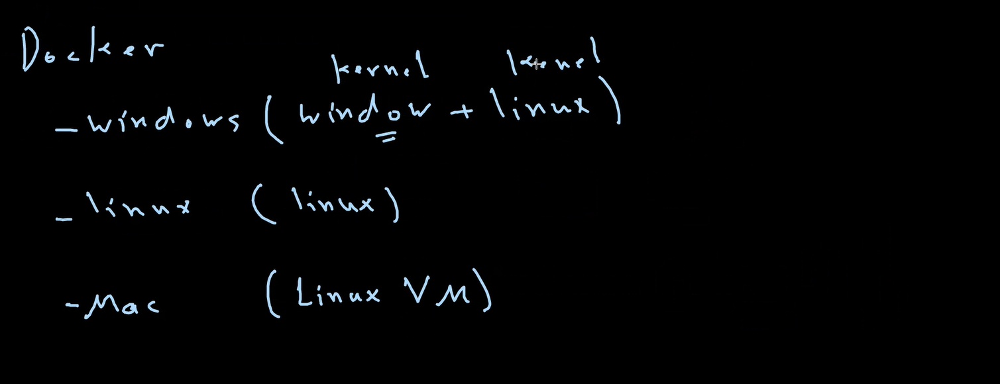

# Docker

## 1. __What is Docker__ ?
### is an OS virtualized software platform that allows IT organizations to quickly create, deploy, and run applications in Docker containers, which have all the dependencies within them. The container itself is a very lightweight package with all the instructions and dependencies—such as frameworks, libraries, and bins—within it.

### The Docker container can be moved from environment to environment very easily.
### Docker really shines when used for deployment. When you deploy your solution, you want to guarantee that the code tested will actually work in the production environment.

<br />

## 2.   __Docker vs Virtual Machines:__


<br />

1. ### The virtual environment has a hypervisor layer, whereas Docker has a Docker engine layer. 
2. ### There are additional layers in the virtual environment, such as the guest OS and the application.
3. ### The Memory and CPU utilization is much higher in the virtual environment than in Docker.
4. ### The Performance is much better in Docker than in the virtual environment.
5. ### In Terms of Portability, Docker is much better than the virtual environment. They’re still dependent on the host operating system, and a lot of problems can happen when you use virtual machines for portability. In contrast, Docker was designed for portability. You can actually build solutions in a Docker container, and the solution is guaranteed to work as you have built it no matter where it’s hosted. 

<br />


<br />

## 3. __How Docker Works:__
### Doker works via Doker Engine, which is a client-server application. The Docker client talks to the Docker daemon, which does the heavy lifting of building, running, and distributing your Docker containers. The Docker client and daemon can run on the same system, or you can connect a Docker client to a remote Docker daemon. The Docker client and daemon communicate using a REST API, over UNIX sockets or a network interface.

## 4. __Components of Docker:__
- ### Docker Client and Server.
- ### Docker Images.
- ### Docker Containers.
- ### Docker Registry.


<br />

## 5. __Docker Client and Server:__
### The Docker client and server are the two main components of Docker. The Docker client is the primary way that many Docker users interact with Docker. When you use commands such as docker run, the client sends these commands to dockerd, which carries them out. The Docker client can communicate with more than one daemon.
### Dockerd is the persistent process that manages Docker containers. Docker uses different binaries for the daemon and client. The Docker daemon is called dockerd, and the Docker client is called docker. They can run on the same system or on different systems. When you use the Docker client, either directly or indirectly through a tool such as Docker Compose, your commands are sent to the Docker daemon, which carries them out. The Docker daemon must always be running, but you don’t have to interact with it directly.


<br />

##  __Docker File:__
### A Dockerfile is a text document that contains all the commands a user could call on the command line to assemble an image. Using docker build users can create an automated build that executes several command-line instructions in succession.
## Example:
```
FROM Python:3.7
COPY . /app
WORKDIR /app
RUN pip install -r requirements.txt
EXPOSE 5000 # Port
CMD python ./src/app.py
```

### Above in Example:
#### CMD: is the command that is executed when the container is started from the image. 
#### EXPOSE: is the port that the container is listening on at runtime. just for documentation purposes.
#### RUN: is used to execute a command during the build process of the image.
#### WORKDIR: is used to set the working directory for the commands that follow it.
#### COPY: is used to copy files from the host machine to the container.
#### FROM: is used to set the base image for subsequent instructions. It’s the first instruction in the Dockerfile.


<br />


## 6. __Docker Images:__
### is a template that contains instructions for the Docker container. That template is written in a language called YAML, which stands for Yet Another Markup Language. 

### The Docker image is built within the YAML file and then hosted as a file in the Docker registry. The image has several key layers, and each layer depends on the layer below it. Image layers are created by executing each command in the Dockerfile and are in the read-only format. You start with your base layer, which will typically have your base image and your base operating system, and then you will have a layer of dependencies above that. These then comprise the instructions in a read-only file that would become your Dockerfile. 


<br />

- ### Pull: Adds files from your Docker repository.
- ### Run: Builds your container.
- ### CMD: Specifies the command to run when the container starts.

<br />

## 7. __Docker Containers:__
### is an executable package of applications and its dependencies bundled together; it gives all the instructions for the solution you’re looking to run. It’s really lightweight due to the built-in structural redundancy. It’s also portable, as it can be moved from environment to environment. It’s also very secure, as it’s isolated from the host machine and other containers. It’s also very easy to manage, as it’s a single unit of deployment.




<br />

## 8. __Docker Registry:__
### The Docker registry is where you would host various types of images and where you would distribute the images from. The repository itself is just a collection of Docker images, which are built on instructions written in YAML and are very easily stored and shared. You can give the Docker images name tags so that it’s easy for people to find and share them within the Docker registry. One way to start managing a registry is to use the publicly accessible Docker hub registry, which is available to anybody. You can also create your own registry for your own use internally.


<br />

## 9. __Docker Compose__: 
### is a tool for defining and running multi-container Docker applications. With Compose, you use a YAML file to configure your application’s services. Then, with a single command, you create and start all the services from your configuration. 
### An Example would be if you are running an Apache server with a single database and you need to create additional containers to run additional services without having to start each one separately. ou would write a set of files using Docker compose to do that.

<br />

## 10. __Docker Swarm__:
### is a clustering and scheduling tool for Docker containers. With Swarm, IT administrators and developers can establish and manage a cluster of Docker nodes as a single virtual system. Swarm mode also provides a fault-tolerant mechanism for orchestrating containers. It’s a native clustering tool for Docker. It’s a container orchestration tool that allows you to manage multiple containers at once. It’s a built-in tool that comes with Docker. It’s a very lightweight tool that allows you to manage multiple containers at once. 


<br />


-----------------------------------------------------

<br />

# Docker Commands:


> __NOTE__: 

> dockder run <image> = download the image + create the container + start the container. 

> docker pull <image> = download the image only.

> docker ps = show the running containers.

> docker ps -a = show all containers.

> docker rm < id container> = remove the container.

> docker rmi < id image> = remove the image.

> docker images = show the images.

> docker image prune = remove all images.

> docker run -it <image> = run the container in the interactive mode. i: interactive, t: terminal.
 
### the order of layers in the docker file is important, because if you change the order of layers, the docker will not use the cache and will rebuild the image from the changed layer.

the layers in the docker file are:
- FROM
- RUN
- COPY
- EXPOSE
- CMD
- ENTRYPOINT
- ENV...etc


# Docker Installation:
- ### Remove any Docker files that are running in the system, using the following command:
```
sudo apt-get remove docker docker-engine docker.io 
``` 

- ###  Check if the system is up-to-date using the following command:

```
sudo apt-get update
```

- ### Install Docker using the following command:

``` 
sudo apt install docker.io
```

- ### Install all the dependency packages using the following command:

```
sudo snap install docker
```

- ### check the version installed using the following command:

```
docker --version
```

- ### run hello-world to check if the installation is successful using the following command:

```
sudo docker run hello-world
``` 

- ### Pull an image from the Docker hub using the following command:

```
sudo docker pull ubuntu: latest
```

- ### Run the docker image using the following command:

```
sudo docker run -it ubuntu: latest
```

- ### Check if the docker image has been pulled and is present in your system using the following command:

```
sudo docker images
```

- ### To remove the docker image, use the following command:

```
sudo docker rmi <Image ID>
```

- ###  To display all the containers pulled, use the following command:

```
sudo docker ps -a
```

- ### To check for containers in a running state, use the following command:

```
sudo docker ps
```

- ### To stop a container, use the following command:

```
sudo docker stop <Container ID>
```

- ### To remove a container, use the following command:

```
sudo docker rm <Container ID>
```

- ### To remove all the containers, use the following command:

```
sudo docker rm $(sudo docker ps -a -q)
```


<br />

## Building a Docker Image from a Dockerfile:
- ### Create a Dockerfile using the following command:

```
sudo nano Dockerfile
```

- ### Add the following lines to the Dockerfile:

```
FROM ubuntu:latest # ubuntu is the base image
RUN apt-get update 
RUN apt-get install apache2 -y
CMD ["echo", "Hello World...! from my first docker image"]
```


- ### Build the Docker image using the following command:

```
sudo docker build -t myfirstimage .   # -t is used to tag the image , . is used to specify the current directory
```

- ### Run the Docker image using the following command:

```
sudo docker run myfirstimage
```

- ### To check the Docker image, use the following command:

```
sudo docker images
```

- ### To run a container from the Docker image, use the following command:

```
sudo docker run -it myfirstimage # -it is used to run the container in the interactive mode
```

-------------------------------------------


# Docker- Compose Commands:

- ### To install Docker Compose, use the following command:

```
sudo apt install docker-compose
```

- ### To check the version of Docker Compose, use the following command:

```
docker compose --version
```

- ### To create a docker-compose.yml file, use the following command:

```
sudo nano docker-compose.yml
```

- ### Run the docker-compose.yml file using the following command:

```
sudo docker compose up -d  # -d is used to run the container in the background
```

- ### To check the status of the container, use the following command:

```
sudo docker compose ps
```

- ### To stop the container, use the following command:

```
sudo docker compose down -v # -v is used to remove the volume
sudo docker compose stop # stop the container
```

>> __NOTE__: for more commands about Docker check [hier](https://www.simplilearn.com/tutorials/docker-tutorial/docker-commands).


### Docker-compose consists of two main components:
- ### Docker-compose.yml file: is a YAML file that contains the configuration of the application’s services and networks.
- ### Docker-compose CLI: is a command-line tool that is used to run commands on the docker-compose.yml file.

### Docker-compose.yml file consists of the following components:
- ### Version: is the version of the docker-compose.yml file.
- ### Services: is the name of the service.
- ### Image: is the name of the image.
- ### Ports: is the port number.
- ### Volumes: is the volume name.
- ### Networks: is the network name.
- ### Environment: is the environment variable name.
- ### Depends_on: is the name of the service that the current service depends on.
- ### Build: is the path to the Dockerfile.
- ### Command: is the command to run when the container starts.

#### example:
```
version: '3.8' # version of the docker-compose.yml file
services: # name of the service
  web: # name of the service 
    image: nginx:latest # name of the image
    ports: # port number
      - "8080:80" # port number
    volumes: # volume name
      - ./html:/usr/share/nginx/html # volume name
    environment: # environment variable name
      - NGINX_HOST=webserver # environment variable name
      - NGINX_PORT=80 # environment variable name
  db: # name of the image
    image: mysql:latest # name of the image
    volumes: # volume name
      - ./db:/var/lib/mysql # volume name
    environment: # environment variable name
      - MYSQL_ROOT_PASSWORD=123456 # environment variable name
      - MYSQL_DATABASE=employee # environment variable name
      - MYSQL_USER=employee # environment variable name
      - MYSQL_PASSWORD=123456 # environment variable name
    ports: # port number
      - "3306:3306" # port number
    build: # path to the Dockerfile
      context: . # path to the Dockerfile
      dockerfile: Dockerfile # path to the Dockerfile
      command: --default-authentication-plugin=mysql_native_password # command to run when the container starts
    depends_on: # name of the service that the current service depends on
      - db # name of the service that the current service depends on

networks: # network name
    mynetwork: # network name
    driver: bridge # network name
```
