### What is Git?


#### Git is a version control system that allows you to track changes to files over time. It is used by programmers to keep track of all the changes they make to their code. Git is a distributed version control system, which means that the entire codebase and history is available on every developer's computer, which allows for easy branching and merging.

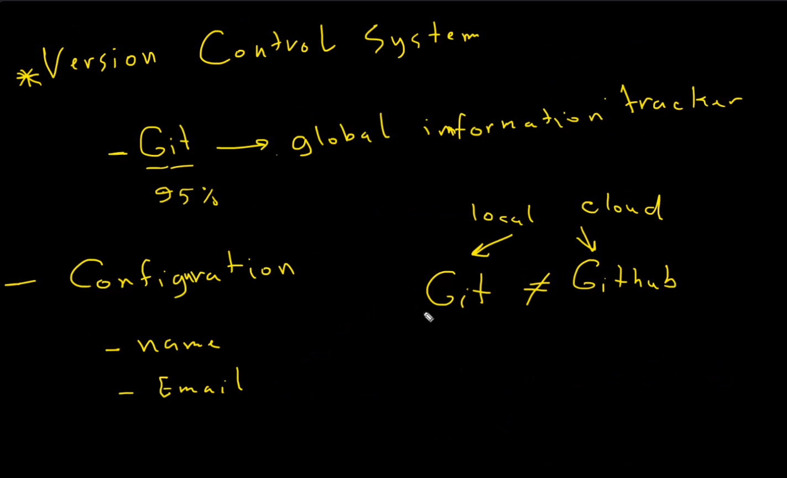

> __NOTE:__  befor to install git we need to configure our git account.

----

### Git vs GitHub: What's the Difference?
#### Git is a version control system that lets you manage and keep track of your source code history. GitHub is a cloud-based hosting service that lets you manage Git repositories. If you have open-source projects that use Git, then GitHub is designed to help you better manage them.


---- 

### To install git on linux:
```bash
sudo apt-get install git
```

> __NOTE:__
- sudo: run as root (adminstrator)
- apt-get: package manager
- install: install a package
- git: the package to install

---- 

### To configure git:
```bash
git config --global user.name "your name"
git config --global user.email "your email"
```

---- 

### To check the configuration:
```bash
git config --list
```
----

### What is Repository?
#### A repository is a storage space where your project lives. It can be local to a folder on your computer, or it can be a storage space on GitHub or another online host. You can keep code files, text files, image files, you name it, inside a repository.

> __NOTES:__ 
> - #### Any changes in one repository then the other repository will not be affected.
> - #### we can not create a repository inside another repository, because it will be a sub-repository. that is mean any changes in the parent repository will affect the sub-repository.
> - #### each repo has a Log file that contains all the changes that have been made to the repo.

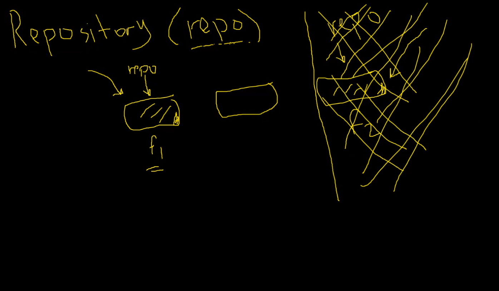


---- 

### To create a repository:
```bash
git init
```
#### then i get hidden folder called .git 

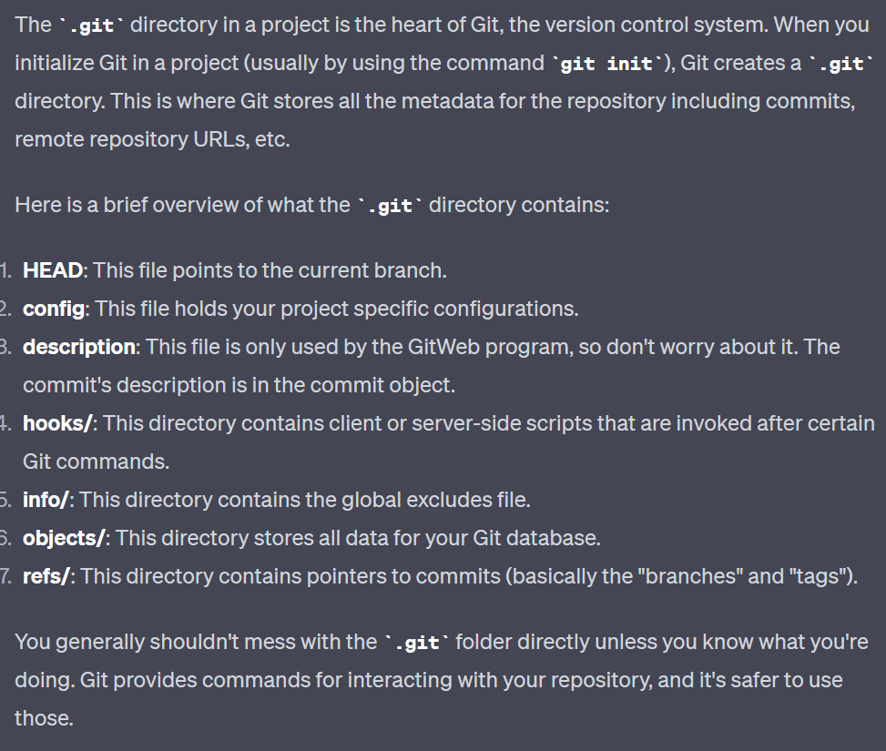

--- 

### To check the status of the repository:
```bash
git status
```
---

### To add files to the staging area:
```bash
git add <file name>
```
### To add all files by using:
```bash
git add .
```

### To add multiple files:
```bash
git add <file name> <file name> <file name>
```

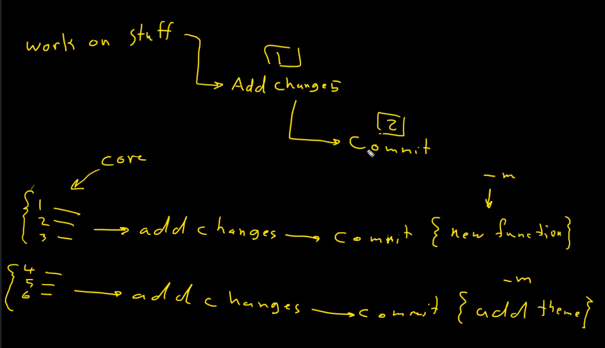
---

### what is the meaning of commit?
#### A commit is an operation which sends the latest changes of the source code to the repository, making these changes part of the head revision of the repository. A commit is done on a single local repository, and it is not visible to other users unless the commit is pushed to the central repository.

### To commit the changes:
```bash
git commit -m "your message"
```

### To add and commit the changes:
```bash
git commit -am "your message" or git commit -a -m "your message"
```
--- 

### To create file: 
```bash
touch <file name>
```

--- 

### To check the log:
```bash
git log
```
#### you got the log file that contains all the changes that have been made to the repo.

### To get the log in one line. 
 ```bash 
 git log --oneline 
 ``` 

> __NOTE:__ we can not to delete the commit because it is a history of the repo.

---

### Ameding commit for  the last commit:
```bash
git commit --amend 
```
#### Ameding the last commit is useful if you forgot to add some files, or you messaged up the commit message. then the last commit will be replaced by the new commit. and the last commit will be the new commit. 

---

### .gitignore file:
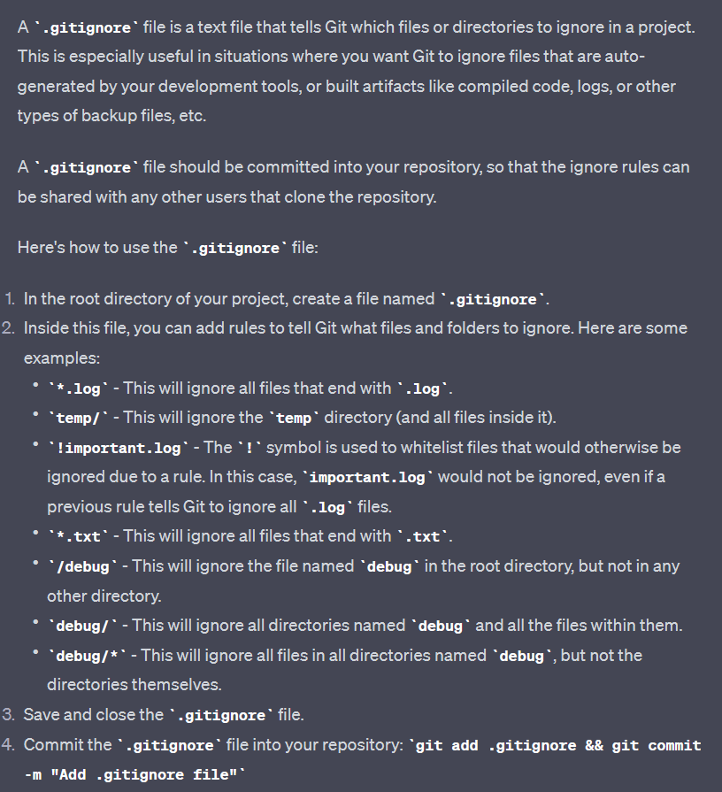

#### .gitignore file is a file that contains all the files that we do not want to add to the repo.

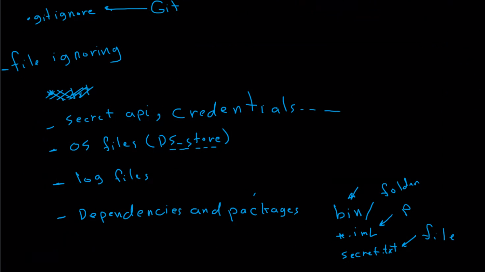


### To add .gitignore file:
```bash
touch .gitignore
``` 
#### Then we add the files  inside the .gitignore file that we do not want to add to the repo. Then we add the .gitignore file to the staging area and commit the changes.

---


### What is the meaning of Branches ?
#### Branches are used to develop features isolated from each other. The master branch is the "default" branch when you create a repository. Use other branches for development and merge them back to the master branch upon completion.

#### a branch is a pointer to a specific commit in the repository history. When you make changes to your code, you commit these changes to a branch. Branches serve as an abstraction for the edit/stage/commit process.

#### Here are the core concepts related to Git branches:

 1. #### Master branch: By default, every new Git repository has a single branch named "master" (or "main" in more recent Git versions). This branch often serves as the main line of development, where final product code resides.

2. #### Feature branches: These are created when you want to develop a new feature without affecting the main line of development. They allow you to work on specific features or bug fixes in isolation. Once the feature or fix is ready, it can be merged back into the main branch.

3. #### Remote branches: These are references to the state of branches in your remote repositories. They are local branches that you can't move; they move automatically whenever you do any network communication.

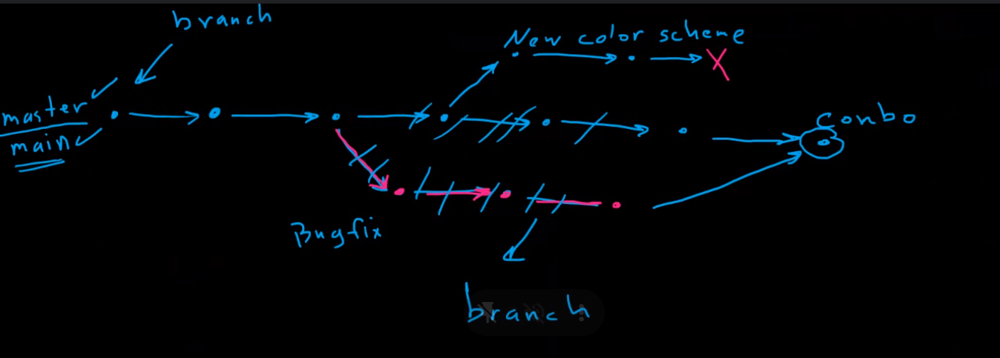

4. #### HEAD: This is a special pointer that points to the local branch you're currently on. By default, when you make a commit, the HEAD pointer moves along with the new commit.

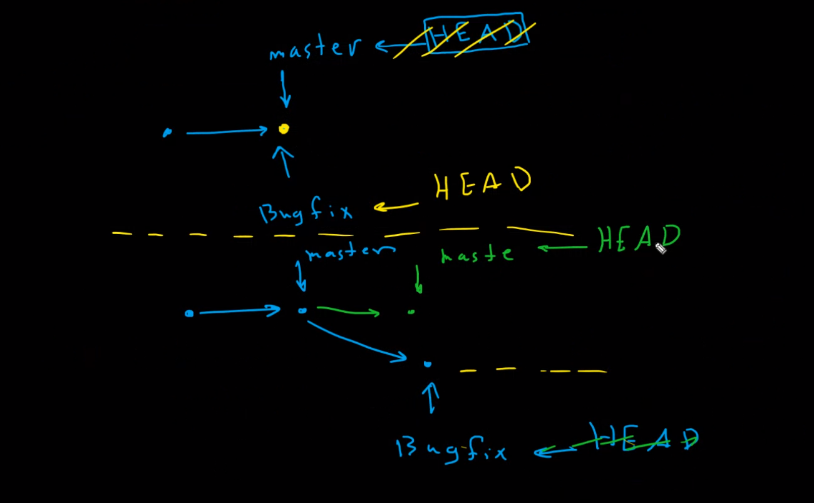


---

### Conflict:
#### A conflict occurs when different branches change the same part of the same file, and then those branches are merged together. For example, if you make a change in a file on one branch, and then another person makes a change to the same file in another branch, a conflict occurs when you try to merge these branches together. To resolve the conflict, you must choose which changes to keep in the final merge manually.

--- 

### To list all the branches:
```bash
git branch
```

### To create a new branch:
```bash
git branch <branch name>
```

### To switch to another branch:
```bash
git checkout <branch name> or git switch <branch name>
```

### To create a new branch and switch to it:
```bash
git checkout -b <branch name> or git switch -c <branch name>
```

### To delete a branch:
```bash
git branch -d <branch name>
```
---

### Types of merging:
#### __1. Fast-forward merge:__  refers to a specific situation when merging branches. This type of merge can only occur when there are no new commits on the base branch since a feature branch was created from it. That means that the feature branch is effectively an extension of the base branch, and there are no diverging points that would necessitate a three-way merge. In such a case, the HEAD of the base branch can be moved directly to the latest commit of the feature branch. This move is called a fast-forward because Git is able to "fast forward" the base branch pointer without creating a new commit. There is no Conflict in this type of merging.

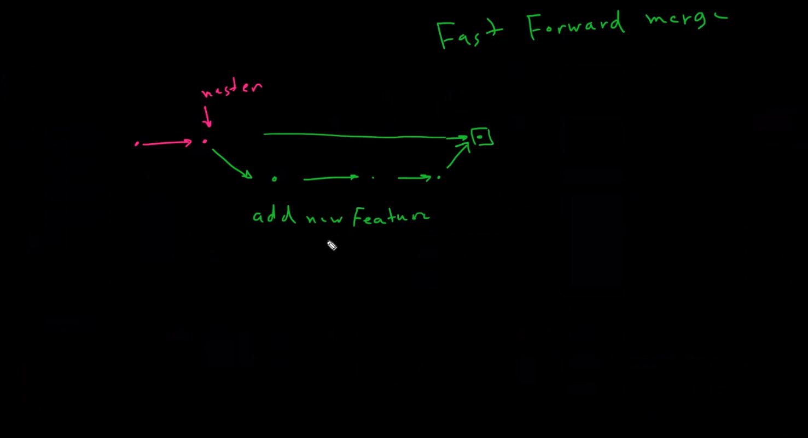


#### __2. Merge branch:__  This type of merge occurs when there are new commits on the base branch since a feature branch was created from it. This situation causes the two branches to diverge. Git must use the two branch's diverging commits to create a new snapshot. This type of merge creates a new commit on the base branch. There is a Conflict in this type of merging.


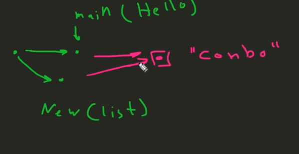

### To merge a branch to another branch:
```bash
git merge <branch name>
```

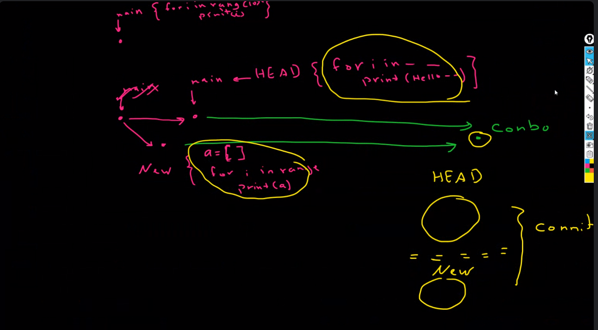

--- 

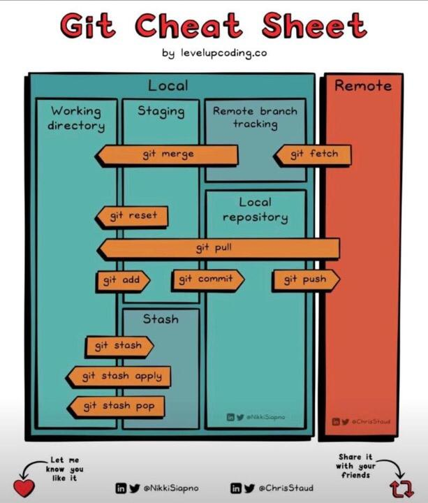