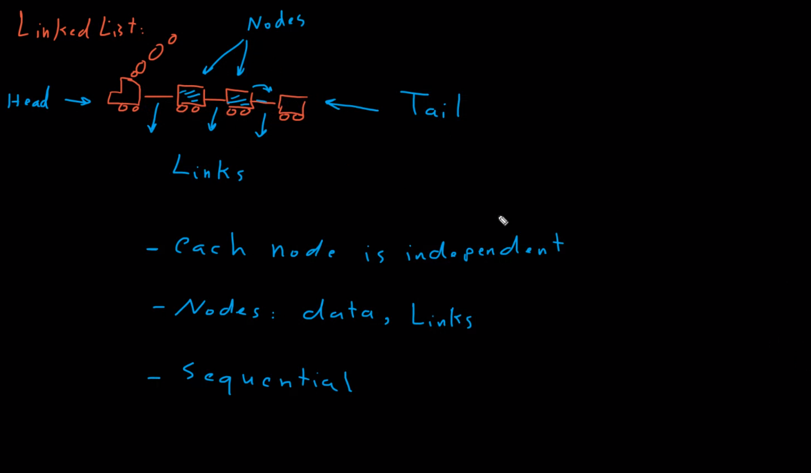
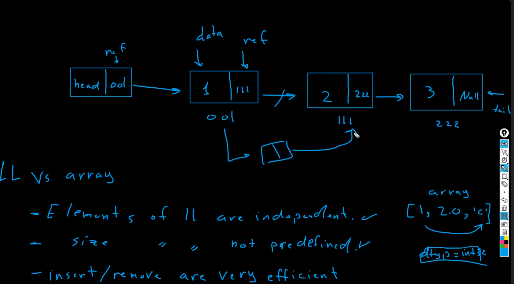

## Linked List in python:
### Linked List is a linear data structure. Unlike arrays, linked list elements are not stored at a contiguous location; the elements are linked using pointers.

- ### Nodes: is the element of the linked list. (Data and Links)
- ### Head: is the first node of the linked list.
- ### Tail: is the last node of the linked list.
- ### Links: is the connection between the nodes.
- ### Sequential: each node is connected to the next node unitl the last node.(Head -> Tail).

### - each node is independent of each other.

 

### Applications of Linked List:
- ### Dynamic memory allocation.
- ### Implementing abstract data types such as list, stack, queue, etc.
- ### Performing arithmetic operations on long integers.

 

### Linked List vs Array:
1. ### Elements in Linked List are not independent of each other. 
2. ### Size of Linked List is not pre-defined. for example in array we can define the size of the array but in linked list we can't.
3.  ### Insert/Delete operation in Linked List is easier than Array. (efficient).
4.  ### Accessing elements in Linked List is slower than Array. (inefficient).

 

### Creation of Linked List:
- ### create Head and Tail (Linked List) -> Head = None, Tail = None.
- ### create Node -> Node(data, next).

### How many classes we need to create Linked List?
- ### we need to create two classes: Node class and Linked List class.

 

