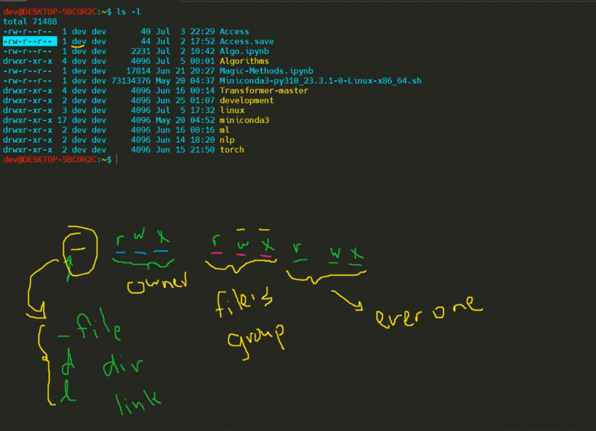
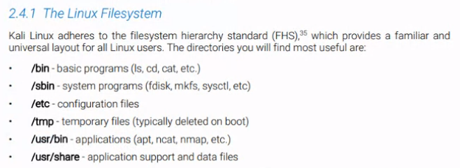

## __Linux Commands:__


<br />

- ### To show the current directory:
```bash 
pwd
```

- ### To show list of files and folders in the current directory:
```bash
ls
```

- ### To show the Date:
```bash
date
```

- ### To show Disk Usage:
```bash
df
```

- ### To show the free space in the disk:
  
```bash
free
```

- ### To show the manual of the command:

```
man <command>
```

- ### To change the directory:
```bash
cd <directory>
```

- ### To go back to the previous directory:
```bash
cd ../
```

- ### To change the directory to the home directory:
```bash
cd ~
```


- ### To show hidden files and folders:
```bash
ls -a
```


- #### To show the files and folders sorted by the last modified time:
```bash
ls -t
```

 


<br />


- ### To create a file and open it in the nano editor to write in it:
```bash
nano <file name>
```

- ### To show the content of the file:
```bash
cat <file name> 
```

- ### To copy a file:
```bash
cp <Source> <Destination>
```

- ### To copy multiple files:
```bash
cp <Source1> <Source2> <Source3> <Destination>
```


- ### To move a file:
```bash
mv <Source> <Destination>
```

- ### To remove a file forcefully:
```bash
rm -rf <file name>
```

- ### To copy only if the file is newer than the destination file or if the destination file does not exist.
```bash
cp -u <Source> <Destination>
```
<br />

> `*.extention`: means all files with this extention.

<br />

- ### To rename a file:
```bash
mv <old file name> <new file name>
```

- ### To create a directory:
```bash
mkdir <directory name>
```

- ### to show the description of the command:
```bash
whatis command
```

- ### to show the description of the command and the commands that are related to it:
```bash
apropros command
```

- ### to create an alias for a command, which means to create a shortcut for a command:
```
alias name="command" 
```

- ### to save the output of the command in a file:
```bash
ls -l /path/to/file > file.txt
```

> `>` means to save the output of the command in a file.
> `>>` means to append the output of the command to the file. 
> the difference between `>` and `>>` is that `>` will overwrite the file if it exists, but `>>` will append the output to the file if it exists.


- ### pipe operator `|`:  to send the output of a command to another command:
```bash
ls -l | grep "file"
```

- ### to search for a word in a file:
```bash
grep "word" file.txt
```

---


<br />

### __Linux File System:__

<br />




----

```bash
| sort | uniq | grep word # sort the output of the command and remove the repeated lines and search for a word in the output.
```

<br />


```bash	
cat file.txt # show the content of the file.
head -n 5 file.txt # show the first 5 lines of the file.
tail -n 5 file.txt # show the last 5 lines of the file.
```

<br />

```bash
ls /path/to/file | tail -n 5 # show the last 5 lines of the output of the command.
ls -l /path/to/file | head -n 5 # show the first 5 lines of the output of the command. -l means to show the details of the file.
```

<br />

```bash
ls /path/to/file | tee file.txt  | grep word  # tee command will save the output of the command in a file and search for a word in the output.
```

<br />

```bash
touch file.txt # create a file.
```

<br />

```bash
cat file.txt # show the content of the file.
wc -l file.txt # show the number of lines in the file. -l for lines. -w for words. -c for characters.
```

<br />

```bash
ls  /path/to/file | wc -lw  # show the number of lines and words in the output of the command.
```

<br />

```bash
cut -f2 file.txt # show the second column of the file. cut: to cut a column. -f: to specify the column.
```

<br />

```bash
cut -f2-4 file.txt | head -n 5 # show the second, third and fourth columns of then show the first 5 lines of the output.
```

<br />

```bash
cut -c1-5 file.txt | head -n 3 # show the first 5 characters of each line of the file and show the first 3 lines of the output.
```

------
<br />

__UNIQ__:

<br />

```bash
cat file.txt # show the content of the file.
uniq something # remove the repeated lines.
uniq -c something # remove the repeated lines and show the number of times each line is repeated. -c for count.
```

------

<br />

###  I have duplicated images in a folder, how can I remove the duplicated images using the terminal?

<br />

###  Using the Hash of the file: to find the duplicated images we check if the hash of 2 images are the same or not. when yes, then the images are duplicated.


<br />


> NOTE: the hash of the file is one way function which means that we can not get the file from the hash. It is used to check if the file is changed or not.

<br />

```bash
md5sum file1 file2 # show the hash of the files.
```

<br />

```bash
md5sum *.jpg | cut -c 1-32 | sort | uniq -c # show the hash of all the jpg files in the folder and show the number of times each hash is repeated. 1-32: to show the first 32 characters of the hash.
```

<br />

```bash
md5sum *.jpg | cut -c 1-32 | sort | uniq -c | sort -nr | grep -v " 1 "  # show the hash of all the jpg files in the folder and show the number of times each hash is repeated and sort the output in descending order and remove the lines that have 1 in them.
```

> __NOTE:__ md5sum is the worst hash-algorithm, we can use sha256sum instead of it.


<br/>

## how to write variable inside .sh file using nano and print it ? 

<br />

```bash
nano file.sh # create a file and open it in the nano editor.
```

<br />

```bash
#!/bin/bash # to tell the terminal that this is a bash file.
```

<br />

```bash
name="Ahmed" # create a variable.
```

<br />

```bash
echo $name # print the variable.
```

<br />

```bash
chmod +x file.sh # to make the file executable.
```

<br />

```bash
./file.sh # to run the file.
```
