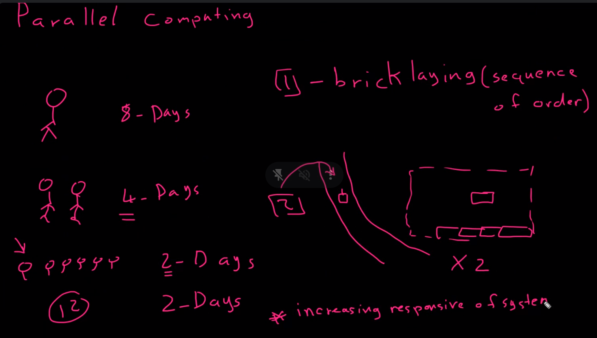
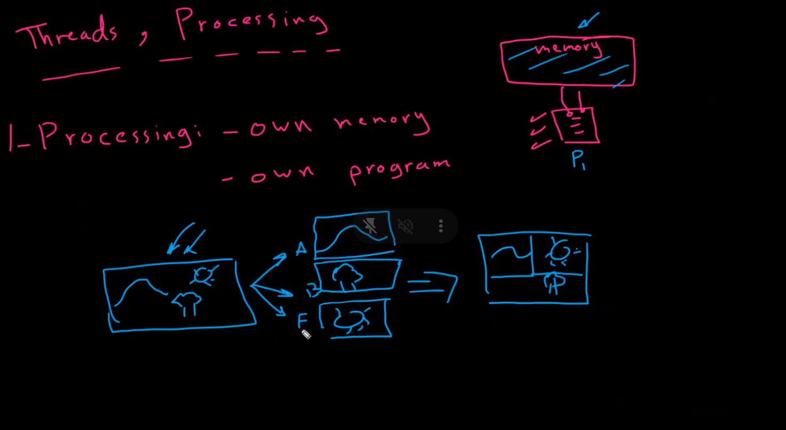
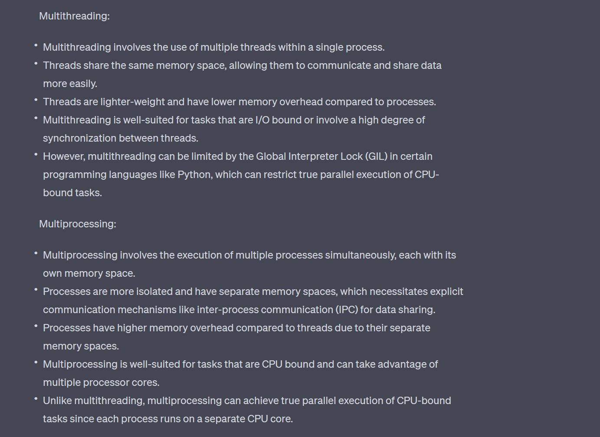
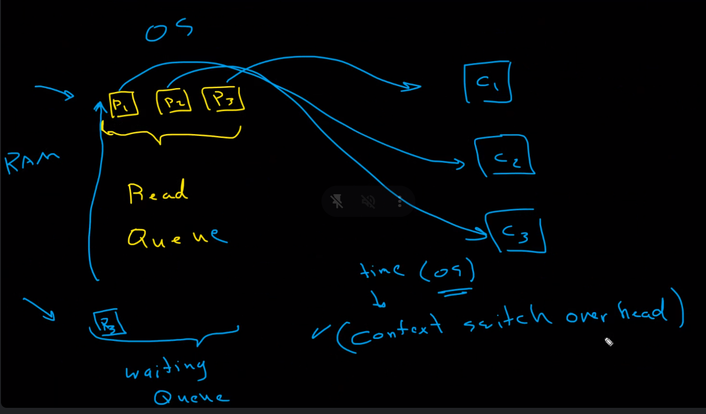
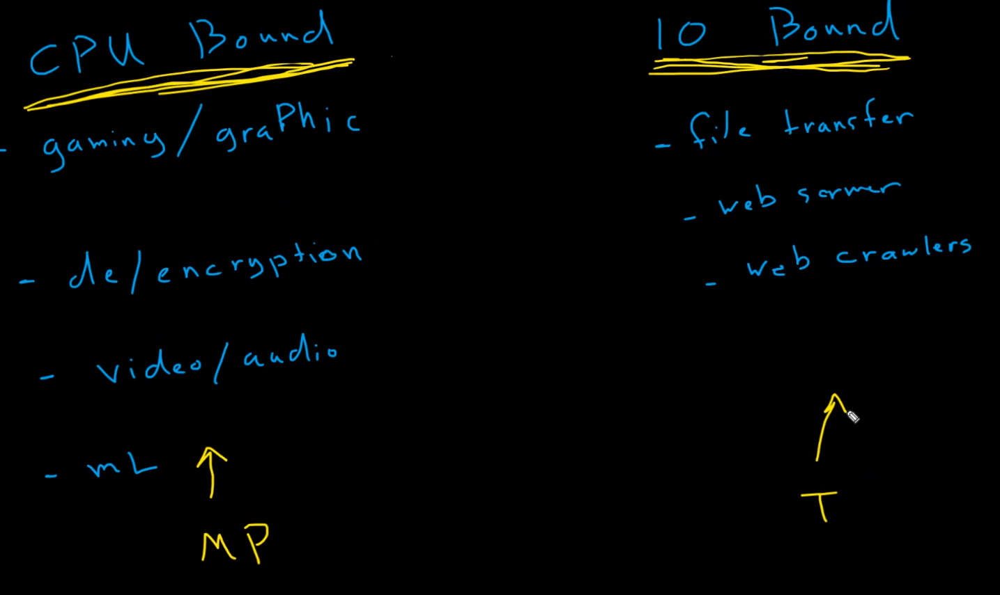
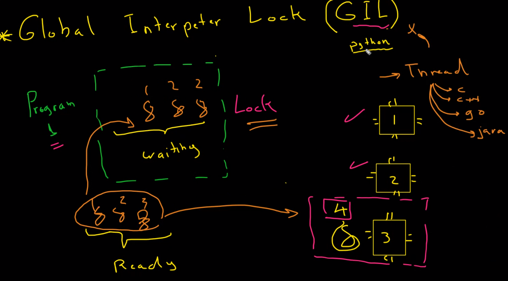
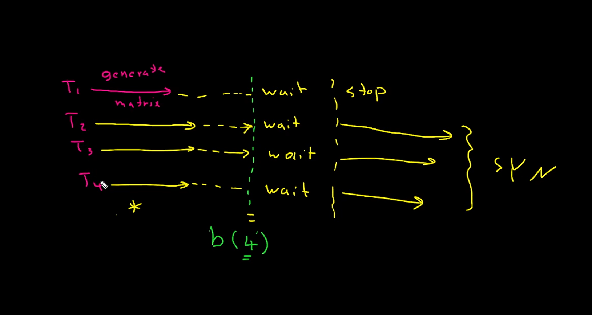
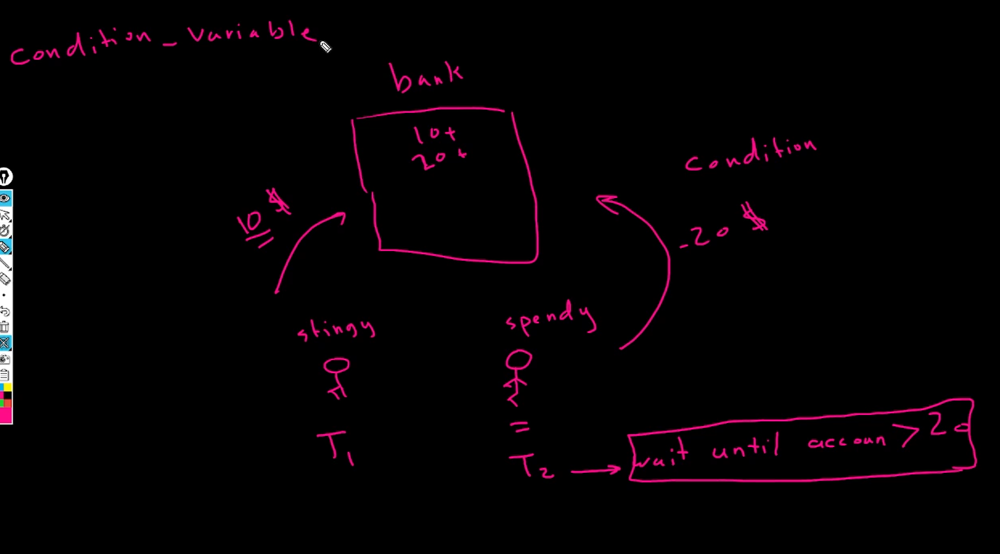

## __What is Parallel Computing?__
###  is the simultaneous use of multiple compute resources to solve a computational problem.



## __Why Parallel Computing?__
### 1. Speed up the computation.
### 2. Solve larger problems.
### 3. Solve more complex problems.
### 4. Increase the responsive of the system.


<br />

## __Thread vs Multiprocess__
### - Thread is a subset of a process.
### - Thread shares the same memory space.


### - Multiprocess is a process that has multiple threads.
### - Multiprocess has its own memory space.

<br />




<br />



<br />

## __READ QUEUE:__
### - A queue is a data structure that stores items in an First In First Out (FIFO) manner.

### - Context switch over head is the time required to save the current state of a thread (waiting Queue) and load the saved state of another thread (ready Queue).

<br />



-- 

### __CPU Bound vs I/O Bound__

### - CPU Bound: is a program that is limited by the speed of the CPU. (e.g. Matrix Multiplication)

### - I/O Bound: is a program that is limited by the speed of the I/O. (e.g. Reading a file)

<br />



> __NOTE:__ Threads are imortant for I/O Bound programs and 
>  Multiprocess are important for CPU Bound programs


<br />

## __GIL (Global Interpreter Lock)__ 
### - GIL is a mutex (or a lock) that allows only one thread to hold the control of the Python interpreter.
### - this is just for python not for other languages.

### - why GIL?
### to makes the implementation of CPython easier.



<br />


### __Interprerter vs Compiler__
### - Interprerter: computes the code line by line. is slower and the source code is not prodetected.
### - Compiler: computes the whole code at once. The the source code is prodetected and faster.


<br />

```python
if __name__ == "__main__":
    pass

```
### - this is used to make sure that the code inside the if statement will be executed only if the file is executed directly not if it is imported.


<br />

### Mutex: is a lock that allows only one thread to access a resource at a time.


### Join: is a method that locks the current thread until the thread on which it is called is terminated.


### Barrier: This function is used to block until all threads have finished. for example, if you have 5 threads, then the barrier must be called 5 times before any of the threads can continue. This is useful for waiting for all threads to finish before continuing.




<br />

### Wait_Group: is a synchronization mechanism that allows multiple threads to wait for each other. In other words, a wait group lets you defer the execution of a thread until the execution of all the other threads in the wait group completes. under Condition Variable.

