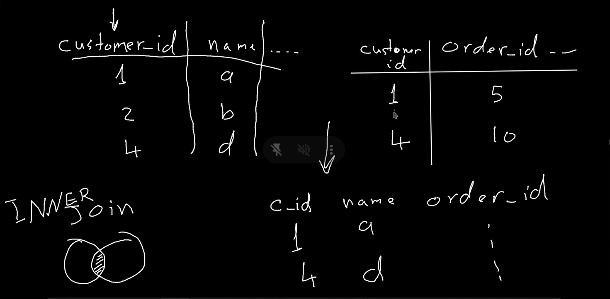

## SQL


### 1. To select database
```bash 
USE `database_name`; 
```

###  2.  Select all columns from table that match the condition
```bash
SELECT * FROM `table_name`  # *: means all columns
WHERE `column_name` = 'value'; # WHERE: condition
```

### 3. if the column is a number, we can add to the values 
```bash
SELECT `column_name + 1 FROM `table_name`; AS 'name' # +1: add 1 to the value, AS 'name' : rename the column (Alias)
```

### 4. To select distinct values from a column
```bash
SELECT DISTINCT `column_name` FROM `table_name`; # DISTINCT: distinct values means no duplicates.
```

### 5. Where clause
```bash 
SELECT * FROM `table_name` WHERE  NOT `column_name` = 'value'; # WHERE NOT: not equal to
```

### 6. Where clause with multiple conditions
```bash
SELECT * FROM `table_name` WHERE `column_name` = 'value' AND `column_name` = 'value'; # AND: both conditions must be true
SELECT * FROM `table_name` WHERE `column_name` = 'value' OR `column_name` = 'value'; # OR: one of the conditions must be true
```

```bash
SELECT * FROM `table_name` WHERE `column_name` IN ('value', 'value'); # IN: one of the conditions must be true
```

```bash
SELECT * FROM `table_name` WHERE `column_name` BETWEEN 'value' AND 'value'; # BETWEEN: value must be between the two values
```

```bash
SELECT * FROM `table_name` WHERE `column_name` LIKE '%b%'; # LIKE: value must contain the letter b
```

```bash
SELECT * FROM `table_name` WHERE `column_name` LIKE 'b%'; # LIKE: value must start with the letter b
```

```bash	
SELECT * FROM `table_name` WHERE `column_name`  REGEXP '^[0-9]'; # REGEXP: value must be a nmber between 0 and 9 (you can use any regular expression)
```

 ```bash
 SELECT * FROM `table_name` ORDER BY `column_name` ASC; # ORDER BY: sort the values in ascending order
 ```

```bash
SELECT * FROM `table_name` ORDER BY `column_name` DESC; # ORDER BY: sort the values in descending order
```

```bash
SELECT * FROM `table_name` ORDER BY `column_name` ASC, `column_name` DESC; # ORDER BY: sort the values in ascending order and then in descending order
```

```bash
SELECT * FROM `table_name` ORDER BY `column_name` ASC LIMIT 2,2; # LIMIT: show only 2 rows starting from the 3rd row
```

---- 

### INNER JOIN: is used to combine each row from one table with every row from another table if the join condition is true.



```bash
SELECT * FROM `table_name` t INNER JOIN `table_name` ON `table_name`.`column_name` = `table_name`.`column_name`; # INNER JOIN: combine each row from one table with every row from another table if the join condition is true., t: alias
```


### JOIN CONDITION: is used to combine each row from one table with every row from another table if the join condition is true.

```bash
SELECT * FROM `table_name` t INNER JOIN `table_name` ON `table_name`.`column_name` = `table_name`.`column_name`AND  `table_name`.`column_name` = `table_name`.`column_name`;  # AND: join condition
````

