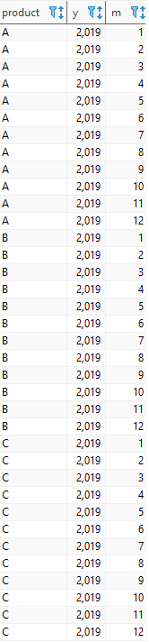
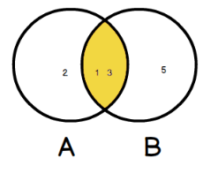
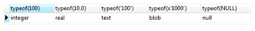
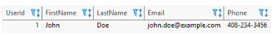
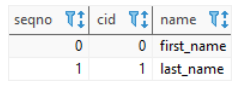
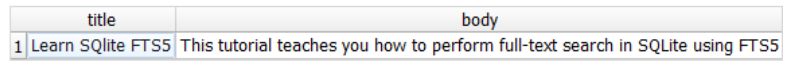

> # 💻 Webpage:  [SQLite Tutorial](https://www.sqlitetutorial.net/) 

- # **contents**:
* [Download SQLite tools](#Download-SQLite-tools) ✅
* [Run SQLite tools](#Run-SQLite-tools) ✅
* [SQLite Commands](#SQLite-Commands) ✅


<br />

* # **SQLite Tutorial**:

<br />

* [1. SQLite SELECT](#SQLite-SELECT) ✅
* [2. SQLite ORDER BY](#SQLite-ORDER-BY) ✅
* [3. SQLite SELECT DISTINCT](#SQLite-SELECT-DISTINCT) ✅
* [4. SQLite WHERE clause](#SQLite-WHERE-clause) ✅
* [5. SQLite LIMIT clause](#SQLite-LIMIT-clause) ✅
* [6. SQLite BETWEEN Operator](#SQLite-BETWEEN-Operator) ✅
* [7. SQLite IN operator](#SQLite-IN-operator) ✅
* [8. SQLite LIKE operator](#SQLite-LIKE-operator) ✅
* [9. SQLite IS NULL operator](#SQLite-IS-NULL-operator) ✅
* [10. SQLite GLOB operator](#SQLite-GLOB-operator) ✅
* [11. SQLite joins](#SQLite-joins) ✅
* [12. SQLite inner join clause](#SQLite-inner-join-clause) ✅
* [13. SQLite LEFT JOIN clause](#SQLite-LEFT-JOIN-clause) ✅
* [14. SQLite CROSS Join](#SQLite-CROSS-Join) ✅
* [15. SQLite self join](#SQLite-self-join) ✅
* [16. SQLite Full Outer Join](#SQLite-Full-Outer-Join) ✅
* [17. SQLite Group By](#SQLite-Group-By) ✅
* [18. SQLite Having](#SQLite-Having) ✅
* [19. SQLite Union](#SQLite-Union) ✅
* [20. SQLite Except](#SQLite-Except) ✅
* [21. SQLite Intersect](#SQLite-Intersect) ✅
* [22. SQLite Subquery](#SQLite-Subquery) ✅
* [23. SQLite EXISTS](#SQLite-EXISTS) ✅
* [24. SQLite Case](#SQLite-Case) ✅
* [25. SQLite Insert](#SQLite-Insert) ✅
* [26. SQLite Update](#SQLite-Update) ✅
* [27. SQLite Delete](#SQLite-Delete) ✅
* [28. SQLite Replace](#SQLite-Replace) ✅
* [29. SQLite Transaction](#SQLite-Transaction) ✅

<br />

* # **SQLITE DATA DEFINITION:**
* [1. SQLite Data Types](#SQLite-Data-Types) ✅
* [2. SQLite Date and Time](#SQLite-Date-and-Time) ✅
* [3. SQLite Create Table](#SQLite-Create-Table) ✅
* [4. SQLite Primary Key](#SQLite-Primary-Key) ✅
* [5. SQLite Foreign Key](#SQLite-Foreign-Key) ✅
* [6. SQLite NOT NULL Constraint](#SQLite-NOT-NULL-Constraint) ✅
* [7. SQLite UNIQUE Constraint](#SQLite-UNIQUE-Constraint) ✅
* [8. SQLite CHECK constraints](#SQLite-CHECK-constraints) ✅
* [9. SQLite AUTOINCREMENT](#SQLite-AUTOINCREMENT) ✅
* [10. SQLite Alter Table](#SQLite-Alter-Table) ✅
* [11. SQLite Rename Column](#SQLite-Rename-Column) ✅
* [12. SQLite Drop Table](#SQLite-Drop-Table) ✅
* [13. SQLite Create View](#SQLite-Create-View) ✅
* [14. SQLite Drop View](#SQLite-Drop-View) ✅
* [15. SQLite-Index](#SQLite-Index) ✅
* [16. SQLite Expression-based Index](#SQLite-Expression-based-Index) ✅
* [17. SQLite Trigger](#SQLite-Trigger) ✅
* [18. SQLite VACUUM](#SQLite-VACUUM) ✅
* [19. SQLite Full-text Search](#SQLite-Full-text-Search) ✅


<br/>

* # **SQLITE TOOLS:**
* [1. SQLite Import CSV](#SQLite-Import-CSV) ✅
* [2. SQLite Export CSV](#SQLite-Export-CSV) ✅

<br/>

* # **SQLITE INTERFACES:**
* [SQLite Python](https://github.com/ahmadSoliman94/Database/tree/main/SQLite/SQLite%20with%20Python) ✅

<br/>
<br/>

#  **GETTING STARTED** :

--------------------------------

### **What is SQLite?** 
#### `SQLite:` is a software library that provides a relational database management system. The lite in SQLite means lightweight in terms of setup, database administration, and required resources.
<br />

## -  **Serverless**:
#### Normally, an RDBMS such as MySQL, PostgreSQL, etc., requires a separate server process to operate. The applications that want to access the database server use TCP/IP protocol to send and receive requests. This is called client/server architecture.

#### The following diagram illustrates the RDBMS client/server architecture:


### - SQLite does NOT work this way.

### - SQLite does NOT require a server to run.

### - SQLite database is integrated with the application that accesses the database. The applications interact with the SQLite database read and write directly from the database files stored on disk.

### - The following diagram illustrates the SQLite server-less architecture:


<br />

## - **Self-Contained:**:
+ ### SQLite is self-contained means it requires minimal support from the operating system or external library. This makes SQLite usable in any environment especially in embedded devices like iPhones, Android phones, game consoles, handheld media players, etc.

<br />

## - **Zero-configuration:**
+ ### Because of the serverless architecture, you don’t need to “install” SQLite before using it. There is no server process that needs to be configured, started, and stopped.

* ### In addition, SQLite does not use any configuration files.

<br />

## - **Transactional:**
* ### All changes within a transaction take place completely or not at all even when an unexpected situation like application crash, power failure, or operating system crash occurs.

<br/>
<br/>

### Download SQLite tools:
#### To download SQLite, you open the [download page](https://www.sqlite.org/download.html) of the SQlite official website.
- #### To work with SQLite on Windows, you download the command-line shell program as shown in the screenshot below.


### Run SQLite tools:
#### Installing SQLite is simple and straightforward.

#### First, create a new folder e.g., `C:\sqlite`.
#### Second, extract the content of the file that you downloaded in the previous section to the C:\sqlite folder. You should see three programs in the `C:\sqlite` folder as shown below:


### 1. open the command line window:


### 2. navigate to the `C:\sqlite` folder.
```js
C:\cd c:\sqlite
C:\sqlite>
```
### 3. type `sqlite3` and press enter, you should see the following output:
```js
C:\sqlite>sqlite3
SQLite version 3.29.0 2019-07-10 17:32:03
Enter ".help" for usage hints.
Connected to a transient in-memory database.
Use ".open FILENAME" to reopen on a persistent database.
sqlite>
```
### 4. to quit the sqlite>, you use  `.quit` command as follows:
```bsah
sqlite> .quit
```
## SQLite Commands:
* ### To start the sqlite3, you type the `sqlite3` as follows:
```js
>sqlite3
SQLite version 3.29.0 2019-07-10 17:32:03
Enter ".help" for usage hints.
Connected to a transient in-memory database.
Use ".open FILENAME" to reopen on a persistent database.
```

* ### To open a database file, you use the `.open FILENAME` command. The following statement opens the chinook.db database:
 ```js
sqlite> .open c:\sqlite\db\chinook.db
```

* ### Show tables in a database
#### To display all the tables in the current database, you use the `.tables` command. The following commands open a new database connection to the chinook database and display the tables in the database.
```js
>sqlite3 c:\sqlite\db\chinook.db
SQLite version 3.29.0 2019-07-10 17:32:03
Enter ".help" for usage hints.
sqlite> .tables
albums          employees       invoices        playlists
artists         genres          media_types     tracks
customers       invoice_items   playlist_track
sqlite>
```
* ### To exit the sqlite3 program, you use the `.exit` command.
```js
sqlite>.exit
```
* ### To find tables based on a specific pattern, you use the `.table` pattern command. The sqlite3 uses the `LIKE` operator for pattern matching.

### For example, the following statement returns the table that ends with the string `es`.
```js
sqlite> .table '%es'
employees    genres       invoices     media_types
sqlite>
```

* ### Show the structure of a table

### The following command shows the structure of the albums table.
```js
sqlite> .schema albums
CREATE TABLE "albums"
(
    [AlbumId] INTEGER PRIMARY KEY AUTOINCREMENT NOT NULL,
    [Title] NVARCHAR(160)  NOT NULL,
    [ArtistId] INTEGER  NOT NULL,
    FOREIGN KEY ([ArtistId]) REFERENCES "artists" ([ArtistId])
                ON DELETE NO ACTION ON UPDATE NO ACTION
);
CREATE INDEX [IFK_AlbumArtistId] ON "albums" ([ArtistId]);
sqlite>
```

* ### To show all indexes of the current database
```js
sqlite> .indexes
```

* ### To show the indexes of a specific table, you use the `.indexes TABLE` command. For example, to show indexes of the `albums` table, you use the following command:

```js
sqlite> .indexes albums
```

* ### Save the result of a query into a file:
   ###  To save the result of a query into a file, you use the `.output FILENAME` command. Once you issue the `.output` command, all the results of the subsequent queries will be saved to the file that you specified in the `FILENAME` argument. If you want to save the result of the next single query only to the file, you issue the `.once FILENAME` command.

   ### To display the result of the query to the standard output again, you issue the `.output` command without arguments.

    ### The following commands select the `title` from the `albums` table and write the result to the ``albums.txt` file.

```js
sqlite> .output albums.txt
sqlite> SELECT title FROM albums;
```

- ### Execute SQL statements from a file
  ### Suppose we have a file named `commands.txt` in the `c:\sqlite\` folder with the following content:

```js
SELECT albumid, title
FROM albums
ORDER BY title
LIMIT 10;
```
- ### To execute the SQL statements in the `commands.txt` file, you use the `.read FILENAME` command as follows:

```js
sqlite> .mode column
sqlite> .header on
sqlite> .read c:/sqlite/commands.txt
AlbumId     Title
----------  ----------------------
156         ...And Justice For All
257         20th Century Masters -
296         A Copland Celebration,
94          A Matter of Life and D
95          A Real Dead One
96          A Real Live One
285         A Soprano Inspired
139         A TempestadeTempestade
203         A-Sides
160         Ace Of Spades
```
<br />

------------------------------------------------------------------

## **SQLite Functions tables**:

1. ## <ins> SQLite aggregate functions:


<br />

2. ## <ins> SQLite string functions:


<br />


3. ## <ins> SQLite control flow functions:


<br />

4. ## <ins> SQlite date and time functions:


<br />

5. ## <ins> SQLite math functions:


<br />
------------------------------------------------------------------
## **SQLITE TUTORIAL**:

-----------------------------------------------------------

> 1. ### SQLite SELECT:

- ### Querying data from a table using the SELECT statement
  ### We often use the SELECT statement to query data from one or more table. The syntax of the SELECT statement is as follows:

```js
SELECT DISTINCT column_list
FROM table_list
  JOIN table ON join_condition
WHERE row_filter
ORDER BY column
LIMIT count OFFSET offset
GROUP BY column
HAVING group_filter;
```
- #### Use `SELECT` statement that allows you to query data from a single table.
- #### Use `ORDER` BY clause to sort the result set.
- #### Use `DISTINCT` clause to query unique rows in a table.
- #### Use `WHERE` clause to filter rows in the result set.
- #### Use `LIMIT OFFSET` clauses to constrain the number of rows returned.
- #### Use `INNER JOIN` or `LEFT JOIN` to query data from multiple tables using join.
- #### Use `GROUP BY` to get the group rows into groups and apply aggregate function for each group.
- #### Use `HAVING` clause to filter groups.

* ### To get data from the tracks table such as trackid, track name, composer, and unit price, you use the following statement:
```js
SELECT
	trackid,
	name,
	composer,
	unitprice
FROM
	tracks;
```

  ### SQLite returns the following result: 
  

* ### To get data from all columns: 
```js
SELECT * FROM tracks;
```

> - ### NOTE: You should use the asterisk (*) for the testing purpose only, not in the real application development. Becaus When you develop an application, you should control what SQLite returns to your application. Suppose, a table has 3 columns, and you use the asterisk (*) to retrieve the data from all three columns. What if someone removes a column, your application would not be working properly, because it assumes that there are three columns returned and the logic to process those three columns would be broken.

-----------------------------------------------------------
> 2. ### SQLite ORDER BY:
#### If you use the  `SELECT` statement to query data from a table, the order of rows in the result set is unspecified.

#### To sort the result set, you add the `ORDER BY` clause to the  SELECT statement as follows:

```js
SELECT
   select_list
FROM
   table
ORDER BY
    column_1 ASC,
    column_2 DESC;
```

* ### The `ASC` keyword means ascending.
* ### And the `DESC` keyword means descending.
- ### Suppose, you want to get data from ***name***, ***milliseconds***, and ***album id*** columns and you want to sort the sorted result (by ***AlbumId***) above by the ***Milliseconds*** column in descending order. In this case, you need to add the ***Milliseconds*** column to the `ORDER BY` clause as follows:, you use the following statement:
```js
SELECT
	name,
	milliseconds, 
	albumid
FROM
	tracks
ORDER BY
	albumid ASC,
        milliseconds DESC;
```


* ### **Sorting NULLs:**
#### In the database world, NULL is special. It denotes that the information missing or the data is not applicable.

> ***NOTE***: SQLite 3.30.0 added the `NULLS FIRST` and `NULLS LAST` options to the ORDER BY clause. The `NULLS FIRST` option specifies that the NULLs will appear at the beginning of the result set while the `NULLS LAST` option place NULLs at the end of the result set.

- ### The following example uses the `NULLS LAST` option to place ***NULLs*** after other values:

```js
SELECT 
    TrackId, 
    Name, 
    Composer 
FROM 
    tracks
ORDER BY 
    Composer NULLS LAST;
```


> 3. ### SQLite SELECT DISTINCT:
 #### The `DISTINCT` clause is an optional clause of the  `SELECT` statement. The `DISTINCT` clause allows you to remove the duplicate rows in the result set.

 * #### The syntax of the `DISTINCT` clause:
```js
SELECT DISTINCT	select_list
FROM table;
```

- ### Suppose you want to know the cities where the customers locate, you can use the `SELECT` statement to get data from the ***city*** column of the ***customers*** table as follows:

```js
SELECT city
FROM customers
ORDER BY city;
```


- ### It returns 59 rows. There are few duplicate rows such as ***Berlin ,London*** and ***Mountain View***. To remove these duplicate rows, you use the `DISTINCT` clause as follows:
```js
SELECT DISTINCT city
FROM customers
ORDER BY city;
```


> ###  ***NOTE**: if i select a list of columns from a table and want to get a unique combination of some columns, i can use the `GROUP BY` clause.

-----------------------------------------------------------

> 4. ###  SQLite WHERE clause: 
#### The `WHERE` clause is an optional clause of the `SELECT` statement. It appears after the `FROM` clause as the following statement:

```js
SELECT
	column_list
FROM
	table
WHERE
	search_condition;
```
- #### SQLite uses the following steps:

- ####  First, check the table in the `FROM` clause.
- #### Second, evaluate the conditions in the `WHERE` clause to get the rows that met these conditions.
- ### Third, make the final result set based on the rows in the previous step with columns in the `SELECT` clause.
### The search condition in the `WHERE` has the following form:
```js
left_expression COMPARISON_OPERATOR right_expression
```

## + **SQLite comparison operators**:


## + **SQLite logical operators**:


- ### The equality operator (`=`) is the most commonly used operator. For example, the following query uses the `WHERE` clause the equality operator to find all the tracks in the album id 1:

```js
SELECT
   name,
   milliseconds,
   bytes,
   albumid
FROM
   tracks
WHERE
   albumid = 1;
```


- ### I can use the logical operator to combine expressions. For example, to get tracks of the album 1 that have the length greater than 200,000 milliseconds, i use the following statement:

```js
SELECT
	name,
	milliseconds,
	bytes,
	albumid
FROM
	tracks
WHERE
	albumid = 1
AND milliseconds > 250000;
```


> ### SQLite WHERE clause with LIKE operator:
### Sometimes, you may not remember exactly the data that you want to search. In this case, you perform an inexact search using the `LIKE` operator.

### For example, to find which tracks composed by Smith, you use the LIKE operator as follows:

```js
SELECT
	name,
	albumid,
	composer
FROM
	tracks
WHERE
	composer LIKE '%Smith%'
ORDER BY
	albumid;
```


> ### SQLite WHERE clause with the IN operator:
The `IN` operator allows you to check whether a value is in a list of a comma-separated list of values. For example, to find tracks that have media type id is 2 or 3, you use the `IN` operator as shown in the following statement:

```js
SELECT
	name,
	albumid,
	mediatypeid
FROM
	tracks
WHERE
	mediatypeid IN (2, 3);
```


-----------------------------------------------------------

> 5. ###  SQLite LIMIT clause:
### use the `LIMIT` clause to constrain the number of rows returned by the query.
```js
SELECT
	column_list
FROM
	table
LIMIT row_count;
```
### For example, to get the first 10 rows in the ***tracks*** table, you use the following statement:

```js
SELECT
	trackId,
	name
FROM
	tracks
LIMIT 10;
```


### to get the first 10 rows starting from the 10th row of the result set, you use `LIMIT OFFSET` keyword as the following:
```js
SELECT
	column_list
FROM
	table
LIMIT offset, row_count;
```
### For example, to get 10 rows starting from the 11th row in the tracks table, you use the following statement:

```js
SELECT
	trackId,
	name
FROM
	tracks
LIMIT 10 OFFSET 10;
```


> ### LIMIT and ORDER BY clause:
-----------------------------------------------
>### ***NOTE:*** I should always use the `LIMIT` clause with the  `ORDER BY` clause. Because i want to get a number of rows in a specified order, not in an unspecified order.

```js
SELECT
   column_list
FROM
   table
ORDER BY column_1
LIMIT row_count;
```
### to get the top 10 biggest tracks by size, you use the following query:
```js
SELECT
	trackid,
	name,
	bytes
FROM
	tracks
ORDER BY
	bytes DESC
LIMIT 10;
```


### To get the 5 shortest tracks, you sort the tracks by the length specified by milliseconds column using `ORDER BY` clause and get the first 5 rows using LIMIT clause.

```js
SELECT
	trackid,
	name,
	milliseconds
FROM
	tracks
ORDER BY
	milliseconds ASC
LIMIT 5;
```


### Getting the nth highest and the lowest value:
### You can use the `ORDER BY` and `LIMIT` clauses to get the nth highest or lowest value rows.
### you use the following steps:

### - First, use `ORDER BY` to sort the result set in ascending order in case you want to get the nth lowest value, or descending order if you want to get the nth highest value.
### - Second, use the `LIMIT` OFFSET clause to get the nth highest or the nth lowest row.
### The following statement returns the second-longest track in the tracks table.
```js
SELECT
	trackid,
	name,
	milliseconds
FROM
	tracks
ORDER BY
	milliseconds DESC
LIMIT 1 OFFSET 1;
```


### The following statement gets the third smallest track on the tracks table.

```js
SELECT
	trackid,
	name,
	bytes
FROM
	tracks
ORDER BY
	bytes
LIMIT 1 OFFSET 2;
```


-----------------------------------

> 6. ###  SQLite BETWEEN Operator:
### The `BETWEEN` operator is a logical operator that tests whether a value is in range of values. If the value is in the specified range, the `BETWEEN` operator returns true. The `BETWEEN` operator can be used in the `WHERE` clause of the `SELECT`, `DELETE`, `UPDATE`, and `REPLACE` statements.

### The following illustrates the syntax of the SQLite BETWEEN operator:

```js
test_expression BETWEEN low_expression AND high_expression
```

### To negate the result of the BETWEEN operator, you use the NOT BETWEEN operator as follows:

```js
test_expression NOT BETWEEN low_expression AND high_expression
```
### * The following statement finds invoices whose total is between 14.96 and 18.86:

```js
SELECT
    InvoiceId,
    BillingAddress,
    Total
FROM
    invoices
WHERE
    Total BETWEEN 14.91 and 18.86    
ORDER BY
    Total; 
```


### - To find the invoices whose total are not between 1 and 20, you use the NOT BETWEEN operator as shown in the following query:

```js
SELECT
    InvoiceId,
    BillingAddress,
    Total
FROM
    invoices
WHERE
    Total NOT BETWEEN 1 and 20
ORDER BY
    Total;    
```


> ###  SQLite BETWEEN dates example:

- ### The following example finds invoices whose invoice dates are from January 1 2010 and January 31 2010:

```js
SELECT
    InvoiceId,
    BillingAddress,
    InvoiceDate,
    Total
FROM
    invoices
WHERE
    InvoiceDate BETWEEN '2010-01-01' AND '2010-01-31'
ORDER BY
    InvoiceDate;    
```


> ### SQLite NOT BETWEEN dates example:
### - The following statement finds invoices whose dates are not between January 03, 2009, and December 01, 2013:

```js
SELECT
    InvoiceId,
    BillingAddress,
    date(InvoiceDate) InvoiceDate,
    Total
FROM
    invoices
WHERE
    InvoiceDate NOT BETWEEN '2009-01-03' AND '2013-12-01'
ORDER BY
    InvoiceDate;
```


------------------------------

> 7. ###  SQLite IN operator:

 ### The SQLite IN operator determines whether a value matches any value in a list or a subquery.

* ###  The following statement uses the IN operator to query the tracks whose media type id is 1 or 2.

```js 
SELECT
	TrackId,
	Name,
	Mediatypeid
FROM
	Tracks
WHERE
	MediaTypeId IN (1, 2)
ORDER BY
	Name ASC;
```


- ### IN operator with a subquery example:
### The following query returns a list of album id of the artist id 12:

```js
SELECT albumid
FROM albums
WHERE artistid = 12;
```


- ### To get the tracks that belong to the artist id 12, you can combine the `IN` operator with a subquery as follows:

```js
SELECT
	TrackId, 
	Name, 
	AlbumId
FROM
	Tracks
WHERE
	AlbumId IN (
		SELECT
			AlbumId
		FROM
			Albums
		WHERE
			ArtistId = 12
	);
```


### In this example:

* ### First, the subquery returns a list of album ids that belong to the artist id 12.
* ### Then, the outer query return all tracks whose album id matches with the album id list returned by the subquery.

### - The following statement returns a list of tracks whose genre id is not in a list of (1,2,3).

```js
SELECT
	trackid,
	name,
	genreid
FROM
	tracks
WHERE
	genreid NOT IN (1, 2,3);
```


---------------------------------------------

> 8. ###  SQLite LIKE operator:

* ###  To query data based on partial information, you use the `LIKE` operator in the `WHERE` clause of the `SELECT` statement as follows:

```sql
SELECT
	column_list
FROM
	table_name
WHERE
	column_1 LIKE pattern;
```

> ### ***Note:*** that you can also use the `LIKE` operator in the `WHERE` clause of other statements such as the `DELETE` and `UPDATE`.

- ### SQLite provides two wildcards for constructing patterns. They are percent sign `%` and underscore `_` :

 * ### The percent sign `%` wildcard matches any sequence of zero or more characters.
* ### The underscore `_` wildcard matches any single character.
### -  The percent sign % wildcard examples:
* ### The `s%` pattern that uses the percent sign wildcard ( %) matches any string that starts with s e.g.,son and so.

* ### The %er pattern matches any string that ends with er like peter, clever, etc.

* ### And the %per% pattern matches any string that contains per such as percent and peeper.

### - The underscore _ wildcard examples:
* ### The `h_nt` pattern matches hunt, hint, etc. The __pple pattern matches topple, supple, tipple, etc.

> ### ***Note:*** that SQLite `LIKE` operator is case-insensitive. It means "A" LIKE "a" is true.

> - ### However, for Unicode characters that are not in the ASCII ranges, the LIKE operator is case sensitive e.g., "Ä" LIKE "ä" is false.

* ### To find the tracks whose names start with the `Wild` literal string, you use the percent sign `%` wildcard at the end of the pattern.

```sql
SELECT
	trackid,
	name	
FROM
	tracks
WHERE
	name LIKE 'Wild%'
```


* ### To find the tracks whose names end with Wild word, you use % wildcard at the beginning of the pattern.

```sql
SELECT
	trackid,
	name
FROM
	tracks
WHERE
	name LIKE '%Wild'
```


* ### To find the tracks whose names contain the Wild literal string, you use `%` wildcard at the beginning and end of the pattern:

```sql
SELECT
	trackid,
	name	
FROM
	tracks
WHERE
	name LIKE '%Wild%';
```


> ### LIKE with ESCAPE clause:
### If the pattern that you want to match contains `%` or `_` , you must use an escape character in an optional `ESCAPE` clause as follows:

```sql
column_1 LIKE pattern ESCAPE expression;
```
-  ### First, create a table t that has one column:

```sql
CREATE TABLE t(
	c TEXT
);
```
- ### Next, insert some rows into the table t:

```sql
INSERT INTO t(c)
VALUES('10% increase'),
	('10 times decrease'),
	('100% vs. last year'),
	('20% increase next year');
```
* ### Then, query data from the t table:

```sql
SELECT * FROM t;
```
```bash
c                     
----------------------
10% increase          
10 times decrease     
100% vs. last year    
20% increase next year
```

* ### Fourth, attempt to find the row whose value in the c column contains the 10% literal string:

```sql
SELECT c 
FROM t 
WHERE c LIKE '%10%%';
```
* ### However, it returns rows whose values in the c column contains 10:

```
c                 
------------------
10% increase      
10 times decrease 
100% vs. last year
```

* ### Fifth, to get the correct result, you use the ESCAPE clause as shown in the following query:

```sql
SELECT c 
FROM t 
WHERE c LIKE '%10\%%' ESCAPE '\';
```

* ### Here is the result set:

```
c           
------------
10% increase
```
----------------------

> 9. ###  SQLite IS NULL operator:
* ### `NULL` is special. It indicates that a piece of information is unknown or not applicable.

### The following statement attempts to find tracks whose composers are NULL:

```sql
SELECT
    Name, 
    Composer
FROM
    tracks
WHERE
    Composer = NULL;
```
* ### It returns an empty row without issuing any additional message.

### - To find all tracks whose composers are unknown, you use the IS NULL operator as shown in the following query:

```sql
SELECT
    Name, 
    Composer
FROM
    tracks
WHERE
    Composer IS NULL
ORDER BY 
    Name;
```   


> ### SQLite IS NOT NULL operator:
### The NOT operator negates the IS NULL operator as follows:

```
expression | column IS NOT NULL
```

* ### The following example finds tracks whose composers are not NULL:

```sql
SELECT
    Name, 
    Composer
FROM
    tracks
WHERE
    Composer IS NOT NULL
ORDER BY 
    Name;     
```


>  10. ###  SQLite GLOB operator:

- ### The `GLOB` operator is similar to the `LIKE` operator. The `GLOB` operator determines whether a string matches a specific pattern.

>> ###  ***NOTE:*** the `GLOB` patterns do not have escape characters.

### - The following shows the wildcards used with the `GLOB`  operator:

* ### The asterisk (`*`) wildcard matches any number of characters.
* ### The question mark (`?`) wildcard matches exactly one character.
<br />

### The following statement finds tracks whose names start with the string *Man*.
### The pattern *Man** matches any string that starts with Man.

```sql 
SELECT
	trackid,
	name
FROM
	tracks
WHERE
	name GLOB 'Man*';
```


<br />

- ## The following statement gets the tracks whose names end with `Man`. The pattern `*Man` matches any string that ends with Man.

```sql
SELECT
	trackid,
	name
FROM
	tracks
WHERE
	name GLOB '*Man';
```

<br />

* ### The following query finds the tracks whose names start with any single character (`?`), followed by the string `ere` and then any number of character (`*`).

```sql
SELECT
	trackid,
	name
FROM
	tracks
WHERE
	name GLOB '?ere*';
```


<br/>

* ### To find the tracks whose names contain numbers, you can use the list wildcard `[0-9]` as follows:

```sql
SELECT
	trackid,
	name
FROM
	tracks
WHERE
	name GLOB '*[1-9]*';
```


<br/>

* ### to find the tracks whose name does not contain any number, you place the character `^` at the beginning of the list:

```sql
SELECT
	trackid,
	name
FROM
	tracks
WHERE
	name GLOB '*[^1-9]*';
```


<br/>

+ ### The following statement finds the tracks whose names end with a number.

```sql
SELECT
	trackid,
	name
FROM
	tracks
WHERE
	name GLOB '*[1-9]';
```


<br/>

> 11. ###  SQLite joins: 
### To query data from two or more tables.
### Example: I will use the *artists* and *albums* tables:


+ ### To query data from both *artists* and *albums* tables, you use can use an `INNER JOIN`, `LEFT JOIN`, or `CROSS JOIN` clause. Each join clause determines how SQLite uses data from one table to match with rows in another table.

>>  ### ***Note:*** that SQLite doesn’t directly support the `RIGHT JOIN` and `FULL OUTER JOIN`.

<br/>

> ### SQLite INNER JOIN: 
- ### The following statement returns the album titles and their artist names:

```sql
SELECT 
    Title,
    Name
FROM 
    albums
INNER JOIN artists 
    ON artists.ArtistId = albums.ArtistId;
```


### In this example, the `INNER JOIN` clause matches each row from the albums table with every row from the *artists* table based on the join condition `(artists.ArtistId = albums.ArtistId)` specified after the `ON` keyword.

### If the join condition evaluates to true (or 1), the columns of rows from both *albums* and *artists* tables are included in the result set.

### This query uses table aliases (`l` for the albums table and `r` for artists table) to shorten the query:

```sql
SELECT
    l.Title, 
    r.Name
FROM
    albums l
INNER JOIN artists r ON
    r.ArtistId = l.ArtistId;
```

<br />

> ### SQLite LEFT JOIN:
### This statement selects the artist names and album titles from the artists and albums tables using the LEFT JOIN clause:

```sql
SELECT
    Name, 
    Title
FROM
    artists
LEFT JOIN albums ON
    artists.ArtistId = albums.ArtistId
ORDER BY Name;
```


### The `LEFT JOIN` clause selects data starting from the left table (*artists*) and matching rows in the right table (*albums*) based on the join condition (*artists.ArtistId = albums.ArtistId*) .

- ### The left join returns all rows from the artists table (or left table) and the matching rows from the albums table (or right table).

- ### If a row from the left table doesn’t have a matching row in the right table, SQLite includes columns of the rows in the left table and NULL for the columns of the right table.

<br/>

- ### The `CROSS JOIN` clause creates a Cartesian product of rows from the joined tables.

- ### Unlike the `INNER JOIN` and `LEFT JOIN` clauses, a `CROSS JOIN` doesn’t have a join condition. Here is the basic syntax of the CROSS JOIN clause:

```sql
SELECT
    select_list
FROM table1
CROSS JOIN table2;
```
>> ### **NOTE:** If the first table has N rows, the second table has M rows, the final result will have NxM rows.

<br/>

### - The following script creates the products and calendars tables:

```sql
CREATE TABLE products(
    product text NOT null
);

INSERT INTO products(product)
VALUES('P1'),('P2'),('P3');


CREATE TABLE calendars(
    y int NOT NULL,
    m int NOT NULL
);

INSERT INTO calendars(y,m)
VALUES 
    (2019,1),
    (2019,2),
    (2019,3),
    (2019,4),
    (2019,5),
    (2019,6),
    (2019,7),
    (2019,8),
    (2019,9),
    (2019,10),
    (2019,11),
    (2019,12);
```

* ### This query uses the `CROSS JOIN` clause to combine the *products* with the *months*:

```sql
SELECT * 
FROM products
CROSS JOIN calendars;
```


-----------------------------------

> 12.  ###  SQLite inner join clause:
### To query data from multiple tables, you use `INNER JOIN` clause. The `INNER JOIN` clause combines columns from correlated tables.

<br />

### Suppose you have two tables: A and B.
<br />

### A has a1, a2, and f columns. B has b1, b2, and f column. The A table links to the B table using a foreign key column named f.

```sql
SELECT a1, a2, b1, b2
FROM A
INNER JOIN B on B.f = A.f;
```
<br/>

* ### For each row in the ***A*** table, the `INNER JOIN` clause compares the value of the ***f*** column with the value of the ***f*** column in the ***B*** table. If the value of the ***f*** column in the ***A*** table equals the value of the ***f*** column in the ***B*** table, it combines data from ***a1, a2, b1, b2***, columns and includes this row in the result set.

<br/>


* ### Only the rows in the A table: (a1,1), (a3,3) have the corresponding rows in the B table (b1,1), (b2,3) are included in the result set.

<br/>

- ### The following diagram illustrates the `INNER JOIN` clause:


<br/>

- ### Let’s take a look at the ***tracks*** and ***albums*** tables in the sample database. The tracks table links to the ***albums** table via ***AlbumId*** column.


###  - In the tracks table, the ***AlbumId*** column is a `foreign` key. And in the ***albums*** table, the ***AlbumId*** is the `primary` key.
<br />

* ### To query data from both ***tracks*** and ***albums*** tables, you use the following statement:

```sql
SELECT
	trackid,
	name,
	title
FROM
	tracks
INNER JOIN albums ON albums.albumid = tracks.albumid;
```


<br />

> ###  `inner join`: 3 tables example:


<br />

* ### To query data from these tables, you need to use two `inner join` clauses in the SELECT statement as follows:

```sql
SELECT
    trackid,
    tracks.name AS track,
    albums.title AS album,
    artists.name AS artist
FROM
    tracks
    INNER JOIN albums ON albums.albumid = tracks.albumid
    INNER JOIN artists ON artists.artistid = albums.artistid;
```


<br />

### - I can use a `WHERE` clause to get the ***tracks*** and ***albums*** of the ***artist*** with ***id*** 10 as the following statement:

```sql
SELECT
	trackid,
	tracks.name AS Track,
	albums.title AS Album,
	artists.name AS Artist
FROM
	tracks
INNER JOIN albums ON albums.albumid = tracks.albumid
INNER JOIN artists ON artists.artistid = albums.artistid
WHERE
	artists.artistid = 10;
```


<br/>

-----------------------------------

> 13. ### SQLite LEFT JOIN clause:  
### to query data from multiple tables. 

* ### Similar to the INNER JOIN clause, the LEFT JOIN clause is an optional clause of the SELECT statement. You use the LEFT JOIN clause to query data from multiple related tables.

### - Suppose we have two tables: A and B.

* ### A has m and f columns.
* ### B has n and f columns.
### - To perform join between A and B using LEFT JOIN clause, you use the following statement:

```sql
SELECT
	a,
	b
FROM
	A
LEFT JOIN B ON A.f = B.f
WHERE search_condition;
```


- ### The expression `A.f = B.f` is a conditional expression. Besides the equality (=) operator, you can use other comparison operators such as greater than (>), less than (<), etc.

- ### The statement returns a result set that includes:

### - Rows in table A (left table) that have corresponding rows in table B.
### -Rows in the table A table and the rows in the table B filled with NULL values in case the row from table A does not have any corresponding rows in table B.


- ### In case you have a `WHERE` clause in the statement, the search_condition in the `WHERE` clause is applied after the matching of the LEFT JOIN clause completes.


- ### All rows in the table A are included in the result set.

- ### Because the second row (a2,2) does not have a corresponding row in table B, the LEFT JOIN clause creates a fake row filled with NULL.

- ### The following Venn Diagram illustrates the LEFT JOIN clause.


> ### LEFT JOIN examples:


<br />

- ### To find artists who do not have any albums by using the LEFT JOIN clause, we select artists and their corresponding albums. If an artist does not have any albums, the value of the AlbumId column is NULL.

### - To display the artists who do not have any albums first, we have two choices:

- ### First, use `ORDER BY` clause to list the rows whose AlbumId is `NULL` values first.
- ### Second, use `WHERE` clause and `IS NULL` operator to list only artists who do not have any albums.

- ### The following statement uses the `LEFT JOIN` clause with the `ORDER BY` clause.

```sql
SELECT
   artists.ArtistId, 
   AlbumId
FROM
   artists
LEFT JOIN albums ON
   albums.ArtistId = artists.ArtistId
ORDER BY
   AlbumId;
```
<br />

- ### The following statement uses the `LEFT JOIN` clause with the `WHERE` clause.

```sql
SELECT
   artists.ArtistId
   , AlbumId
FROM
   artists
LEFT JOIN albums ON
   albums.ArtistId = artists.ArtistId
WHERE
   AlbumId IS NULL;
```

<br />

-----------------------------------

> 14. ### SQLite CROSS Join: 
### to combine two or more result sets from multiple tables.

* ### If you use a `LEFT JOIN`, `INNER JOIN`, or `CROSS JOIN` without the `ON` or `USING` clause, SQLite produces the Cartesian product of the involved tables. The number of rows in the Cartesian product is the product of the number of rows in each involved tables.

### - Suppose, we have two tables A and B. The following statements perform the cross join and produce a cartesian product of the rows from the A and B tables.

```sql
SELECT *
FROM A JOIN B;
```
```sql
SELECT *
FROM A
INNER JOIN B;
```
```sql
SELECT *
FROM A
CROSS JOIN B;
```
```sql
SELECT * 
FROM A, B;
```

* ### Suppose, the ***A*** table has ___N___ rows and ___B___ table has ***M*** rows, the `CROSS JOIN` of these two tables will produce a result set that contains *NxM* rows.

* ### Imagine that if you have the third table ***C*** with ***K*** rows, the result of the `CROSS JOIN` clause of these three tables will contain NxMxK rows, which may be very huge. Therefore, you should be very careful when using the `CROSS JOIN` clause.

>> ___NOTE:___ You use the `INNER JOIN` and `LEFT JOIN` clauses more often than the `CROSS JOIN` clause. However, you will find the `CROSS JOIN` clause very useful in some cases.

### - For example, when you want to have a matrix that has two dimensions filled with data completely like members and dates data in a membership database. You want to check the attendants of members for all relevant dates. In this case, you may use the `CROSS JOIN` clause as the following statement:

```sql
SELECT name,
       date 
FROM members
CROSS JOIN dates;
```

> ### CROSS JOIN clause example:

<br/>

### -  The following statements create the ***ranks*** and ***suits*** tables that store the ranks and suits for a deck of cards and insert the complete data into these two tables.

```sql
CREATE TABLE ranks (
    rank TEXT NOT NULL
);

CREATE TABLE suits (
    suit TEXT NOT NULL
);

INSERT INTO ranks(rank) 
VALUES('2'),('3'),('4'),('5'),('6'),('7'),('8'),('9'),('10'),('J'),('Q'),('K'),('A');

INSERT INTO suits(suit) 
VALUES('Clubs'),('Diamonds'),('Hearts'),('Spades');
```
+ ###  The following statement uses the `CROSS JOIN` clause to return a complete deck of cards data:

```sql
SELECT rank,
       suit
  FROM ranks
       CROSS JOIN
       suits
ORDER BY suit;
```


<br />

> 15. ## **SQLite self join**:
* ### The self-join is a special kind of joins that allow you to join a table to itself using either `LEFT JOIN` or `INNER JOIN` clause. You use self-join to create a result set that joins the rows with the other rows within the same table.

- ### The self-join compares values of the same or different columns in the same table. Only one table is involved in the self-join.

<br />

 ## - <ins>Self-join examples<ins />:

 

 <br />


* ### The ***employees*** table stores not only employee data but also organizational data. The ReportsTo column specifies the reporting relationship between employees.

* ### If an employee reports to a manager, the value of the ***ReportsTo*** column of the employee’s row is equal to the value of the ***EmployeeId*** column of the manager’s row. In case an employee does not report to anyone, the ***ReportsTo*** column is `NULL`.

- ### To get the information on who is the direct report of whom, you use the following statement:

```sql
SELECT m.firstname || ' ' || m.lastname AS 'Manager',
       e.firstname || ' ' || e.lastname AS 'Direct report' 
FROM employees e
INNER JOIN employees m ON m.employeeid = e.reportsto
ORDER BY manager;
```


### -  The statement used the `INNER JOIN` clause to join the employees to itself. The employees table has two roles: employees and managers.

### - Because we used the `INNER JOIN` clause to join the employees table to itself, the result set does not have the row whose manager column contains a `NULL` value.

>> ### ___Note:___ that the concatenation operator `||` concatenates multiple strings into a single string. In the example, we use the concatenation operator to from the full names of the employees by concatenating the first name, space, and last name.

<br/>


- ### In case you want to query the CEO who does not report to anyone, you need to change the `INNER JOIN` clause to `LEFT JOIN` clause in the query above.


- ### ***Andrew Adams:*** is the CEO because he does not report anyone.

<br/>

+ ### You can use the self-join technique to find the employees located in the same city as the following query:

```sql
SELECT DISTINCT
	e1.city,
	e1.firstName || ' ' || e1.lastname AS fullname
FROM
	employees e1
INNER JOIN employees e2 ON e2.city = e1.city 
   AND (e1.firstname <> e2.firstname AND e1.lastname <> e2.lastname)
ORDER BY
	e1.city;
```


<br />

### - The join condition has two expressions:
* ### `e1.city = e2.city`: to make sure that both employees located in the same city.
* ### `e.firstname <> e2.firstname AND e1.lastname <> e2.lastname`: to ensure that `e1` and `e2` are not the same employee with the assumption that there aren’t employees who have the same first name and last name.

<be />

> 16. ##  **SQLite Full Outer Join:**
* ### is a combination of  a `LEFT JOIN` and a `RIGHT JOIN`. The result set of the full outer join has `NULL` values for every column of the table that does not have a matching row in the other table. For the matching rows, the `FULL OUTER JOIN` produces a single row with values from columns of the rows in both tables.

### - The following picture illustrates the result of the `FULL OUTER JOIN` clause:


```sql
-- create and insert data into the dogs table
CREATE TABLE dogs (
    type       TEXT,
    color TEXT
);

INSERT INTO dogs(type, color) 
VALUES('Hunting','Black'), ('Guard','Brown');

-- create and insert data into the cats table
CREATE TABLE cats (
    type       TEXT,
    color TEXT
);

INSERT INTO cats(type,color) 
VALUES('Indoor','White'), 
      ('Outdoor','Black');
```

- ### The following statement uses the `FULL OUTER JOIN` clause to query data from the dogs and cats tables.

```sql
SELECT *
FROM dogs 
FULL OUTER JOIN cats
    ON dogs.color = cats.color;
```


<br />

>> ___NOTE:___ SQLite does not support the `RIGHT JOIN` clause and also the `FULL OUTER JOIN` clause.

<br />

## - <ins>Emulating SQLite full outer join:
- ### The following statement emulates the FULL OUTER JOIN clause in SQLite:

```sql
SELECT d.type,
         d.color,
         c.type,
         c.color
FROM dogs d
LEFT JOIN cats c USING(color)
UNION ALL
SELECT d.type,
         d.color,
         c.type,
         c.color
FROM cats c
LEFT JOIN dogs d USING(color)
WHERE d.color IS NULL;
```
### - How the query works:
+ ### Because SQLilte does not support the `RIGHT JOIN` clause, we use the `LEFT JOIN` clause in the second `SELECT` statement instead and switch the positions of the cats and dogs tables.
+ ### The `UNION ALL` clause retains the duplicate rows from the result sets of both queries.
+ ### The `WHERE` clause in the second `SELECT` statement removes rows that already included in the result set of the first `SELECT` statement.

> 17. ## SQLite Group By:

- ### The `GROUP BY` clause is an optional clause of the `SELECT` statement. The `GROUP BY` clause a selected group of rows into summary rows by values of one or more columns.

- ### The `GROUP BY` clause returns one row for each group. For each group, you can apply an ***aggregate function*** such as `MIN, MAX, SUM, COUNT, or AVG` to provide more information about each group.

### - The illustrate of the SQLite GROUP BY clause.

```sql
SELECT 
    column_1,
    aggregate_function(column_2) 
FROM 
    table
GROUP BY 
    column_1,
    column_2;
```

* ## <ins>GROUP BY examples:


- ### <ins>GROUP BY clause with COUNT function:
###  The following statement returns the album id and the number of tracks per album. It uses the `GROUP BY` clause to groups tracks by album and applies the `COUNT()` function to each group.

```sql
SELECT
	albumid,
	COUNT(trackid)
FROM
	tracks
GROUP BY
	albumid;
```


<br />

### - You can use the `ORDER BY` clause to sort the groups as follows:

```sql
SELECT
	albumid,
	COUNT(trackid)
FROM
	tracks
GROUP BY
	albumid
ORDER BY COUNT(trackid) DESC;
```


<br />

+ ### <ins>GROUP BY and INNER JOIN clause:
### You can query data from multiple tables using the `INNER JOIN` clause, then use the `GROUP BY` clause to group rows into a set of summary rows.
<br />


### - The following statement joins the tracks table with the albums table to get the album’s titles and uses the `GROUP BY` clause with the COUNT function to get the number of tracks per album.

```sql
SELECT
	tracks.albumid,
	title,
	COUNT(trackid)
FROM
	tracks
INNER JOIN albums ON albums.albumid = tracks.albumid
GROUP BY
	tracks.albumid;
```


<br />

 ### -  <ins>GROUP BY with HAVING clause:
- ### To filter groups, you use the `GROUP BY & HAVING` clause. To get the albums that have more than 15 tracks, you use the following statement:

```sql
SELECT
	tracks.albumid,
	title,
	COUNT(trackid)
FROM
	tracks
INNER JOIN albums ON albums.albumid = tracks.albumid
GROUP BY
	tracks.albumid
HAVING COUNT(trackid) > 15;
```


 ### - <ins>GROUP BY clause with SUM function example:
- ### You can use the `SUM` function to calculate total per group. To get total length and bytes for each album, you use the `SUM` function to calculate total milliseconds and bytes.

```sql
SELECT
	albumid,
	SUM(milliseconds) length,
	SUM(bytes) size
FROM
	tracks
GROUP BY
	albumid;
```


<br />

### -<ins>GROUP BY with MAX, MIN, and AVG functions:
- ### The following statement returns the album id, album title, maximum length, minimum length, and the average length of tracks in the tracks table.

```sql
SELECT
	tracks.albumid,
	title,
	min(milliseconds),
	max(milliseconds),
	round(avg(milliseconds),2)
FROM
	tracks
INNER JOIN albums ON albums.albumid = tracks.albumid
GROUP BY
	tracks.albumid;
```


<br/>

### -<ins>GROUP BY multiple columns example:
- ### In the previous example, we have used one column in the `GROUP BY` clause. SQLite allows you to group rows by multiple columns.

### - to group tracks by media type and genre, you use the following statement:

```sql
SELECT
   MediaTypeId, 
   GenreId, 
   COUNT(TrackId)
FROM
   tracks
GROUP BY
   MediaTypeId, 
   GenreId;
```


<br/>

### -<ins>GROUP BY date example:


<br/>

### - The following statement returns the number of invoice by years.

```sql
SELECT
   STRFTIME('%Y', InvoiceDate) InvoiceYear, 
   COUNT(InvoiceId) InvoiceCount
FROM
   invoices
GROUP BY
   STRFTIME('%Y', InvoiceDate)
ORDER BY
   InvoiceYear;
```


<br/>

### - In this example:

* ### The function `STRFTIME('%Y', InvoiceDate)` returns a year from a date string.
* ### The `GROUP BY` clause groups the invoices by years.
* ### The function `COUNT()` returns the number of invoice in each year.


----------------------------------------------

> 18. ## SQLite Having:
- ### is specifies a search condition for a group.
+ ###  useing the `HAVING` clause with the `GROUP BY` clause. The `GROUP BY` clause groups a set of rows into a set of summary rows or groups. Then the `HAVING` clause filters groups based on a specified condition.

>> ### * ___NOTE:___ that the `HAVING` clause is applied after `GROUP BY` clause, whereas the `WHERE` clause is applied before the `GROUP BY` clause. And use the `HAVING` clause, you must include the `GROUP BY` clause.

```sql
SELECT
	column_1, 
        column_2,
	aggregate_function (column_3)
FROM
	table
GROUP BY
	column_1,
        column_2
HAVING
	search_condition;
```

### - <ins> HAVING clause examples:


<br />

### - To find the number of tracks for each album, you use `GROUP BY` clause as follows:

```sql
SELECT
	albumid,
	COUNT(trackid)
FROM
	tracks
GROUP BY
	albumid;
```


<br />

### - To find the numbers of tracks for the album with id 1, we add a ``HAVING`` clause to the following statement:

```sql
SELECT
	albumid,
	COUNT(trackid)
FROM
	tracks
GROUP BY
	albumid
HAVING albumid = 1;
```


### - To find albums that have the number of tracks between 18 and 20, you use the aggregate function in the `HAVING` clause as shown in the following statement:

```sql
SELECT
   albumid,
   COUNT(trackid)
FROM
   tracks
GROUP BY
   albumid
HAVING 
   COUNT(albumid) BETWEEN 18 AND 20
ORDER BY albumid;
```


<br />

### -  <ins>HAVING clause with INNER JOIN example:

+ ### The following statement queries data from ***tracks*** and ***albums*** tables using `inner join` to find albums that have the total length greater than 60,000,000 milliseconds.

```sql
SELECT
	tracks.AlbumId,
	title,
	SUM(Milliseconds) AS length
FROM
	tracks
INNER JOIN albums ON albums.AlbumId = tracks.AlbumId
GROUP BY
	tracks.AlbumId 
HAVING
	length > 60000000;
```


------------------

> 19. ## SQLite Union:
### - to combine data from multiple tables into a complete result set. It may be for tables with similar data within the same database or maybe you need to combine similar data from multiple databases. 

### - To combine rows from two or more queries into a single result set, you use SQLite `UNION` operator. The following illustrates the basic syntax of the `UNION` operator:

```bsah
query_1
UNION [ALL]
query_2
UNION [ALL]
query_3
...;
```

 - ### Both `UNION` and `UNION ALL` operators combine rows from result sets into a single result set. The `UNION` operator removes eliminate duplicate rows, whereas the `UNION ALL` operator does not.

- ### Because the `UNION ALL` operator does not remove duplicate rows, it runs faster than the `UNION` operator.

### - There are rules to union data:

+ ### The number of columns in all queries must be the same.
+ ### The corresponding columns must have compatible data types.
+ ### The column names of the first query determine the column names of the combined result set.
+ ### The `GROUP BY` and `HAVING` clauses are applied to each individual query, not the final result set.
+ ### `The ORDER BY clause is applied to the combined result set, not within the individual result set.`

>> ### ___Note:___ that the difference between `UNION` and `JOIN` e.g., `INNER JOIN` or `LEFT JOIN` is that the `JOIN` clause combines columns from multiple related tables, while `UNION` combines rows from multiple similar tables.

- ### Suppose we have two tables t1 and t2 with the following structures:

```sql
CREATE TABLE t1(
    v1 INT
);
 
INSERT INTO t1(v1)
VALUES(1),(2),(3);
 
CREATE TABLE t2(
    v2 INT
);
INSERT INTO t2(v2)
VALUES(2),(3),(4);
```

- ### The following statement combines the result sets of the t1 and t2 table using the `UNION` operator:

```sql
SELECT v1
  FROM t1
UNION
SELECT v2
  FROM t2;
```


### - the illustrates for `UNION` operation of t1 and t2 tables:


### - The following statement combines the result sets of `t1` and `t2` table using the  `UNION ALL` operator:

```sql
SELECT v1
  FROM t1
UNION ALL
SELECT v2
  FROM t2;
```


### - The following picture illustrates the `UNION ALL` operation of the result sets of ***t1*** and ***t2*** tables:


<br />

### <ins>1) SQLite UNION example:

* ### This statement uses the `UNION` operator to combine names of employees and customers into a single list:

```sql
SELECT FirstName, LastName, 'Employee' AS Type
FROM employees
UNION
SELECT FirstName, LastName, 'Customer'
FROM customers;
```


<br />


### <ins> 2)  UNION with ORDER BY example:

- ### This example uses the `UNION` operator to combine the names of the employees and customers into a single list. In addition, it uses the `ORDER BY` clause to sort the name list by first name and last name.

```sql
SELECT FirstName, LastName, 'Employee' AS Type
FROM employees
UNION
SELECT FirstName, LastName, 'Customer'
FROM customers
ORDER BY FirstName, LastName;
```


-----------

>  20. ## SQLite Except:

- ### compares the result sets of two queries and returns distinct rows from the left query that are not output by the right query.

```sql
SELECT select_list1
FROM table1
EXCEPT
SELECT select_list2
FROM table2
```

### - This query must conform to the following rules:

* ### First, the number of columns in the select lists of both queries must be the same.
- ### Second, the order of the columns and their types must be comparable.

<br />

### - The following statements create two tables ***t1*** and ***t2*** and insert some data into both tables:

```sql
CREATE TABLE t1(
    v1 INT
);

INSERT INTO t1(v1)
VALUES(1),(2),(3);

CREATE TABLE t2(
    v2 INT
);
INSERT INTO t2(v2)
VALUES(2),(3),(4);
```
<br />

### - The following statement illustrates how to use the `EXCEPT` operator to compare result sets of two queries:

```sql
SELECT v1
FROM t1
EXCEPT 
SELECT v2
FROM t2;
```

```
- The output is 1.
```


<br/>

## -  <ins>EXCEPT examples:


 <br />

- ### The following statement finds artist ids of artists who do not have any album in the ***albums*** table:

```sql
SELECT ArtistId
FROM artists
EXCEPT
SELECT ArtistId
FROM albums;
```


-------------------------------------
> 21.  ## SQLite Intersect:

### - compares the result sets of two queries and returns distinct rows that are output by both queries.

<br/>

- ### The following illustrates the syntax of the `INTERSECT` operator:

```sql
SELECT select_list1
FROM table1
INTERSECT
SELECT select_list2
FROM table2
```

 ### - The basic rules for combining the result sets of two queries are as follows:

+ ### First, the number and the order of the columns in all queries must be the same.
+ ### Second, the data types must be comparable.

<br/>

 ### - We will create two tables ***t1*** and ***t2*** and insert some data into both:

```sql
CREATE TABLE t1(
    v1 INT
);

INSERT INTO t1(v1)
VALUES(1),(2),(3);

CREATE TABLE t2(
    v2 INT
);
INSERT INTO t2(v2)
VALUES(2),(3),(4);
``` 

### - The following statement illustrates how to use the `INTERSECT` operator to compare result sets of two queries:

```sql
SELECT v1
FROM t1
INTERSECT
SELECT v2
FROM t2;
```


<br/>


<br/>

## - <ins>INTERSECT example:


- ### The following statement finds customers who have invoices:

```sql
SELECT CustomerId
FROM customers
INTERSECT
SELECT CustomerId
FROM invoices
ORDER BY CustomerId;
```


<br/>

------------------------

> 22. ## SQLite Subquery:
### is a `SELECT` statement nested in another statement. See the following statement.

```sql
SELECT column_1
FROM table_1
WHERE column_1 = (
   SELECT column_1 
   FROM table_2
);
```

### - The following query is the outer query:

```sql
SELECT column_1
  FROM table_1
 WHERE colum_1 =
```

### - And the following query is the subquery.

```sql
(SELECT column_1
  FROM table_2)
```

## - <ins>subquery examples:


<br />

## 1) <ins>SQLite subquery in the WHERE clause example:

### - The following statement returns all the tracks in the album with the title  ***Let There Be Rock***

```sql
SELECT trackid,
       name,
       albumid
FROM tracks
WHERE albumid = (
   SELECT albumid
   FROM albums
   WHERE title = 'Let There Be Rock'
);
```


<br />

- ### The subquery returns the ***id*** of the album with the title ***'Let There Be Rock'***. The query uses the equal operator (`=`) to compare ***albumid*** returned by the subquery with the  ***albumid*** in the ***tracks*** table.

>> ### ___NOTE:___ If the subquery returns multiple values, you can use the `IN` operator to check for the existence of a single value against a set of value.

<br />


<br />

### - The following query returns the customers whose sales representatives are in Canada.

```sql
SELECT customerid,
       firstname,
       lastname
  FROM customers
 WHERE supportrepid IN (
           SELECT employeeid
             FROM employees
            WHERE country = 'Canada'
       );
```


>> ___NOTE:___ The subquery returns a list of ids of the employees who locate in Canada. The outer query uses the `IN` operator to find the customers who have the sales representative id in the list.

## <ins>2) SQLite subquery in the FROM clause example:
- ### Sometimes you want to apply aggregate functions to a column multiple times. For example, first, you want to sum the size of an album and then calculate the average size of all albums. You may come up with the following query.

```sql
SELECT AVG(SUM(bytes) 
FROM tracks
GROUP BY albumid;
```

```
This query is not valid.
```

### - To fix it, you can use a subquery in the `FROM` clause as follows:

```sql
SELECT
	AVG(album.size)
FROM
	(
		SELECT
			SUM(bytes) SIZE
		FROM
			tracks
		GROUP BY
			albumid
	) AS album;
```

```
AVG(album.size)
---------------
  338288920.317
```

>> ### In this case, SQLite first executes the subquery in the FROM clause and returns a result set. Then, SQLite uses this result set as a derived table in the outer query.

<br />

## - <ins>correlated subquery:

- ### All the subqueries you have seen so far can be executed independently. In other words, it does not depend on the outer query.

- ### The correlated subquery is a subquery that uses the values from the outer query. Unlike an ordinal subquery, a correlated subquery cannot be executed independently.

- ## The correlated subquery is not efficient because it is evaluated for each row processed by the outer query.

### - The following query uses a correlated subquery to return the albums whose size is less than 10MB.

```sql
SELECT albumid,
       title
  FROM albums
 WHERE 10000000 > (
                      SELECT sum(bytes) 
                        FROM tracks
                       WHERE tracks.AlbumId = albums.AlbumId
                  )
 ORDER BY title;
```


###  - How the query works.

* ### For each row processed in the outer query, the correlated subquery calculates the size of the albums from the tracks that belong the current album using the SUM function.
* ### The predicate in the `WHERE` clause filters the albums that have the size greater than or equal 10MB (10000000 bytes).

<br />


## - <ins>correlated subquery in the SELECT clause example:
* ### The following query uses a correlated subquery in the `SELECT` clause to return the number of tracks in an album.

```sql
SELECT albumid,
       title,
       (
           SELECT count(trackid) 
             FROM tracks
            WHERE tracks.AlbumId = albums.AlbumId
       )
       tracks_count
  FROM albums
 ORDER BY tracks_count DESC;
```


<br />

> 23. ## SQLite EXISTS:
- ###  is a logical operator that checks whether a subquery returns any row.

### -Here is the basic syntax of the EXISTS operator:

```
EXISTS(subquery)
```

### - If the subquery returns one or more row, the `EXISTS` operator return true. Otherwise, the EXISTS operator returns false or `NULL`.

<br/>

>> ### ___Note:___ that if the subquery returns one row with `NULL`, the result of the `EXISTS` operator is still true because the result set contains one row with `NULL`.

### -To negate the `EXISTS` operator, you use the `NOT EXISTS` operator as follows:

```
NOT EXISTS (subquery)
```

## - <ins>EXISTS operator example:


<br/>

### - The following statement finds customers who have invoices:

```sql
SELECT
    CustomerId,
    FirstName,
    LastName,
    Company
FROM
    Customers c
WHERE
    EXISTS (
        SELECT 
            1 
        FROM 
            Invoices
        WHERE 
            CustomerId = c.CustomerId
    )
ORDER BY
    FirstName,
    LastName; 
```


<br/>

### - In this example, for each customer, the `EXISTS` operator checks if the customer id exists in the invoices table.

### - If yes, the subquery returns one row with value 1 that causes the `EXISTS` operator evaluate to true. Therefore, the query includes the curstomer in the result set.
### - In case the customer id does not exist in the ***Invoices*** table, the subquery returns no rows which causes the EXISTS operator to evaluate to false, hence the query does not include the customer in the result set.

<br/>

>> ___NOTE:___ that you can use the `IN` operator instead of `EXISTS` operator in this case to achieve the same result:

```sql
SELECT
   CustomerId, 
   FirstName, 
   LastName, 
   Company
FROM
   Customers c
WHERE
   CustomerId IN (
      SELECT
         CustomerId
      FROM
         Invoices
   )
ORDER BY
   FirstName, 
   LastName;
```

### - Once the subquery returns the first row, the EXISTS operator stops searching because it can determine the result. On the other hand, the IN operator must scan all rows returned by the subquery to determine the result.

>> ###  ___NOTE:___ The `EXISTS` operator is faster than `IN` operator if the result set returned by the subquery is large. By contrast, the `IN` operator is faster than the EXISTS operator if the result set returned by the subquery is small.

## - <ins>NOT EXISTS operator example:


<br />

- ### This query find all artists who do not have any album in the Albums table:

```sql
SELECT
   *
FROM
   Artists a
WHERE
   NOT EXISTS(
      SELECT
         1
      FROM
         Albums
      WHERE
         ArtistId = a.ArtistId
   )
ORDER BY Name;
```


<br />

---------------------------------------

> 24. ## SQLite Case:
- ### evaluates a list of conditions and returns an expression based on the result of the evaluation.

- ### The `CASE` expression is similar to the IF-THEN-ELSE statement in other programming languages.

- ### You can use the `CASE` expression in any clause or statement that accepts a valid expression. For example, you can use the `CASE` expression in clauses such as `WHERE, ORDER BY, HAVING, SELECT` and statements such as `SELECT, UPDATE, and DELETE`.

- ### SQLite provides two forms of the `CASE` expression: ***simple CASE*** and ***searched CASE***.

# - <ins>simple CASE expression:
- ### The `simple CASE` expression compares an expression to a list of expressions to return the result. The following illustrates the syntax of the simple CASE expression.

```sql
CASE case_expression
     WHEN when_expression_1 THEN result_1
     WHEN when_expression_2 THEN result_2
     ...
     [ ELSE result_else ] 
END
```

- ### The `simple CASE` expression compares the ***case_expression*** to the expression appears in the first `WHEN clause`, when_expression_1, for equality.

- ### If the ***case_expression*** equals ***when_expression_1***, the `simple CASE` returns the expression in the corresponding `THEN` clause, which is the ***result_1***.

- ### Otherwise, the simple `CASE` expression compares the ***case_expression*** with the expression in the next `WHEN` clause.

- ### In case no ***case_expression*** matches the ***when_expression***, the `CASE` expression returns the ***result_else*** in the `ELSE` clause. If you omit the `ELSE` clause, the `CASE` expression returns `NULL`.

# - <ins>Simple CASE example:


<br />

### - Suppose, you have to make a report of the customer groups with the logic that if a customer locates in the USA, this customer belongs to the domestic group, otherwise the customer belongs to the foreign group.

### - To make this report, you use the `simple CASE` expression in the `SELECT` statement as follows:

```sql
SELECT customerid,
       firstname,
       lastname,
       CASE country 
           WHEN 'USA' 
               THEN 'Domestic' 
           ELSE 'Foreign' 
       END CustomerGroup
FROM 
    customers
ORDER BY 
    LastName,
    FirstName;
```


<br />

# - <ins> Searched CASE expression
- ### The `searched CASE` expression evaluates a list of expressions to decide the result. Note that the simple CASE expression only compares for equality, while the searched CASE expression can use any forms of comparison.

- ### The following illustrates the syntax of the `searched CASE` expression.

```sql
CASE
     WHEN bool_expression_1 THEN result_1
     WHEN bool_expression_2 THEN result_2
     [ ELSE result_else ] 
END
```

- ### The `searched CASE` expression evaluates the Boolean expressions in the sequence specified and return the corresponding result if the expression evaluates to true.

- ### In case no expression evaluates to true, the `searched CASE` expression returns the expression in the `ELSE` clause if specified. If you omit the `ELSE` clause, the `searched CASE` expression returns `NULL`.

 # - <ins>Searched CASE example:
  
 
 <br />

 - ### Suppose you want to classify the tracks based on its length such as less a minute, the track is short; between 1 and 5 minutes, the track is medium; greater than 5 minutes, the track is long.

### -  To achieve this, you use the searched CASE expression as follows:

```sql
SELECT
	trackid,
	name,
	CASE
		WHEN milliseconds < 60000 THEN
			'short'
		WHEN milliseconds > 60000 AND milliseconds < 300000 THEN 'medium'
		ELSE
			'long'
		END category
FROM
	tracks;
```

  

 <br />

---------------------------------------

> 25. ## SQLite Insert:
* ### To insert data into a table.

- ### To insert a single row into a table, you use the following form of the `INSERT` statement:

```sql
INSERT INTO table (column1,column2 ,..)
VALUES( value1,	value2 ,...);
```

### - Let’s examine the INSERT statement in more detail:

- ### First, specify the name of the table to which you want to insert data after the `INSERT INTO` keywords.
- ### Second, add a `comma-separated` list of columns after the table name. The column list is optional. However, it is a good practice to include the column list after the table name.
- ### Third, add a `comma-separated` list of values after the `VALUES` keyword. If you omit the column list, you have to specify values for all columns in the value list. The number of values in the value list must be the same as the number of columns in the column list.


<br/>

### - The following statement insert a new row into the artists table:

```sql
INSERT INTO artists (name)
VALUES('Bud Powell');
```
### - You can verify the insert operation by using the following `SELECT` statement:

```sql
SELECT
	ArtistId,
	Name
FROM
	Artists
ORDER BY
	ArtistId DESC
LIMIT 1;
```


<br />

# - <ins> SQLite INSERT – Inserting multiple rows into a table:
- ### To insert multiple rows into a table, you use the following form of the `INSERT statement`:

```sql
INSERT INTO table1 (column1,column2 ,..)
VALUES 
   (value1,value2 ,...),
   (value1,value2 ,...),
    ...
   (value1,value2 ,...);
```
+ ### Each value list following the `VALUES` clause is a row that will be inserted into the table.

### - The following example inserts three rows into the artists table:

```sql
INSERT INTO artists (name)
VALUES
	("Buddy Rich"),
	("Candido"),
	("Charlie Byrd");
```

### -  You can verify the result using the following statement:

```sql
SELECT
	ArtistId,
	Name
FROM
	artists
ORDER BY
	ArtistId DESC
LIMIT 3;
```


<br />

# - <isn>SQLite INSERT – Inserting default values:
- ### When you create a new table using the `CREATE TABLE` statement, you can specify default values for columns, or a `NULL` if a default value is not specified.

- ### The third form of the `INSERT` statement is `INSERT DEFAULT VALUES`, which inserts a new row into a table using the default values specified in the column definition or `NULL` if the default value is not available and the column does not have a `NOT NULL` constraint.

### - The following statement inserts a new row into the artists table using INSERT DEFAULT VALUES:

```sql 
INSERT INTO artists DEFAULT VALUES;
```

###  - To verify the insert, you use the following statement:

```sql
SELECT
	ArtistId,
	Name
FROM
	artists
ORDER BY
	ArtistId DESC;
```


<br />

>> The default value of the ***ArtistId*** column is the next sequential integer . The name column does not have any default value, therefore, the `INSERT DEFAULT VALUES` statement inserts `NULL`  into it.

# - <ins> SQLite INSERT – Inserting new rows with data provided by a SELECT statement:

### - Suppose you want to backup the artists table, you can follow these steps:

+ ### First, create a new table named artists_backup as follows:

```sql
CREATE TABLE artists_backup(
   ArtistId INTEGER PRIMARY KEY AUTOINCREMENT,
   Name NVARCHAR
);
```

### - To insert data into the artists_backup table with the data from the artists table, you use the `INSERT INTO SELECT` statement as follows:

```sql
INSERT INTO artists_backup 
SELECT ArtistId, Name
FROM artists;
```

### - If you query data from the artists_backup table, you will see all data in the artists table.

```sql
SELECT * FROM artists_backup;
```


<br />


----------------------------------------

> 26. ## SQLite Update:

### - To update existing data in a table, you use `SQLite UPDATE` statement. The following illustrates the syntax of the `UPDATE` statement:

```sql
UPDATE table
SET column_1 = new_value_1,
    column_2 = new_value_2
WHERE
    search_condition 
ORDER column_or_expression
LIMIT row_count OFFSET offset;
```

### - In this syntax:

- ### First, specify the table where you want to update after the `UPDATE` clause.
- ### Second, set new value for each column of the table in the `SET` clause.
- ### Third, specify rows to update using a condition in the `WHERE` clause. The `WHERE` clause is optional. If you skip it, the `UPDATE` statement will update data in all rows of the table.
- ### Finally, use the `ORDER BY` and `LIMIT` clauses in the `UPDATE` statement to specify the number of rows to update.

>> ### ___NOTE:___  that if use a negative value in the `LIMIT` clause, SQLite assumes that there are no limit and updates all rows that meet the condition in the preceding `WHERE` clause.

### -  The `ORDER BY` clause should always goes with the `LIMIT` clause to specify exactly which rows to be updated. Otherwise, you will never know which row will be actually updated; because without the `ORDER BY` clause, the order of rows in the table is unspecified.

<br />

# - <ins> UPDATE statement examples:


<br />

### -  The following `SELECT` statement gets partial data from the employees table:

```sql
SELECT
	employeeid,
	firstname,
	lastname,
	title,
	email
FROM
	employees;
```


## <ins> 1) Update one column example:

- ### Suppose, Jane got married and she wanted to change her last name to her husband’s last name i.e., Smith. In this case, you can update Jane’s last name using the following statement:

```sql
UPDATE employees
SET lastname = 'Smith'
WHERE employeeid = 3;
```

- ### The expression in the `WHERE` clause makes sure that we update Jane’s record only. We set the lastname column to a literal string 'Smith'.

- ### To verify the `UPDATE`, you use the following statement:

```sql
SELECT
	employeeid,
	firstname,
	lastname,
	title,
	email
FROM
	employees
WHERE
	employeeid = 3;
```


<br/>

### <ins> 2) Update multiple columns example:
- ### Suppose Park Margaret locates in Toronto and you want to change his address, city, and state information. You can use the `UPDATE` statement to update multiple columns as follows:

```sql
UPDATE employees
SET city = 'Toronto',
    state = 'ON',
    postalcode = 'M5P 2N7'
WHERE
    employeeid = 4;
```

### - To verify the UPDATE, you use the following statement:

```sql
SELECT
	employeeid,
	firstname,
	lastname,
	state,
	city,
	PostalCode
FROM
	employees
WHERE
	employeeid = 4;
```


<br/>

## <ins> 3) Update with ORDER BY and LIMIT clauses example:

> ___NOTE:___ that you need to build SQLite with SQLITE_ENABLE_UPDATE_DELETE_LIMIT option in order to perform UPDATE statement with optional `ORDER BY` and `LIMIT` clauses.

### - Let’s check the email addresses of employees in the employees table:

```sql
SELECT
	employeeid,
	firstname,
	lastname,
	email
FROM
	employees;
```


<br/>

### - To update one row in the ***employees*** table, you use `LIMIT 1` clause. To make sure that you update the first row of employees sorted by the first name, you add the `ORDER BY` firstname clause.

### - So the following statement updates email of Andrew Adams:

```sql
UPDATE employees
SET email = LOWER(
	firstname || "." || lastname || "@chinookcorp.com"
)
ORDER BY
	firstname
LIMIT 1;
```


<br />

>> ### The `LOWER()` function converts the email to lower case.

## <ins> 4) Update all rows example:
- ### To update all rows in the  employees table, you skip the `WHERE` clause. For example, the following `UPDATE` statement changes all email addresses of all employees to lowercase:

```sql
UPDATE employees
SET email = LOWER(
	firstname || "." || lastname || "@chinookcorp.com"
);
``` 


<br />

----------------------------------------

> 27. ## SQLite Delete:

 + ### allows you to delete one row, multiple rows, and all rows in a table. The syntax of the SQLite `DELETE` statement is as follows:

```sql
DELETE FROM table
WHERE search_condition;
```

### - In this syntax:
* ### First, specify the name of the table which you want to remove rows after the `DELETE FROM` keywords.
* ### Second, add a search condition in the `WHERE` clause to identify the rows to remove. The `WHERE` clause is an optional part of the `DELETE` statement. If you omit the `WHERE` clause, the `DELETE` statement will delete all rows in the table.

### - you can use the `ORDER BY` and `LIMIT` clause in the `DELETE` statement like the following form:

```sql
DELETE FROM table
WHERE search_condition
ORDER BY criteria
LIMIT row_count OFFSET offset;
```

* ### The `ORDER BY` clause sorts the rows filtered by the preceding search_condition in the `WHERE` clause and the `LIMIT` clause specifies the number of rows that to be deleted.

> ### ___NOTE:___ that when you use the `DELETE` statement without a `WHERE` clause on a table that has no triggers. SQLite will delete all rows in one shot instead of visiting and deleting each individual row. This feature is known as **truncate optimization**.

<br/>

## - <ins>DELETE statement examples:
- ### create the ***artists_backup*** table and insert data into it using the following script:

```sql
-- create artists backup table
CREATE TABLE artists_backup(
   artistid INTEGER PRIMARY KEY AUTOINCREMENT,
   name NVARCHAR
);
-- populate data from the artists table
INSERT INTO artists_backup 
SELECT artistid,name
FROM artists;
```
- ### The following statement returns all rows from the ***artists_backup*** table:

```sql
SELECT
	artistid,
	name
FROM
	artists_backup;
```


```
 - We have 280 rows in the table.
```
### - To remove an artist with id 1, you use the following statement:

```sql
DELETE FROM artists_backup
WHERE artistid = 1;
```

>> Because we use ***artistid*** to identify the artist, the statement removed exactly 1 row.

<br/>

### - To delete artists whose names contain the word ***Santana***:

```sql
DELETE FROM artists_backup
WHERE name LIKE '%Santana%';
```

>> There are 9 rows whose values in the ***name*** column contain the word ***Santana*** therefore, these 9 rows were deleted.

### - To remove all rows in the ***artists_backup*** table, you just need to omit the `WHERE` clause as the following statement:

```sql
DELETE FROM artists_backup;
```
<br />

----------------------------------
> 28. ## SQLite Replace: 
- ### The idea of the REPLACE statement is that when a `UNIQUE` or `PRIMARY KEY` constraint violation occurs, it does the following:

- ### First, delete the existing row that causes a constraint violation.
- ### Second, insert a new row.

### - The following illustrates the syntax of the REPLACE statement.

```sql
INSERT OR REPLACE INTO table(column_list)
VALUES(value_list);
```

# - <ins>The SQLite REPLACE statement examples:

1. ###  First, create a new table named ***positions***  with the following structure.

```sql
CREATE TABLE IF NOT EXISTS positions (
	id INTEGER PRIMARY KEY,
	title TEXT NOT NULL,
	min_salary NUMERIC
);
```

2. ### Second, insert some rows into the ***positions*** table.

```sql
INSERT INTO positions (title, min_salary)
VALUES ('DBA', 120000),
       ('Developer', 100000),
       ('Architect', 150000);
```
3. ### Third, verify the insert using the following `SELECT` statement.

```sql
SELECT * FROM positions;
```


<br />

### - The following statement creates a unique index on the title column of the ***positions*** table to ensure that it doesn’t have any duplicate position title:

```sql
CREATE UNIQUE INDEX idx_positions_title 
ON positions (title);
```

### - Suppose, you want to add a position into the ***positions*** table if it does not exist, in case the position exists, update the current one.

### - The following `REPLACE` statement inserts a new row into the positions table because the position title ***Full Stack Developer*** is not in the positions table.

```sql
REPLACE INTO positions (title, min_salary)
VALUES('Full Stack Developer', 140000);
```


<br />

### - See the following statement:

```sql
REPLACE INTO positions (title, min_salary)
VALUES('DBA', 170000);
```


<br />

1. ### First, SQLite checked the `UNIQUE` constraint.

2. ### Second, because this statement violated the `UNIQUE` constraint by trying to add the ***DBA*** title that already exists, SQLite deleted the existing row.

3. ### Third, SQLite inserted a new row with the data provided by the `REPLACE` statement.

> ### ___NOTE:___ that the `REPLACE` statement means `INSERT` or `REPLACE`, not `INSERT` or `UPDATE`.

<br />

- ### See the following statement:

```sql
REPLACE INTO positions (id, min_salary)
VALUES(2, 110000);
```
### 1. First, the position with id 2 already exists, the `REPLACE` statement removes it.

### 2. Then, SQLite tried to insert a new row with two columns: ***( id, min_salary)***. However, it violates the `NOT NULL` constraint of the title column. Therefore, SQLite rolls back the transaction.

### - If the title column does not have the `NOT NULL` constraint, the `REPLACE` statement will insert a new row whose the title column is `NULL`.

------------------------------------------------


> 29. ## SQLite Transaction:
- ### to ensure the integrity and reliability of the data.

##  <ins>- SQLite & ACID:
### - SQLite is a transactional database that all changes and queries are atomic, consistent, isolated, and durable (ACID).

<br/>


### - SQLite guarantees all the transactions are ACID compliant even if the transaction is interrupted by a program crash, operation system dump, or power failure to the computer.

- ### **Atomic**: a transaction should be atomic. It means that a change cannot be broken down into smaller ones. When you commit a transaction, either the entire transaction is applied or not.
- ### **Consistent**: a transaction must ensure to change the database from one valid state to another. When a transaction starts and executes a statement to modify data, the database becomes inconsistent. However, when the transaction is committed or rolled back, it is important that the transaction must keep the database consistent.
- ### **Isolation**: a pending transaction performed by a session must be isolated from other sessions. When a session starts a transaction and executes the `INSERT` or `UPDATE` statement to change the data, these changes are only visible to the current session, not others. On the other hand, the changes committed by other sessions after the transaction started should not be visible to the current session.
- ### **Durable**: if a transaction is successfully committed, the changes must be permanent in the database regardless of the condition such as power failure or program crash. On the contrary, if the program crashes before the transaction is committed, the change should not persist.

## - <ins>SQLite transaction statements:
+ ### By default, SQLite operates in auto-commit mode. It means that for each command, SQLite starts, processes, and commits the transaction automatically.

### - To start a transaction explicitly, you use the following steps:

1. ### First, open a transaction by issuing the `BEGIN TRANSACTION` command.

```sql
BEGIN TRANSACTION;
```

### - After executing the statement `BEGIN TRANSACTION`, the transaction is open until it is explicitly committed or rolled back.

2. #### Second, issue SQL statements to select or update data in the database. Note that the change is only visible to the current session (or client).

3. ### Third, commit the changes to the database by using the `COMMIT` or `COMMIT TRANSACTION` statement.

```sql
COMMIT;
```
### - If you do not want to save the changes, you can roll back using the `ROLLBACK` or `ROLLBACK TRANSACTION` statement:

```sql
ROLLBACK;
```

## - <ins>SQLite transaction example:
- ### We will create two new tables: ***accounts*** and ***account_changes*** for the demonstration.

+ ### The accounts table stores data about the account numbers and their balances. The account_changes table stores the changes of the accounts.

### 1. First, create the accounts and account_changes tables by using the following `CREATE TABLE` statements:

```sql
CREATE TABLE accounts ( 
	account_no INTEGER NOT NULL, 
	balance DECIMAL NOT NULL DEFAULT 0,
	PRIMARY KEY(account_no),
        CHECK(balance >= 0)
);

CREATE TABLE account_changes (
	change_no INT NOT NULL PRIMARY KEY,
	account_no INTEGER NOT NULL, 
	flag TEXT NOT NULL, 
	amount DECIMAL NOT NULL, 
	changed_at TEXT NOT NULL 
);
```
### 2. Second, insert some sample data into the accounts table.

```sql
INSERT INTO accounts (account_no,balance)
VALUES (100,20100);

INSERT INTO accounts (account_no,balance)
VALUES (200,10100);
```

### 3. Third, query data from the accounts table:

```sql
SELECT * FROM accounts;
```


<br />

### 4. Fourth, transfer 1000 from account 100 to 200, and log the changes to the table account_changes in a single transaction.

```sql
BEGIN TRANSACTION;

UPDATE accounts
   SET balance = balance - 1000
 WHERE account_no = 100;

UPDATE accounts
   SET balance = balance + 1000
 WHERE account_no = 200;
 
INSERT INTO account_changes(account_no,flag,amount,changed_at) 
VALUES(100,'-',1000,datetime('now'));

INSERT INTO account_changes(account_no,flag,amount,changed_at) 
VALUES(200,'+',1000,datetime('now'));

COMMIT;
```

### 5. Fifth, query data from the accounts table:

```sql
SELECT * FROM accounts;
```


<br />

### 6. Sixth, query the contents of the account_changes table:

```sql
SELECT * FROM account_changes;
```


<br />

### - Let’s take another example of rolling back a transaction.

1. ### First, attempt to deduct 20,000 from account 100:

```sql
BEGIN TRANSACTION;

UPDATE accounts
   SET balance = balance - 20000
 WHERE account_no = 100;

INSERT INTO account_changes(account_no,flag,amount,changed_at) 
VALUES(100,'-',20000,datetime('now'));
```

### - SQLite issued an error due to not enough balance:

```css
[SQLITE_CONSTRAINT]  Abort due to constraint violation (CHECK constraint failed: accounts)
```

### - However, the log has been saved to the account_changes table:

```sql
SELECT * FROM account_changes;
```


<br />

2. ### Second, roll back the transaction by using the `ROLLBACK` statement:

```sql
ROLLBACK;
```

3. ### Finally, query data from the account_changes table, you will see that the change no #3 is not there anymore:

```sql
SELECT * FROM account_changes;
```


<br />

------------------------------------------------

## <ins> -  ___DATA DEFINITION:___

<br>

> 1. ## SQLite Data Types:
* ### The other database systems such as ***MySQL*** and ***PostgreSQL*** use *static typing*. It means when you declare a column with a specific data type, that column can store only data of the declared data type.
* ###  ***SQLite*** uses dynamic type system. In other words, a value stored in a column determines its data type, not the column’s data type. that is mean you don’t have to declare a specific data type for a column when you create a table. In case you declare a column with the integer data type, you can store any kind of data types such as text and BLOB, SQLite will not complain about this.

<br/>

### - The following table illustrates 5 storage classes in SQLite:
<br />

| Storage Class      | Meaning |
| :---------- | :-----------: |
| NULL        | NULL values mean missing information or unknown.|
| INTEGER   | Integer values are whole numbers (either positive or negative). An integer can have variable sizes such as 1, 2,3, 4, or 8 bytes.|
| REAL | Real values are real numbers with decimal values that use 8-byte|floats.|
| TEXT |TEXT is used to store character data. The maximum length of TEXT is unlimited. SQLite supports various character encodings.|
|BLOB| BLOB stands for a binary large object that can store any kind of data. The maximum size of BLOB is, theoretically, unlimited.|

<br />

### - SQLite determines the data type of a value based on its data type according to the following rules:

* ### If a literal has no enclosing quotes and decimal point or exponent, SQLite assigns the `INTEGER` storage class.
+ ### If a literal is enclosed by single or double quotes, SQLite assigns the `TEXT` storage class.
- ### If a literal does not have quote nor decimal point nor exponent, SQLite assigns `REAL` storage class.
- ### If a literal is NULL without quotes, it assigned `NULL` storage class.
- ### If a literal has the X’ABCD’ or x ‘abcd’, SQLite assigned `BLOB` storage class.

<br/>

### - SQLites provides the `typeof()` function that allows you to check the storage class of a value based on its format. See the following example:

```sql
SELECT
	typeof(100),
	typeof(10.0),
	typeof('100'),
	typeof(x'1000'),
	typeof(NULL);
Code language: SQL (Structured Query Language) (sql)
```


<br>

### - A single column in SQLite can store mixed data types. See the following example.

1. ### First, create a new table named ***test_datatypes*** for testing.

```sql
CREATE TABLE test_datatypes (
	id INTEGER PRIMARY KEY,
	val
);
```
2. ### Second, insert data into the ***test_datatypes*** table.

```sql
INSERT INTO test_datatypes (val)
VALUES
	(1),
	(2),
	(10.1),
	(20.5),
	('A'),
	('B'),
	(NULL),
	(x'0010'),
	(x'0011');
```

3. ### Third, use the `typeof()` function to get the data type of each value stored in the val column.

```sql
SELECT
	id,
	val,
	typeof(val)
FROM
	test_datatypes;
```


<br>

### - When you use the `ORDER BY` clause to sort the data in a column with different storage classes, SQLite performs the following steps:

1. ### First, group values based on storage class: `NULL, INTEGER, and REAL, TEXT, and BLOB`.
2. ### Second, sort the values in each group.
### - The following statement sorts the mixed data in the val column of the test_datatypes table:

```sql
SELECT
	id,
	val,
	typeof(val)
FROM
	test_datatypes
ORDER BY val;
```


<br />

## - <ins>SQLite manifest typing & type affinity:


1. ### ___Manifest___ typing means that a data type is a property of a value stored in a column, not the property of the column in which the value is stored. SQLite uses manifest typing to store values of any type in a column.
2. ### Type ___affinity___ of a column is the recommended type for data stored in that column. Note that the data type is recommended, not required, therefore, a column can store any type of data.

---------------------------------

> 2. ## SQLite Date and Time:

### - SQLite does not support built-in date and/or time storage class. Instead, it leverages some built-in date and time functions to use other storage classes such as `TEXT`, `REAL`, or `INTEGER` for storing the date and time values.

<br>

## <ins> - Using the TEXT storage class for storing SQLite date and time:
- ### If you use the `TEXT` storage class to store date and time value, you need to use the ISO8601 string format as follows:

```sql
YYYY-MM-DD HH:MM:SS.SSS
```

### - For example, `2016-01-01 10:20:05.123`

<br>

1. ### First, create a new table named ***datetime_text*** for demonstration:

```sql
CREATE TABLE datetime_text(
   d1 text, 
   d2 text
);
```


### - To insert date and time values into the datetime_text table, you use the `DATETIME` function.

- ### to get the current UTC date and time value, you pass the now literal string to the function as follows:

```sql
SELECT datetime('now');
```

- ### To get the local time, you pass an additional argument  localtime.

```sql
SELECT datetime('now','localtime');
```

2. ### Second, insert the date and time values into the datetime_text table as follows:

```sql
INSERT INTO datetime_text (d1, d2)
VALUES(datetime('now'),datetime('now', 'localtime'));
```

3. ### Third, query the data from the datetime_text table.

```sql
SELECT
	d1,
	typeof(d1),
	d2,
	typeof(d2)
FROM
	datetime_text;
```


<br />

## <ins> -  Using INTEGER to store SQLite date and time values:
- ### you can use the `INTEGER` storage class to store date and time values.

- ### We typically use the `INTEGER` to store UNIX time which is the number of seconds since `1970-01-01 00:00:00 UTC`. See the following example:

1. ### First, create a table that has one column whose data type is `INTEGER` to store the date and time values.

```sql
CREATE TABLE datetime_int (d1 int);
```

2. ### Second, insert the current date and time value into the datetime_int table.

```sql
INSERT INTO datetime_int (d1)
VALUES(strftime('%s','now'));
```

3. ### Third, query data from the datetime_int table.

```sql
SELECT d1 FROM datetime_int;
```

### - To format the result, you can use the built-in `datetime()` function as follows:

```sql
SELECT datetime(d1,'unixepoch')
FROM datetime_int;
```


<br />

-------------------------------------------

> 3. ## SQLite Create Table:
- ### To create a new table in SQLite, you use `CREATE TABLE` statement using the following syntax:

```sql
CREATE TABLE [IF NOT EXISTS] [schema_name].table_name (
	column_1 data_type PRIMARY KEY,
   	column_2 data_type NOT NULL,
	column_3 data_type DEFAULT 0,
	table_constraints
) [WITHOUT ROWID];
```

### - In this syntax:

1. ### First, specify the name of the table that you want to create after the `CREATE TABLE` keywords. The name of the table cannot start with sqlite_ because it is reserved for the internal use of SQLite.
2. ### Second, use `IF NOT EXISTS` option to create a new table if it does not exist. Attempting to create a table that already exists without using the `IF NOT EXISTS` option will result in an error.
3. ### Third, optionally specify the `schema_name` to which the new table belongs. The schema can be the main database, `temp` database or any attached database.
4. ### Fourth, specify the column list of the table. Each column has a name, data type, and the column constraint. SQLite supports `PRIMARY KEY, UNIQUE, NOT NULL, and CHECK` column constraints.
5. ### Fifth, specify the table constraints such as PRIMARY KEY, FOREIGN KEY, UNIQUE, and CHECK constraints.
6. ### Finally, optionally use the `WITHOUT ROWID` option. By default, a row in a table has an implicit column, which is referred to as the `rowid`, `oid` or `_rowid_` column. The `rowid` column stores a 64-bit signed integer key that uniquely identifies the row inside the table. If you don’t want SQLite creates the `rowid` column, you specify the `WITHOUT ROWID` option. A table that contains the `rowid` column is known as a `rowid` table. Note that the `WITHOUT ROWID` option is only available in SQLite 3.8.2 or later.

>> ___Note:___ that the `primary` key of a table is a column or a group of columns that uniquely identify each row in the table.

<br/>

## - <ins>CREATE TABLE examples
### - Suppose you have to manage contacts using SQLite.

### - Each contact has the following information:
+ ### First name
+ ### Last name
+ ### Email
+ ### Phone
### - The requirement is that the email and phone must be unique. In addition, each contact belongs to one or many groups, and each group can have zero or many contacts.

### - Based on these requirements, we came up with three tables:

- ### The ***contacts*** table that stores contact information.
- ### The ***groups*** table that stores group information.
- ### The ***contact_groups*** table that stores the relationship between contacts and groups.


<br />

### - The following statement creates the contacts table.

```sql
CREATE TABLE contacts (
	contact_id INTEGER PRIMARY KEY,
	first_name TEXT NOT NULL,
	last_name TEXT NOT NULL,
	email TEXT NOT NULL UNIQUE,
	phone TEXT NOT NULL UNIQUE
);
```

- ### The ***contact_id*** is the primary key of the ***contacts*** table.

### - Because the primary key consists of one column, you can use the column constraint.

- ### The ***first_name*** and ***last_name*** columns have `TEXT` storage class and these columns are `NOT NULL`. It means that you must provide values when you insert or update rows in the contacts table.

- ### The ***email*** and ***phone*** are unique therefore we use the `UNIQUE` constraint for each column.

<br />

### - The following statement creates the groups table:

```sql
CREATE TABLE groups (
   group_id INTEGER PRIMARY KEY,
   name TEXT NOT NULL
);
```

- ### The groups table is quite simple with two columns: ***group_id*** and ***name***. The ***Group_id*** column is the `primary` key column.

### - The following statement creates contact_groups table:

```sql
CREATE TABLE contact_groups(
   contact_id INTEGER,
   group_id INTEGER,
   PRIMARY KEY (contact_id, group_id),
   FOREIGN KEY (contact_id) 
      REFERENCES contacts (contact_id) 
         ON DELETE CASCADE 
         ON UPDATE NO ACTION,
   FOREIGN KEY (group_id) 
      REFERENCES groups (group_id) 
         ON DELETE CASCADE 
         ON UPDATE NO ACTION
);
```
### - The contact_groups table has a primary key that consists of two columns: ***contact_id*** and ***group_id***.

------------------------------------------------

> 4. ##  SQLite Primary Key:
- ### A `primary` key is a column or group of columns used to identify the uniqueness of rows in a table. Each table has one and only one primary key.

### - To define primary key in two ways:

1. ### First, if the `primary` key has only one column, you use the `PRIMARY KEY` column constraint to define the primary key as follows:

```sql
CREATE TABLE table_name(
   column_1 INTEGER NOT NULL PRIMARY KEY,
   ...
);
```
2. ### Second, in case primary key consists of two or more columns, you use the `PRIMARY KEY` table constraint to define the primary as shown in the following statement.

```sql
CREATE TABLE table_name(
   column_1 INTEGER NOT NULL,
   column_2 INTEGER NOT NULL,
   ...
   PRIMARY KEY(column_1,column_2,...)
);
```

# - <isn>SQLite primary key and rowid table:
- ### When you create a table without specifying the `WITHOUT ROWID` option, SQLite adds an implicit column called `rowid` that stores 64-bit signed integer. The `rowid` column is a key that uniquely identifies the rows in the table. Tables that have rowid columns are called rowid tables.

- ### If a table has the `primary` key that consists of one column, and that column is defined as INTEGER then this primary key column becomes an alias for the rowid column.

>> ___NOTE:___ that if you assign another integer type such as `BIGINT and UNSIGNED INT` to the primary key column, this column will not be an alias for the rowid column. ___Another note:___ is that if you declare a column with the `INTEGER` type and `PRIMARY KEY DESC` clause, this column will not become an alias for the rowid column:

```sql
CREATE TABLE table(
   pk INTEGER PRIMARY KEY DESC,
   ...
);
```
# - <ins>Creating SQLite primary key examples:
### - The following statement creates a table named ***countries*** which has ***country_id*** column as the `primary key`.

```sql
CREATE TABLE countries (
   country_id INTEGER PRIMARY KEY,
   name TEXT NOT NULL
);
```

### - It is possible to use the `PRIMARY KEY` table constraint to define the primary key that consists of one column as shown in the following statement:

```sql
CREATE TABLE languages (
   language_id INTEGER,
   name TEXT NOT NULL,
   PRIMARY KEY (language_id)
);
```
### - The following statement creates the ***country_languages*** table whose primary key consists of two columns.

```sql
CREATE TABLE country_languages (
	country_id INTEGER NOT NULL,
	language_id INTEGER NOT NULL,
	PRIMARY KEY (country_id, language_id),
	FOREIGN KEY (country_id) REFERENCES countries (country_id) 
            ON DELETE CASCADE ON UPDATE NO ACTION,
	FOREIGN KEY (language_id) REFERENCES languages (language_id) 
            ON DELETE CASCADE ON UPDATE NO ACTION
);
```

# - <ins>Adding SQLite primary key example:
- ### Unlike other database systems e.g., MySQL and PostgreSQL, you cannot use the `ALTER TABLE` statement to add a primary key to an existing table.

### -  You need to follow these steps to work around the limitation:

1. ### First, set the foreign key constarint check off.
2. ### Next, rename the table to another table name (old_table)
3. ### Then, create a new table (table) with exact structure of the table that you have been renamed.
4. ### After that, copy data from the old_table to the table.
5. ### Finally, turn on the foreign key constraint check on

### - See the following statements:

```sql
PRAGMA foreign_keys=off;

BEGIN TRANSACTION;

ALTER TABLE table RENAME TO old_table;

-- define the primary key constraint here
CREATE TABLE table ( ... );

INSERT INTO table SELECT * FROM old_table;

COMMIT;

PRAGMA foreign_keys=on;
```

### - The `BEGIN TRANSACTION` starts a new transaction. It ensures that all subsequent statements execute successfully or nothing executes at all.

### - The `COMMIT` statement commits all the statements.

<br />


###  - Let’s create a table name ***cities*** without a `primary` key.

```sql 
CREATE TABLE cities (
   id INTEGER NOT NULL,
   name text NOT NULL
);

INSERT INTO cities (id, name)
VALUES(1, 'San Jose');
```

### - In order to add the `primary` key to the cities table, you perform the following steps:

```sql
PRAGMA foreign_keys=off;

BEGIN TRANSACTION;

ALTER TABLE cities RENAME TO old_cities;

CREATE TABLE cities (
   id INTEGER NOT NULL PRIMARY KEY,
   name TEXT NOT NULL
);

INSERT INTO cities 
SELECT * FROM old_cities;

DROP TABLE old_cities;

COMMIT;

PRAGMA foreign_keys=on;
```

### - If you use SQLite GUI tool, you can use the following statement to show the table’s information.

```sql
PRAGMA table_info([cities]);
```


<br />

> 5. ## SQLite Foreign Key:
### -  To enforce the relationships between related tables.
<br />

 - ### To check whether your current version of SQLite supports foreign key constraints or not, you use the following command.

```sql
PRAGMA foreign_keys;
```
- ### The command returns an integer value: 1: enable, 0: disabled. If the command returns nothing, it means that your SQLite version doesn’t support foreign key constraints.

- ### If the SQLite library is compiled with foreign key constraint support, the application can use the `PRAGMA foreign_keys` command to enable or disable foreign key constraints at runtime.

### - To disable foreign key constraint:

```sql
PRAGMA foreign_keys = OFF;
```
### - To enable foreign key constraint:
```sql
PRAGMA foreign_keys = ON;
```

# - <ins> SQLite foreign key constraints:

### - Let’s start with two tables: suppliers and supplier_groups :

```Sql
CREATE TABLE suppliers (
	supplier_id integer PRIMARY KEY,
	supplier_name text NOT NULL,
	group_id integer NOT NULL
);

CREATE TABLE supplier_groups (
	group_id integer PRIMARY KEY,
	group_name text NOT NULL
);
```
### - Assuming that each supplier belongs to one and only one supplier group. And each supplier group may have zero or many suppliers. The relationship between ***supplier_groups*** and ***suppliers*** tables is ***one-to-many***. In other words, for each row in the ***suppliers*** table, there is a corresponding row in the ***supplier_groups*** table.

### - To enforce the relationship between rows in the ***suppliers*** and ***supplier_groups*** table, you use the `foreign` key constraints.

- ### To add the `foreign` key constraint to the ***suppliers*** table, you change the definition of the  `CREATE TABLE` statement above as follows:

```sql
DROP TABLE suppliers;

CREATE TABLE suppliers (
    supplier_id   INTEGER PRIMARY KEY,
    supplier_name TEXT    NOT NULL,
    group_id      INTEGER NOT NULL,
    FOREIGN KEY (group_id)
       REFERENCES supplier_groups (group_id) 
);
```


<br />

### - The ***supplier_groups*** table is called a parent table, which is the table that a `foreign key` references. The ***suppliers*** table is known as a child table, which is the table to which the `foreign key` constraint applies.

### - The ***group_id*** column in the ***supplier_groups** table is called the *parent key*, which is a column or a set of columns in the parent table that the foreign key constraint references. Typically, the parent key is the `primary key` of the ***parent table***.

### - The ***group_id*** column in the ***suppliers*** table is called the child key. Generally, the child key references to the primary key of the parent table.

<br />

# -<ins> foreign key constraint example:
1. ### First, insert three rows into the ***supplier_groups*** table.

```sql
INSERT INTO supplier_groups (group_name)
VALUES
   ('Domestic'),
   ('Global'),
   ('One-Time');
```


<br />

2. ### Second, insert a new supplier into the suppliers table with the supplier group that exists in the supplier_groups table.

```sql
INSERT INTO suppliers (supplier_name, group_id)
VALUES ('HP', 2);
``` 

3. ### Third, attempt to insert a new supplier into the suppliers table with the supplier group that does not exist in the supplier_groups table.

```sql
INSERT INTO suppliers (supplier_name, group_id)
VALUES('ABC Inc.', 4);
```

### - SQLite checked the foreign key constraint, rejected the change, and issued the following error message:

```Sql
[SQLITE_CONSTRAINT]  Abort due to constraint violation (FOREIGN KEY constraint failed)
```

# - <ins> foreign key constraint actions: 

### - To specify how foreign key constraint behaves whenever the parent key is deleted or updated, you use the `ON DELETE` or `ON UPDATE` action as follows:

```sql
FOREIGN KEY (foreign_key_columns)
   REFERENCES parent_table(parent_key_columns)
      ON UPDATE action 
      ON DELETE action;
```


### - SQLite supports the following actions:

- ### SET NULL
- ### SET DEFAULT
- ### RESTRICT
- ### NO ACTION
- ### CASCADE

<br />

## 1. SET NULL:
- ### When the parent key changes, delete or update, the corresponding child keys of all rows in the child table set to NULL.

1. ### First, drop and create the table ***suppliers*** using the `SET NULL` action for the ***group_id*** foreign key:

```Sql
DROP TABLE suppliers;

CREATE TABLE suppliers (
    supplier_id   INTEGER PRIMARY KEY,
    supplier_name TEXT    NOT NULL,
    group_id      INTEGER,
    FOREIGN KEY (group_id)
    REFERENCES supplier_groups (group_id) 
       ON UPDATE SET NULL
       ON DELETE SET NULL
);
```

2. ### Second, insert some rows into the suppliers table:

```Sql
INSERT INTO suppliers (supplier_name, group_id)
VALUES('XYZ Corp', 3);

INSERT INTO suppliers (supplier_name, group_id)
VALUES('ABC Corp', 3);
```

3. ### Third, delete the supplier group id 3 from the supplier_groups table:

```Sql
DELETE FROM supplier_groups 
WHERE group_id = 3;
```

4. ### Fourth, query data from the suppliers table.

```sql
SELECT * FROM suppliers;
```


### - The values of the ***group_id*** column of the corresponding rows in the ***suppliers*** table set to `NULL`.

<br/>

## 2. SET DEFAULT: 
- ### The `SET DEFAULT` action sets the value of the foreign key to the default value specified in the column definition when you create the table.

- ### Because the values in the column ***group_id*** defaults to `NULL`, if you delete a row from the ***supplier_groups*** table, the values of the ***group_id*** will set to `NULL`.

## 3. RESTRICT:
- ###  The `RESTRICT` action does not allow you to change or delete values in the parent key of the parent table.

1. ### First, drop and create the suppliers table with the `RESTRICT` action in the foreign key ***group_id***:

```sql
DROP TABLE suppliers;

CREATE TABLE suppliers (
    supplier_id   INTEGER PRIMARY KEY,
    supplier_name TEXT    NOT NULL,
    group_id      INTEGER,
    FOREIGN KEY (group_id)
    REFERENCES supplier_groups (group_id) 
       ON UPDATE RESTRICT
       ON DELETE RESTRICT
);
```

2. ### Second, insert a row into the table suppliers with the group_id 1.

```sql
INSERT INTO suppliers (supplier_name, group_id)
VALUES('XYZ Corp', 1);
```
3. ### Third, delete the supplier group with id 1 from the supplier_groups table:

```sql
DELETE FROM supplier_groups 
WHERE group_id = 1;
``` 
- ### SQLite issued the following error:

```css
[SQLITE_CONSTRAINT]  Abort due to constraint violation (FOREIGN KEY constraint failed)
```

### - To fix it, you must first delete all rows from the suppliers table which has group_id 1:

```sql
DELETE FROM suppliers 
WHERE group_id =1;
```

### - Then, you can delete the supplier group 1 from the supplier_groups table:

```sql
DELETE FROM supplier_groups 
WHERE group_id = 1;
```

## 4. NO ACTION:
- ###  The `NO ACTION` does not mean by-pass the foreign key constraint. It has the similar effect as the `RESTRICT`.

## 5. CASCADE:

- ### The `CASCADE` action propagates the changes from the parent table to the child table when you update or delete the parent key.

1. ### First, insert the supplier groups into the supplier_groups table:

```sql
INSERT INTO supplier_groups (group_name)
VALUES
   ('Domestic'),
   ('Global'),
   ('One-Time');
```


<br/>

2. ### Second, drop and create the table suppliers with the `CASCADE` action in the foreign key group_id :

```sql
DROP TABLE suppliers;

CREATE TABLE suppliers (
    supplier_id   INTEGER PRIMARY KEY,
    supplier_name TEXT    NOT NULL,
    group_id      INTEGER,
    FOREIGN KEY (group_id)
    REFERENCES supplier_groups (group_id) 
       ON UPDATE CASCADE
       ON DELETE CASCADE
);
```

3. ### Third, insert some suppliers into the table suppliers:

```sql
INSERT INTO suppliers (supplier_name, group_id)
VALUES('XYZ Corp', 1);

INSERT INTO suppliers (supplier_name, group_id)
VALUES('ABC Corp', 2);
``` 


<br/>

4. ### Fourth, update group_id of the Domestic supplier group to 100:

```sql
UPDATE supplier_groups
SET group_id = 100
WHERE group_name = 'Domestic';
```

5. ### Fifth, query data from the table suppliers:

```sql
SELECT * FROM suppliers;
```


- ### As you can see the value in the ***group_id*** column of the ***XYZ Corp*** in the table suppliers changed from 1 to 100 when we updated the ***group_id*** in the ***suplier_groups*** table. This is the result of `ON UPDATE CASCADE` action.

6. ### Sixth, delete supplier group id 2 from the supplier_groups table:

```sql
DELETE FROM supplier_groups 
WHERE group_id = 2;
``` 
7. ### Seventh, query data from the table suppliers :

```sql
SELECT * FROM suppliers;
```


### - The supplier id 2 whose group_id is 2 was deleted when the supplier group id 2 was removed from the supplier_groups table. This is the effect of the `ON DELETE CASCADE` action.

<br/>
---------------------------------------------

> 6. ## SQLite NOT NULL Constraint:
### To ensure the values in a column are not `NULL`.

### -  When you create a table, you can specify whether a column accepts `NULL` values or not. By default, all columns in a table accept `NULL` values except you explicitly use `NOT NULL` constraints.

<br />

### - To define a `NOT NULL` constraint for a column, you use the following syntax:

```sql
CREATE TABLE table_name (
    ...,
    column_name type_name NOT NULL,
    ...
);
```
- ### Unlike other constraints such as `PRIMARY KEY` and `CHECK`, you can only define `NOT NULL` constraints at the column level, not the table level.

### - Based on the SQL standard, `PRIMARY KEY` should always imply `NOT NULL`. However, SQLite allows `NULL` values in the `PRIMARY KEY` column except that a column is `INTEGER PRIMARY KEY` column or the table is a `WITHOUT ROWID` table or the column is defined as a `NOT NULL` column.

<br />

### - Once a `NOT NULL` constraint is attached to a column, any attempt to set the column value to `NULL` such as inserting or updating will cause a constraint violation.

# - <ins> NOT NULL constraint example:

###  - The following example creates a new table named ***suppliers***:

```sql
CREATE TABLE suppliers(
    supplier_id INTEGER PRIMARY KEY,
    name TEXT NOT NULL
);
```

### - In this example, the ***supplier_id*** is the `PRIMARY KEY` column of the suppliers table. Because this column is declared as `INTEGER PRIMARY KEY`, it will not accept `NULL` values.

<br />

### - The name column is also declared with a `NOT NULL` constraint, so it will accept only non-NULL values.

### - The following statement attempt to insert a `NULL` into the name column of the suppliers table:

```sql
INSERT INTO suppliers(name)
VALUES(NULL);
```

### - The statement fails due to the `NOT NULL` constraint violation. Here is the error message:

```sql
SQL Error [19]: [SQLITE_CONSTRAINT]  Abort due to constraint violation (NOT NULL constraint failed: suppliers.name)
```

<br />

----------------------------------------------

> 7. ##  SQLite UNIQUE Constraint: 
### To ensure all values in a column or a group of columns are unique.

### - The following shows how to define a `UNIQUE` constraint for a column at the column level:

```sql
CREATE TABLE table_name(
    ...,
    column_name type UNIQUE,
    ...
);
```

### - Or at the table level:

```sql
CREATE TABLE table_name(
    ...,
    UNIQUE(column_name)
);
```

### - The following illustrates how to define a `UNIQUE` constraint for multiple columns:

```sql
CREATE TABLE table_name(
    ...,
    UNIQUE(column_name1,column_name2,...)
);
```

### - Once a `UNIQUE` constraint is defined, if you attempt to insert or update a value that already exists in the column, SQLite will issue an error and abort the operation.

<br />

# - <ins> UNIQUE constraint examples:

## 1. <ins>UNIQUE constraint for one column example:

<br/>

### - The following statement creates a new table named ***contacts*** with a `UNIQUE` constraint defined for the email column:

```sql
CREATE TABLE contacts(
    contact_id INTEGER PRIMARY KEY,
    first_name TEXT,
    last_name TEXT,
    email TEXT NOT NULL UNIQUE
);
```

###  - The following example inserts a new row into the contacts table:

```sql
INSERT INTO contacts(first_name,last_name,email)
VALUES ('John','Doe','john.doe@gmail.com');
``` 

### - If you attempt to insert a new contact with the same email, you will get an error message:

```sql
INSERT INTO contacts(first_name,last_name,email)
VALUES ('Johnny','Doe','john.doe@gmail.com');
```
- ### Here is the error message:

```
Error while executing SQL query on database 'chinook': UNIQUE constraint failed: contacts.email
```
## 2. UNIQUE constraint for multiple columns example:

<br />

### - The following statement creates the shapes table with a `UNIQUE` constraint defined for the `background_color` and `foreground_color` columns:

```Sql
CREATE TABLE shapes(
    shape_id INTEGER PRIMARY KEY,
    background_color TEXT,
    foreground_color TEXT,
    UNIQUE(background_color,foreground_color)
);
```

### - The following statement inserts a new row into the shapes table:

```sql
INSERT INTO shapes(background_color,foreground_color)
VALUES('red','green');
```

### - The following statement works because of no duplication violation in both background_color and foreground_color columns:

```sql
INSERT INTO shapes(background_color,foreground_color)
VALUES('red','blue');
``` 

### - However, the following statement causes an error due to the duplicates in both background_color and foreground_color columns:

```sql
INSERT INTO shapes(background_color,foreground_color)
VALUES('red','green');
``` 

###  - Here is the error:

```
Error while executing SQL query on database 'chinook': `UNIQUE` constraint failed: shapes.background_color, shapes.foreground_color
```

## 3. <ins> UNIQUE constraint and NULL:

### - SQLite treats all `NULL` values are different, therefore, a column with a `UNIQUE` constraint can have `multiple NULL` values.

### - The following statement creates a new table named ***lists*** whose email column has a `UNIQUE` constraint:

```sql
CREATE TABLE lists(
    list_id INTEGER PRIMARY KEY,
    email TEXT UNIQUE
);
```

### - The following statement inserts multiple `NULL` values into the email column of the ***lists*** table:

```sql
INSERT INTO lists(email)
VALUES(NULL),(NULL);
```
### - to query data from the ***lists*** table:

```sql
SELECT * FROM lists;
```


### - As you can see, even though the email column has a `UNIQUE` constraint, it can accept `multiple NULL` values.

<br />

------------------------------------------

> 8. ## SQLite CHECK constraints:
###  To validate data before insert or update.

- ### SQLite `CHECK` constraints allow you to define expressions to test values whenever they are inserted into or updated within a column.

- ### If the values do not meet the criteria defined by the expression, SQLite will issue a constraint violation and abort the statement.

- ### The CHECK constraints allow you to define additional data integrity checks beyond `UNIQUE` or `NOT NULL` to suit your specific application.

### - The following statement shows how to define a `CHECK` constraint at the column level:

```sql
CREATE TABLE table_name(
    ...,
    column_name data_type CHECK(expression),
    ...
);
```
 ### - The following statement illustrates how to define a `CHECK` constraint at the table level:

```sql
CREATE TABLE table_name(
    ...,
    CHECK(expression)
);
```

### - In this syntax, whenever a row is inserted into a table or an existing row is updated, the expression associated with each `CHECK` constraint is evaluated and returned a numeric value 0 or 1.

- ### If the result is zero, then a constraint violation occurred. If the result is a non-zero value or NULL, it means no constraint violation occurred.

>> ___Note:___ that the expression of a CHECK constraint cannot contain a subquery.

## - <ins>CHECK constraint examples:

### 1) CHECK constraint at the column level example:

###  - The following statement creates a new table named contacts:

```sql
CREATE TABLE contacts (
    contact_id INTEGER PRIMARY KEY,
    first_name TEXT    NOT NULL,
    last_name  TEXT    NOT NULL,
    email      TEXT,
    phone      TEXT    NOT NULL
                    CHECK (length(phone) >= 10) 
);
```
### - In the contacts table, the phone column has a `CHECK` constraint:

```sql
CHECK (length(phone) >= 10) 
```

### - This `CHECK` constraint ensures that the values in the phone column must be at least 10 characters.

- ### If you attempt to execute the following statement, you will get a constraint violation error:

```sql
INSERT INTO contacts(first_name, last_name, phone)
VALUES('John','Doe','408123456');
```

```
Result: CHECK constraint failed: contacts
```

### - The reason was that the phone number that you attempted to insert just has 9 characters while it requires at least 10 characters.

<br />

### - The following statement should work because the value in the phone column has 13 characters, which satisfies the expression in the `CHECK` constraint:

```sql
INSERT INTO contacts(first_name, last_name, phone)
VALUES('John','Doe','(408)-123-456');
```

### 2) CHECK constraints at the table level example:

### - The following statement creates a new table named `products`:

```sql
CREATE TABLE products (
    product_id   INTEGER         PRIMARY KEY,
    product_name TEXT            NOT NULL,
    list_price   DECIMAL (10, 2) NOT NULL,
    discount     DECIMAL (10, 2) NOT NULL
                                DEFAULT 0,
    CHECK (list_price >= discount AND 
        discount >= 0 AND 
        list_price >= 0) 
);
```

### - In this example, the `CHECK` constraint is defined at the table level:

```sql
CHECK (list_price >= discount AND 
            discount >= 0 AND 
            list_price >= 0) 
```

### - The `CHECK` constraint ensures that ***list price*** is always greater or equal to ***discount*** and both ***discount*** and ***list price*** are greater or equal to zero.

<br />

### - The following statement violates the `CHECK` constraint because the discount is higher than the list price.

```sql
INSERT INTO products(product_name, list_price, discount)
VALUES('New Product',900,1000);    
```

### - The following statement also violates the CHECK constraint because the discount is negative:
```sql
INSERT INTO products(product_name, list_price, discount)
VALUES('New XFactor',1000,-10);   
``` 

## - <ins>CHECK constraints to an existing table:

1. ###  First, create a new table whose structure is the same as the table that you want to add a `CHECK` constraint. The new table should also include the `CHECK` constraint:

```sql
CREATE TABLE new_table (
    [...],
    CHECK ([...])
);
```

- ### To get the structure of the old table, you can use the `.schema` command. 

2.  ### Second, copy data from the old table to the new table.

```sql
INSERT INTO new_table SELECT * FROM old_table;
```

3. ### Third, drop the old table:

```sql
DROP TABLE old_table;
```

4. ### Fourth, rename the new table to the old one:

```sql
ALTER TABLE new_table RENAME TO old_table;
``` 

### - To make all statements above transaction-safe, you should execute all of them within a transaction like this:

```sql
BEGIN;
-- create a new table 
CREATE TABLE new_table (
    [...],
    CHECK ([...])
);
-- copy data from old table to the new one
INSERT INTO new_table SELECT * FROM old_table;

-- drop the old table
DROP TABLE old_table;

-- rename new table to the old one
ALTER TABLE new_table RENAME TO old_table;

-- commit changes
COMMIT;
```
----------------------------

> 9. ## SQLite AUTOINCREMENT:

## -<ins> SQLite ROWID table:

- ### Whenever you create a table without specifying the WITHOUT ROWID option, you get an implicit auto-increment column called rowid. The rowid column store 64-bit signed integer that uniquely identifies a row in the table.

1. ### First, create a new table named ***people*** that has two columns: ***first_name***,  and ***last_name***:

```sql
CREATE TABLE people (
   first_name TEXT NOT NULL,
   last_name TEXT NOT NULL
);
```

2. ### Second, insert a row into the ***people*** table using the following `INSERT` statement:

```sql
INSERT INTO people (first_name, last_name)
VALUES('John', 'Doe');
```
3. ### Third, query data from the ***people*** table using the following `SELECT` statement:

```sql
SELECT
   rowid,
   first_name,
   last_name
FROM
   people;
```


<br />

>> ___NOTE:___ When you create a table that has an `INTEGER PRIMARY KEY` column, this column is the alias of the rowid column.

### - The following statement drops table people and recreates it. This time, however, we add another column named ***person_id*** whose data type is `INTEGER` and column constraint is `PRIMARY KEY`:

```sql
DROP TABLE people;

CREATE TABLE people (
   person_id INTEGER PRIMARY KEY,
   first_name TEXT NOT NULL,
   last_name TEXT NOT NULL
);
```

###  - In this case, the ***person_id*** column is actually the rowid column.

### - How does SQLite assign an integer value to the ***rowid*** column?

If you don’t specify the ***rowid*** value or you use a `NULL` value when you insert a new row, SQLite automatically assigns the next sequential integer, which is one larger than the largest ***rowid*** in the table. The ***rowid*** value starts at 1.

<br />

## - Consider another example: 

### - First, create a new table named `t1` that has one column:

```sql
CREATE TABLE t1(c text);
```

### - Second, insert some rows into the t1 table:

```sql
INSERT INTO t1(c) VALUES('A');
INSERT INTO t1(c) values('B');
INSERT INTO t1(c) values('C');
INSERT INTO t1(c) values('D');
```

### - Third, query data from the t1 table:

```sql
SELECT rowid, c FROM t1;
```


<br />

### - Fourth, delete all rows of the t1 table:

```sql
DELETE FROM t1;
``` 

### - Fifth, insert some rows into the t1 table:

```sql
INSERT INTO t1(c) values('E');
INSERT INTO t1(c) values('F');
INSERT INTO t1(c) values('G');
```
### - query data from the t1 table:

```sql
SELECT rowid, c FROM t1;
```


<br />

- ###  the rowid 1, 2 and 3 have been reused for the new rows.

<br />

## -<ins> SQLite AUTOINCREMENT column attribute:

### - SQLite recommends that you should not use `AUTOINCREMENT` attribute because:

1. ### The `AUTOINCREMENT` keyword imposes extra CPU, memory, disk space, and disk I/O overhead and should be avoided if not strictly needed. It is usually not needed.

### - In addition, the way SQLite assigns a value for the `AUTOINCREMENT` column slightly different from the way it does for the `rowid` column.

<br/>

### - Consider the following example:

1. ###  First, drop and recreate the ***people*** table. This time, we use `AUTOINCREMENT` attribute column:

```sql
DROP TABLE people;

CREATE TABLE people (
   person_id INTEGER PRIMARY KEY AUTOINCREMENT,
   first_name text NOT NULL,
   last_name text NOT NULL
);
```
2. ### Second, insert a row with the maximum ***rowid*** value into the ***people*** table.

```sql
INSERT INTO people (person_id,first_name,last_name)
VALUES(9223372036854775807,'Johnathan','Smith');
```

3. ### Third, insert another row into the ***people*** table.

```sql
INSERT INTO people (first_name,last_name)
VALUES('John','Smith');
```

### - This time, SQLite issued an error message because the ***person_id*** column did not reuse the number like a rowid column.

```sql 
[Err] 13 - database or disk is full
```
> ### When should you use the AUTOINCREMENT column attribute?

- ### The main purpose of using attribute `AUTOINCREMENT` is to prevent SQLite to reuse a value that has not been used or a value from the previously deleted row.

----------------------------------------------

> 10. ## SQLite Alter Table:
### to change the structure of an existing table.

### - Unlike SQL-standard and other database systems, SQLite supports a very limited functionality of the `ALTER TABLE` statement.

<br />

### -By using an SQLite `ALTER TABLE` statement, you can perform actions:
1. ### Rename a table.
2. ### Add a new column to a table.
3. ### Rename a column.

## -<ins> Using SQLite ALTER TABLE to rename a table:
- ### To rename a table, you use the following `ALTER TABLE RENAME` TO statement:

```sql
ALTER TABLE existing_table
RENAME TO new_table;
```

### - These are important points you should know before you rename a table:

- ### The ALTER TABLE only renames a table within a database. You cannot use it to move the table between the attached databases.
- ### The database objects such as indexes and triggers associated with the table will be associated with the new table.
- ### If a table is referenced by views or statements in triggers, you must manually change the definition of views and triggers.

## -<ins>example of renaming a table: 

1. ### First, create a table named ***devices*** that has three columns: ***name, model, serial;*** and insert a new row into the ***devices*** table.

```sql
CREATE TABLE devices (
   name TEXT NOT NULL,
   model TEXT NOT NULL,
   Serial INTEGER NOT NULL UNIQUE
);

INSERT INTO devices (name, model, serial)
VALUES('HP ZBook 17 G3 Mobile Workstation','ZBook','SN-2015');
```

2. #### Second, use the `ALTER TABLE RENAME TO` statement to change the ***devices*** table to ***equipment*** table as follows:

```sql
ALTER TABLE devices
RENAME TO equipment;
```

3. ### Third, query data from the ***equipment*** table to verify the `RENAME` operation.

```sql
SELECT
	name,
	model,
	serial
FROM
	equipment;
```

## <ins>Using SQLite ALTER TABLE to add a new column to a table

### - The following illustrates the syntax of `ALTER TABLE ADD COLUMN` statement:

```sql
ALTER TABLE table_name
ADD COLUMN column_definition;
```

### - There are some restrictions on the new column:

- ### The new column cannot have a `UNIQUE` or `PRIMARY KEY` constraint.
- ### If the new column has a `NOT NULL` constraint, you must specify a default value for the column other than a `NULL` value.
- ### The new column cannot have a default of `CURRENT_TIMESTAMP, CURRENT_DATE, and CURRENT_TIME`, or an expression.
- ### If the new column is a foreign key and the foreign key constraint check is enabled, the new column must accept a default value `NULL`.

### - For example, you can add a new column named ***location*** to the equipment ***table***:

```sql
ALTER TABLE equipment 
ADD COLUMN location text;
```

## <ins>Using SQLite ALTER TABLE to rename a column:

### - The following shows the syntax of the `ALTER TABLE RENAME COLUMN` statement:

```sql
ALTER TABLE table_name
RENAME COLUMN current_name TO new_name;
```

## <ins> Using SQLite ALTER TABLE for other actions:
### - If you want to perform other actions e.g., drop a column, you use the following steps:


<br />

### - The following script illustrates the steps above:

```sql
-- disable foreign key constraint check
PRAGMA foreign_keys=off;

-- start a transaction
BEGIN TRANSACTION;

-- Here you can drop column
CREATE TABLE IF NOT EXISTS new_table( 
   column_definition,
   ...
);
-- copy data from the table to the new_table
INSERT INTO new_table(column_list)
SELECT column_list
FROM table;

-- drop the table
DROP TABLE table;

-- rename the new_table to the table
ALTER TABLE new_table RENAME TO table; 

-- commit the transaction
COMMIT;

-- enable foreign key constraint check
PRAGMA foreign_keys=on;
```
<br/>

### - <ins>SQLite ALTER TABLE DROP COLUMN example:

### - The following script creates two tables ***users*** and ***favorites***, and insert data into these tables:

```sql
CREATE TABLE users(
	UserId INTEGER PRIMARY KEY,
	FirstName TEXT NOT NULL,
	LastName TEXT NOT NULL,
	Email TEXT NOT NULL,
	Phone TEXT NOT NULL
);

CREATE TABLE favorites(
	UserId INTEGER,
	PlaylistId INTEGER,
	FOREIGN KEY(UserId) REFERENCES users(UserId),
	FOREIGN KEY(PlaylistId) REFERENCES playlists(PlaylistId)
);

INSERT INTO users(FirstName, LastName, Email, Phone)
VALUES('John','Doe','john.doe@example.com','408-234-3456');

INSERT INTO favorites(UserId, PlaylistId)
VALUES(1,1);
```

### - The following statement returns data from the users table:

```sql
SELECT * FROM users;
```



<br />

### - And the following statement returns the data from the favorites table:

```sql
SELECT * FROM favorites;
```


<br />

### - Suppose, you want to drop the column ***phone*** of the ***users*** table.

1. ### First, disable the foreign key constraint check:

```sql
PRAGMA foreign_keys=off;
```

2. ### Second, start a new transaction:

```sql
BEGIN TRANSACTION;
```

3. ### Third, create a new table to hold data of the ***users*** table except for the ***phone*** column:

```sql
CREATE TABLE IF NOT EXISTS persons (
	UserId INTEGER PRIMARY KEY,
	FirstName TEXT NOT NULL,
	LastName TEXT NOT NULL,
	Email TEXT NOT NULL
);
```

4. # Fourth, copy data from the ***users*** to ***persons*** table:

```sql
INSERT INTO persons(UserId, FirstName, LastName, Email)
SELECT UserId, FirstName, LastName, Email 
FROM users;
```

5. ### Fifth, drop the users table:

```sql
DROP TABLE users;
```

6. ### Sixth, rename the persons table to users table:

```sql
ALTER TABLE persons RENAME TO users;
```

7. ### Seventh, commit the transaction:

```sql
COMMIT;
``` 

8. ### Eighth, enable the foreign key constraint check:

```sql
PRAGMA foreign_keys=on;
```

### - Here is the ***users*** table after dropping the ***phone*** column:

```sql
SELECT * FROM users;
```


<br />

 ## - Summary:
1. ### Use the `ALTER TABLE` statement to modify the structure of an existing table.
2. ### Use `ALTER TABLE table_name RENAME TO new_name` statement to rename a table.
3. ### Use `ALTER TABLE table_name ADD COLUMN column_definition` statement to add a column to a table.
4. ### Use `ALTER TABLE table_name RENAME COLUMN current_name TO new_name` to rename a column.

-------------------------------------
> 11. ##  SQLite Rename Column:

### -  SQLite added support for renaming column since version 3.25.0

<br/>

```sql
ALTER TABLE table_name
RENAME COLUMN current_name TO new_name;
``` 
###  - In this syntax:

1. ### First, specify the name of the table after the `ALTER TABLE` keywords.

2. ### Second, specify the name of the column that you want to rename after the `RENAME COLUMN` keywords and the new name after the `TO` keyword.

## - <ins> ALTER TABLE RENAME COLUMN example:

## 1. First, create a new table called ***Locations***:

```sql
CREATE TABLE Locations(
	LocationId INTEGER PRIMARY KEY,
	Address TEXT NOT NULL,
	City TEXT NOT NULL,
	State TEXT NOT NULL,
	Country TEXT NOT NULL
);
```

### 2. Second, insert a new row into the ***Locations*** table by using the `INSERT` statement:

```sql
INSERT INTO Locations(Address,City,State,Country)
VALUES('3960 North 1st Street','San Jose','CA','USA');
```

### 3. Third, rename the column ***Address*** to ***Street*** by using the `ALTER TABLE RENAME` COLUMN statement:

```sql
ALTER TABLE Locations
RENAME COLUMN Address TO Street;
```

### 4. Fourth, query data from the ***Locations*** table:

```sql
SELECT * FROM Locations;
```

### - Output:

```
LocationId  Street                 City        State       Country
----------  ---------------------  ----------  ----------  ----------
1           3960 North 1st Street  San Jose    CA          USA
```

### 5. Finally, show the schema of the ***Locations*** table:

```
.schema Locations
```

### - Output:

```sql
CREATE TABLE Locations(
        LocationId INTEGER PRIMARY KEY,
        Street TEXT NOT NULL,
        City TEXT NOT NULL,
        State TEXT NOT NULL,
        Country TEXT NOT NULL
);
```


--------------------------------------

> 12. ##  SQLite Drop Table:
### - To remove a table in a database, you use SQLite DROP TABLE statement.

```sql
DROP TABLE [IF EXISTS] [schema_name.]table_name;
```

### - In this syntax, you specify the name of the table which you want to remove after the `DROP TABLE` keywords.

### - If you want to remove a table in a specific database, you use the `[schema_name.]` explicitly.

### - In case the table has dependent objects such as ***triggers*** and ***indexes***, the `DROP TABLE` statement also removes all the dependent objects.

### - If the foreign key constraints enabled and you perform the `DROP TABLE` statement, before SQLite performs the implicit `DELETE` statement, it carries the foreign key constraints check. If a foreign key constraint violation occurs, SQLite issues an error message and will not drop the table.

>> ___NOTE:___ that the `DROP TABLE` statement deletes the table from the database and the file on disk completely. You will not be able to undo or recover from this action. Therefore, you should perform the `DROP TABLE` statement with extra caution.

## - <ins >SQLite DROP TABLE statement examples:
 ### + we will create two tables: ***people*** and ***addresses***. Each person has one address. And one address can be shared by multiple people.

###  1. First, create the tables:

```sql
CREATE TABLE IF NOT EXISTS people (
   person_id INTEGER PRIMARY KEY,
   first_name TEXT,
   last_name TEXT,
   address_id INTEGER,
   FOREIGN KEY (address_id) 
      REFERENCES addresses (address_id)
);

CREATE TABLE IF NOT EXISTS addresses (
   address_id INTEGER PRIMARY KEY,
   house_no TEXT,
   street TEXT,
   city TEXT,
   postal_code TEXT,
   country TEXT
);
```


<br />

### 2. Second, insert an address and a person into the ***addresses*** and ***people*** tables.


```sql
INSERT INTO addresses ( house_no, street, city, postal_code, country ) 
VALUES ( '3960', 'North 1st Street', 'San Jose ', '95134', 'USA ' ); 
INSERT INTO people ( first_name, last_name, address_id ) 
VALUES ('John', 'Doe', 1);
```

### 3. Third, use the `DROP TABLE` statement to remove the ***addresses*** table.

```sql
DROP TABLE addresses;
```

### - SQLite issued an error message:

```
constraint failed
```

### - Because this action violates the foreign key constraint.

<br />

### - To remove the addresses table, you have to:

1. ### Disable foreign key constraints.
2. ### Drop the ***addresses*** table.
3. ### Update the ***address_id*** in the ***people*** table to `NULL` values.
4. ### Enable the foreign key constraints.

### - See the following statements:

```sql
PRAGMA foreign_keys = OFF;

DROP TABLE addresses;

UPDATE people
SET address_id = NULL;

PRAGMA foreign_keys = ON;
```

### - The ***addresses*** table is removed and values of the ***address_id*** column are updated to `NULL` values.

-------------------------------------------------

> 13. ## SQLite Create View:

### - What is a view?

- ### In database theory, a view is a result set of a stored query. A view is the way to pack a query into a named object stored in the database.

### - A view is useful in some cases:

1. ### First, views provide an abstraction layer over tables. You can add and remove the columns in the view without touching the schema of the underlying tables.
2. #### Second, you can use views to encapsulate complex queries with joins to simplify the data access.

### - SQLite view is read only. It means you cannot use `INSERT`, `DELETE`, and  `UPDATE` statements to update data in the base tables through the view.

<br />

## -  <ins> CREATE VIEW statement:
### - To create a view, you use the `CREATE VIEW` statement as follows:

```sql
CREATE [TEMP] VIEW [IF NOT EXISTS] view_name[(column-name-list)]
AS 
   select-statement;
```

1. ###  First, specify a name for the view. The `IF NOT EXISTS` option only creates a new view if it doesn’t exist. If the view already exists, it does nothing.
2. ### Second, use the the `TEMP` or `TEMPORARY` option if you want the view to be only visible in the current database connection. The view is called a temporary view and SQLite automatically removes the temporary view whenever the database connection is closed.
3. ### Third, specify a  `SELECT` statement for the view. By default, the columns of the view derive from the result set of the `SELECT` statement. However, you can assign the names of the view columns that are different from the column name of the table.

## - <ins>SQLite CREATE VIEW examples:

###  1) Creating a view to simplify a complex query:

### - The following query gets data from the ***tracks***, ***albums***, ***media_types*** and ***genres*** tables in the sample database using the `inner join` clause.

```sql
SELECT
   trackid,
   tracks.name,
   albums.Title AS album,
   media_types.Name AS media,
   genres.Name AS genres
FROM
   tracks
INNER JOIN albums ON Albums.AlbumId = tracks.AlbumId
INNER JOIN media_types ON media_types.MediaTypeId = tracks.MediaTypeId
INNER JOIN genres ON genres.GenreId = tracks.GenreId;
```


<br />

### - To create a view based on this query, you use the following statement:

```sql
CREATE VIEW v_tracks 
AS 
SELECT
	trackid,
	tracks.name,
	albums.Title AS album,
	media_types.Name AS media,
	genres.Name AS genres
FROM
	tracks
INNER JOIN albums ON Albums.AlbumId = tracks.AlbumId
INNER JOIN media_types ON media_types.MediaTypeId = tracks.MediaTypeId
INNER JOIN genres ON genres.GenreId = tracks.GenreId;
```

### - From now on, you can use the following simple query instead of the complex one above.

```sql
SELECT * FROM v_tracks;
```

## 2) <ins>Creating a view with custom column names:
### - The following statement creates a view named ***v_albums*** that contains album title and the length of album in minutes:

```sql
CREATE VIEW v_albums (
    AlbumTitle,
    Minutes
)
AS
    SELECT albums.title,
           SUM(milliseconds) / 60000
      FROM tracks
           INNER JOIN
           albums USING (
               AlbumId
           )
     GROUP BY AlbumTitle;
```

### - In this example, we specified new columns for the view ***AlbumTitle*** for the ***albums.title*** column and ***Minutes*** for the expression ***SUM(milliseconds) / 60000***

<br />

### - This query returns data from the v_albums view:
```sql
SELECT * FROM v_albums;
```
--------------------------------

> 14. ##  SQLite Drop View:
### - The `DROP VIEW` statement deletes a view from the database schema. Here is the basic syntax of the DROP VIEW statement:

```sql
DROP VIEW [IF EXISTS] [schema_name.]view_name;
```

### - In this syntax:

1. ### First, specify the name of the view that you wants to remove after the `DROP VIEW` keywords.
2. ### Second, specify the schema of the view that you want to delete.
3. ### Third, use the `IF EXISTS` option to remove a view only if it exists. If the view does not exist, the `DROP VIEW IF EXISTS` statement does nothing. However, trying to drop a non-existing view without the `IF EXISTS` option will result in an error.

>> ___NOTE:___ that the `DROP VIEW` statement only removes the view object from the database schema. It does not remove the data of the base tables.

<br />

## - <ins>SQLite DROP VIEW statement examples:

### - This statement creates a view that summarizes data from the ***invoices*** and ***invoice_items*** in the sample database:

```sql
CREATE VIEW v_billings (
    invoiceid,
    invoicedate,
    total
)
AS
    SELECT invoiceid,
           invoicedate,
           sum(unit_price * quantity) 
      FROM invoices
           INNER JOIN
           invoice_items USING (
               invoice_id
           );
```

### - To delete the ***v_billings*** view, you use the following `DROP VIEW` statement:

```sql
DROP VIEW v_billings;
```

### - This example uses the `IF EXISTS` option to delete a non-existing view:

```sql
DROP VIEW IF EXISTS v_xyz;
```

### - It does not return any error. However, if you don’t use the `IF EXISTS` option like the following example, you will get an error:

```sql
DROP VIEW v_xyz;
```

### - Here is the error message:

```sql
Error while executing SQL query on database 'chinook': no such view: v_xyz
```
----------------------------------------------------
> 15. ## SQLite-Index:

### - What is an index?
- ### In relational databases, a table is a list of rows. In the same time, each row has the same column structure that consists of cells. Each row also has a consecutive rowid sequence number used to identify the row. Therefore, you can consider a table as a list of pairs: (rowid, row).

- ### Unlike a table, an index has an opposite relationship: (row, rowid). An index is an additional data structure that helps improve the performance of a query.


### - How does an index work?
- ### Each index must be associated with a specific table. An index consists of one or more columns, but all columns of an index must be in the same table. A table may have multiple indexes.

- ### The index contains data from the columns that you specify in the index and the corresponding ***rowid*** value. This helps SQLite quickly locate the row based on the values of the indexed columns.

## - <ins>SQLite CREATE INDEX statement:
### - To create an index, you use the `CREATE INDEX` statement with the following syntax:

```sql
CREATE [UNIQUE] INDEX index_name 
ON table_name(column_list);
```

### - To create an index, you specify three important information:
1. ### The name of the index after the `CREATE INDEX` keywords.
2. ### The name of the table to the index belongs.
3. ### A list of columns of the index.

### - In case you want to make sure that values in one or more columns are unique like email and phone, you use the `UNIQUE` option in the `CREATE INDEX` statement. The `CREATE UNIQUE INDEX` creates a new unique index.

<br />

## - <ins>SQLite UNIQUE index example:

### - Let’s create a new table named ***contacts***:

```sql
CREATE TABLE contacts (
	first_name text NOT NULL,
	last_name text NOT NULL,
	email text NOT NULL
);
```

### - Suppose, you want to enforce that the email is unique, you create a unique index as follows:

```sql
CREATE UNIQUE INDEX idx_contacts_email 
ON contacts (email);
```

### - To test this:

1. ### First,  insert a row into the contacts table.

```sql
INSERT INTO contacts (first_name, last_name, email)
VALUES('John','Doe','john.doe@sqlitetutorial.net');
```

2. ### Second, insert another row with a duplicate email.

```sql
INSERT INTO contacts (first_name, last_name, email)
VALUES('Johny','Doe','john.doe@sqlitetutorial.net');
```

### - SQLite issued an error message indicating that the unique index has been violated. Because when you inserted the second row, SQLite checked and made sure that the email is unique across of rows in ***email*** of the ***contacts*** table.

<br />

### - Let’s insert two more rows into the contacts table.

```sql
INSERT INTO contacts (first_name, last_name, email)
VALUES('David','Brown','david.brown@sqlitetutorial.net'),
      ('Lisa','Smith','lisa.smith@sqlitetutorial.net');
```

### - If you query data from the ***contacts*** table based on a specific email, SQLite will use the index to locate the data. See the following statement:

```sql
SELECT
	first_name,
	last_name,
	email
FROM
	contacts
WHERE
	email = 'lisa.smith@sqlitetutorial.net';
```


<br />

### - To check if SQLite uses the index or not, you use the `EXPLAIN QUERY PLAN` statement as follows:

```sql
EXPLAIN QUERY PLAN 
SELECT
	first_name,
	last_name,
	email
FROM
	contacts
WHERE
	email = 'lisa.smith@sqlitetutorial.net';
```


<br />

## - <ins>SQLite multicolumn index example:
### - If you create an index that consists of one column, SQLite uses that column as the sort key. In case you create an index that has multiple columns, SQLite uses the additional columns as the second, third, … as the sort keys.

<br />

### - SQLite sorts the data on the multicolumn index by the first column specified in the CREATE INDEX statement. Then, it sorts the duplicate values by the second column, and so on.

<br />

### - Therefore, the column order is very important when you create a multicolumn index.

<br />

### - To utilize a multicolumn index, the query must contain the condition that has the same column order as defined in the index.

<br />

### - The following statement creates a multicolumn index on the ***first_name*** and ***last_name*** columns of the contacts ***table***:

```sql
CREATE INDEX idx_contacts_name 
ON contacts (first_name, last_name);
```

<br />

### - If you query the ***contacts*** table with one of the following conditions in the `WHERE` clause, SQLite will utilize the multicolumn index to search for data.

<br />

1) ###  filter data by the ***first_name*** column.

```sql
WHERE
	first_name = 'John';
```

2) ### filter data by both ***first_name*** and ***last_name*** columns:

```sql
WHERE
	first_name = 'John' AND last_name = 'Doe';
```

### - However, SQLite will not use the multicolumn index if you use one of the following conditions.


1) ### filter by the last_name column only.

```sql
WHERE
	last_name = 'Doe';
```

2) ###  filter by first_name OR last_name columns.

```sql
last_name = 'Doe' OR first_name = 'John';
```

<br />

## -<ins>SQLite Show Indexes:

### - To find all indexes associated with a table, you use the following command:

```sql
PRAGMA index_list('table_name');
```

### - For example, this statement shows all the indexes of the contacts table:

```sql
PRAGMA index_list('playlist_track');
```


### - To get the information about the columns in an index, you use the following command:

```sql
PRAGMA index_info('idx_contacts_name');
```


### - Another way to get all indexes from a database is to query from the ***sqlite_master*** table:

```sql
SELECT
   type, 
   name, 
   tbl_name, 
   sql
FROM
   sqlite_master
WHERE
   type= 'index';
```

## - <ins> SQLite DROP INDEX statement:
### - To remove an index from a database, you use the DROP INDEX statement as follows:

```sql
DROP INDEX [IF EXISTS] index_name;
```

### - In this syntax, you specify the name of the index that you want to drop after the `DROP INDEX` keywords. The `IF EXISTS` option removes an index only if it exists.

### -  to remove the ***idx_contacts_name*** index:

```
DROP INDEX idx_contacts_name;
```

### - The ***idx_contacts_name*** index is removed completely from the database.

--------------------------------------------------------

> 16. ## SQLite Expression-based Index: 
###  To query data to improve the query performance especially for the queries that use expression or function.

<br />

### - When you create an index, you often use one or more columns in a table. Besides the normal indexes, SQLite allows you to form an index based on expressions involved table columns. This kind of index is called an expression based index.

<br />

### - The following query selects the customers whose the length of the company is greater than 10 characters.

```sql
SELECT customerid,
       company
  FROM customers
 WHERE length(company) > 10
 ORDER BY length(company) DESC;
```
### - If you use the `EXPLAIN QUERY PLAN` statement, you will find that SQLite query planner had to scan the whole customers table to return the result set.

```sql
EXPLAIN QUERY PLAN
SELECT customerid,
       company
  FROM customers
 WHERE length(company) > 10
 ORDER BY length(company) DESC;
```

### - To create an index based on the expression `LENGTH(company)`, you use the following statement.

```sql 
CREATE INDEX customers_length_company 
ON customers(LENGTH(company));
```

### - Now if you execute the query above again, SQLite will use the expression index to search to select the data, which is faster.

<br />

### - How the SQLite expression-based index work?
- ### The SQLite query planner uses the expression-based index only when the expression, which you specified in the `CREATE INDEX` statement, appears the same as in the `WHERE` clause or `ORDER BY` clause.

<br />

### - For example, in the sample database, we have the ***invoice_items*** table.

### - The following statement creates an index using the unit price and quantity columns.

```sql
CREATE INDEX invoice_line_amount 
ON invoice_items(unitprice*quantity);
```
### -  when you run the following query:

```sql
EXPLAIN QUERY PLAN 
SELECT invoicelineid,
       invoiceid, 
       unitprice*quantity
FROM invoice_items
WHERE quantity*unitprice > 10;
```


### - The SQLite query planner did not use the index because the expression in the `CREATE INDEX ( unitprice*quantity)` is not the same as the one in the `WHERE` clause (quantity*unitprice)


 ## <ins> SQLite expression based index restriction:
### - The following lists all the restrictions on the expression that appears in the `CREATE INDEX` statement.

1. ### The expression must refer to the columns of the table that is being indexed only. It cannot refer to the columns of other tables.
2. ### The expression can only use the deterministic function call.
3. ### The expression cannot use a subquery.

----------------------------------------------------

> 17. ## SQLite Trigger:

### - What is an SQLite trigger ?
- ### An SQLite trigger is a named database object that is executed automatically when an `INSERT`, `UPDATE` or `DELETE` statement is issued against the associated table.

### - When do we need SQLite triggers ?
- ### You often use triggers to enable sophisticated auditing. For example, you want to log the changes in the sensitive data such as ***salary*** and ***address*** whenever it changes.

## - <ins>SQLite CREATE TRIGGER statement:
- ### To create a new trigger in SQLite, you use the `CREATE TRIGGER` statement as follows:


```sql 
CREATE TRIGGER [IF NOT EXISTS] trigger_name 
   [BEFORE|AFTER|INSTEAD OF] [INSERT|UPDATE|DELETE] 
   ON table_name
   [WHEN condition]
BEGIN
 statements;
END;
```

### - In this syntax:

1. ### First,  specify the name of the trigger after the `CREATE TRIGGER` keywords.
2. ### Next, determine when the trigger is fired such as `BEFORE, AFTER, or INSTEAD OF`. You can create `BEFORE` and `AFTER` triggers on a table. However, you can only create an `INSTEAD OF` trigger on a view.
3. ### Then, specify the event that causes the trigger to be invoked such as `INSERT`, `UPDATE`, or `DELETE`.
4. ### After that, indicate the table to which the trigger belongs.
5. ### Finally, place the trigger logic in the `BEGIN END` block, which can be any valid SQL statements.

### - If you combine the time when the trigger is fired and the event that causes the trigger to be fired, you have a total of 9 possibilities:

- ### `BEFORE INSERT`
- ### `AFTER INSERT`
- ### `BEFORE UPDATE`
- ### `AFTER UPDATE`
- ### `BEFORE DELETE`
- ### `AFTER DELETE`
- ### `INSTEAD OF INSERT`
- ### `INSTEAD OF DELETE`
- ### `INSTEAD OF UPDATE`

### - Suppose you use a `UPDATE` statement to update 10 rows in a table, the trigger that associated with the table is fired 10 times. This trigger is called `FOR EACH ROW trigger`. If the trigger associated with the table is fired one time, we call this trigger a FOR EACH STATEMENT trigger.


### - If you use a condition in the `WHEN clause`, the trigger is only invoked when the condition is true. In case you omit the WHEN clause, the trigger is executed for all rows.

<br />

>> ___NOTE:___ that if you drop a table, all associated triggers are also deleted. However, if the trigger references other tables, the trigger is not removed or changed if other tables are removed or updated.


### - You can access the data of the row being inserted, deleted, or updated using the `OLD` and `NEW` references in the form: `OLD.column_name` and `NEW.column_name`.

### - the `OLD` and `NEW` references are available depending on the event that causes the trigger to be fired.

<br />

### - The following table illustrates the rules.:

| Action   |  Reference    |  
|----------|:-------------|
| INSERT |  NEW is available |
| UPDATE |  Both NEW and OLD are available|  
| DELETE | OLD is available |  

<br />

## - <ins>SQLite triggers examples:
### -Let’s create a new table called ***leads*** to store all business leads of the company.

```sql
CREATE TABLE leads (
	id integer PRIMARY KEY,
	first_name text NOT NULL,
	last_name text NOT NULL,
	phone text NOT NULL,
	email text NOT NULL,
	source text NOT NULL
);
```

### 1) <ins> SQLite BEFORE INSERT trigger example:
- ### Suppose you want to validate the email address before inserting a new lead into the leads table. In this case, you can use a `BEFORE INSERT trigger`.

1. ### First, create a `BEFORE INSERT trigger` as follows:

```sql
CREATE TRIGGER validate_email_before_insert_leads 
   BEFORE INSERT ON leads
BEGIN
   SELECT
      CASE
	WHEN NEW.email NOT LIKE '%_@__%.__%' THEN
   	  RAISE (ABORT,'Invalid email address')
       END;
END;
```
### - We used the `NEW` reference to access the email column of the row that is being inserted.

### - To validate the email, we used the `LIKE` operator to determine whether the email is valid or not based on the email pattern. If the email is not valid, the `RAISE` function aborts the insert and issues an error message.

2. ### Second, insert a row with an invalid email into the leads table.

```sql
INSERT INTO leads (first_name,last_name,email,phone)
VALUES('John','Doe','jjj','4089009334');
```

### - SQLite issued an error: “Invalid email address” and aborted the execution of the insert.

3. ### Third, insert a row with a valid email.

```sql
INSERT INTO leads (first_name, last_name, email, phone)
VALUES ('John', 'Doe', 'john.doe@sqlitetutorial.net', '4089009334');
```

### - Because the email is valid, the insert statement executed successfully.

```sql
SELECT
	first_name,
	last_name,
	email,
	phone
FROM
	leads;
```


<br />

### <ins> 2) SQLite AFTER UPDATE trigger example:

### - The phones and emails of the leads are so important that you can’t afford to lose this information. For example, someone accidentally updates the email or phone to the wrong ones or even delete it.

### - To protect this valuable data, you use a trigger to log all changes which are made to the phone and email.

1. ### First, create a new table called ***lead_logs*** to store the historical data.

```sql
CREATE TABLE lead_logs (
	id INTEGER PRIMARY KEY,
	old_id int,
	new_id int,
	old_phone text,
	new_phone text,
	old_email text,
	new_email text,
	user_action text,
	created_at text
);
```

2.  ### Second, create an `AFTER UPDATE trigger` to log data to the ***lead_logs*** table whenever there is an update in the email or phone column.

```sql
CREATE TRIGGER log_contact_after_update 
   AFTER UPDATE ON leads
   WHEN old.phone <> new.phone
        OR old.email <> new.email
BEGIN
	INSERT INTO lead_logs (
		old_id,
		new_id,
		old_phone,
		new_phone,
		old_email,
		new_email,
		user_action,
		created_at
	)
VALUES
	(
		old.id,
		new.id,
		old.phone,
		new.phone,
		old.email,
		new.email,
		'UPDATE',
		DATETIME('NOW')
	) ;
END;
```

### - You notice that in the condition in the `WHEN` clause specifies that the trigger is invoked only when there is a change in either email or phone column.

<br />

3. ### Third, update the last name of John from Doe to Smith.

```sql
UPDATE leads
SET 
   last_name = 'Smith'
WHERE
   id = 1;
```

### - The trigger `log_contact_after_update` was not invoked because there was no change in email or phone.

<br />

4. ###  Fourth, update both email and phone of John to the new ones.

```sql
UPDATE leads
SET 
   phone = '4089998888',
   email = 'john.smith@sqlitetutorial.net'
WHERE
   id = 1;
```

### - If you check the log table, you will see there is a new entry there.

```sql
SELECT
   old_phone, 
   new_phone, 
   old_email, 
   new_email, 
   user_action
FROM
   lead_logs;
```


<br />

### <ins>SQLite DROP TRIGGER statement:

### - To drop an existing trigger, you use the `DROP TRIGGER` statement as follows:

```sql
DROP TRIGGER [IF EXISTS] trigger_name;
```

### - In this syntax:

 1. ### First, specify the name of the trigger that you want to drop after the `DROP TRIGGER` keywords.
2. ### Second, use the `IF EXISTS` option to delete the trigger only if it exists.

>> ___NOTE:___ Note that if you drop a table, SQLite will automatically drop all triggers associated with the table.

### - For example, to remove the `validate_email_before_insert_leads` trigger, you use the following statement:

```sql
DROP TRIGGER validate_email_before_insert_leads;
```

----------------------------------------------------

> 18. ## SQLite VACUUM: 
### - Why do you need SQLite VACUUM command?

1. ### First, when you drop database objects such as tables, views, indexes, and triggers or delete data from tables, the database file size remains unchanged. Because SQLite just marks the deleted objects as free and reserves it for the future uses. As a result, the size of the database file always grows in size.

2. ### Second, when you insert or delete data from the tables, the indexes and tables become fragmented, especially for the database that has a high number of inserts, updates, and deletes.

3. ### third, the insert, update and delete operations create unused data block within individual database pages. It decreases the number of rows that can be stored in a single page. Therefore, it increases the number of pages to hold a table. Because of this, it increases storage overhead for the table, takes more time to read/write, and decreases the cache performance.


<br />

### - SQLite first copies data within a database file to a temporary database. This operation defragments the database objects, ignores the free spaces, and repacks individual pages. Then, SQLite copies the content of the temporary database file back to the original database file. The original database file is overwritten.

### - Because the `VACUUM` command rebuilds the database, you can use it to change some database-specific configuration parameters such as page size, page format, and default encoding. To do this, you set new values using pragma and then vacuum the database.

### -<ins>The SQLite VACUUM command:

The `VACUUM` command does not change the content of the database except the rowid values. If you use `INTEGER PRIMARY KEY` column, the `VACUUM` does not change the values of that column. However, if you use unaliased rowid, the `VACUUM` command will reset the rowid values. Besides changing the rowid values, the `VACUUM` command also builds the index from scratch.

>>___NOTE:__ The VACUUM command will not run successfully if the database has a pending SQL statement or an open transaction.

<br />

### - <inns>How to run the SQLite VACUUM command?

```sql
VACUUM;
```

>>___NOTE:___ Make sure that there is no open transaction while you’re running the command.


### - The following statement enables full auto-vacuum mode:

```js
PRAGMA auto_vacuum = FULL;
```
### - To enable incremental vacuum, you use the following statement:

```js
PRAGMA auto_vacuum = INCREMENTAL;
```

### - The following statement disables auto-vacuum mode:
```js
PRAGMA auto_vacuum = NONE;
```

### - <ins> VACUUM with an `INTO` clause:

```sql
VACUUM schema-name INTO filename;
```

### - The `VACUUM` statement with an `INTO` clause keeps the original database file unchanged and creates a new database with the file name specified. The new database will contain the same logical content as the original database, but fully vacuumed.

<br />

### - The filename in the `INTO` clause can be any SQL expression that evaluates to a string. It must be a path to a file that does not exist or to an empty file, or the `VACUUM INTO` command will result in an error.

<br />

### - The `VACUUM` command is very useful for generating backup copies of a live database. It is transactional safe, which the generated database is a consistent snapshot of the original database. However, if a unplanned shutdown or power lose interupts the command, the generated database might be corrupted.

<br/>

### - The following statement uses the `VACUUM INTO` command to generate a new database with the file name ***chinook_backup.db*** whose data is copied from of the main schema of the chinook database:

```sql
VACUUM main INTO 'c:\sqlite\db\chinook_backup.db';
```

--------------------------------------------------

> 19. ## SQLite Full-text Search:

### - A virtual table is a custom extension to SQLite. A virtual table is like a normal table. The difference between a virtual table and a normal table is where the data come from i.e., when you process a normal table, SQLite accesses the database file to retrieve data. However, when you access a virtual table, SQLite calls the custom code to get the data. The custom code can have specified logic to handle certain tasks such as getting data from multiple data sources.

### - The following `CREATE VIRTUAL TABLE` statement creates an ***FTS5*** table with two columns:

```sql
CREATE VIRTUAL TABLE table_name 
USING FTS5(column1,column2...);
```

>> ___Notice:___ that you cannot add types, constraints, or PRIMARY KEY declaration in the CREATE VIRTUAL TABLE statement for creating an FTS5 table. If you do so, SQLite will issue an error.


### - The following example creates an ***FTS*** table named ***posts*** with two columns **title** and **body**.

```sql
CREATE VIRTUAL TABLE posts 
USING FTS5(title, body);
```

###  - Similar to a normal table, you can insert data into the ***posts*** table as follows:

```sql
INSERT INTO posts(title,body)
VALUES('Learn SQlite FTS5','This tutorial teaches you how to perform full-text search in SQLite using FTS5'),
('Advanced SQlite Full-text Search','Show you some advanced techniques in SQLite full-text searching'),
('SQLite Tutorial','Help you learn SQLite quickly and effectively');
```

### - And query data against it:

```sql
SELECT * FROM posts;
```


<br />

## - <ins>Querying data using full-text search:

## - You can execute a full-text query against an FTS5 table using one of these three ways.

1. ###  First, use a `MATCH` operator in the `WHERE` clause of the `SELECT` statement. For example, to get all rows that have the term fts5, you use the following query:

```sql
SELECT * 
FROM posts 
WHERE posts MATCH 'fts5';
```



<br />

2. ### Second, use an equal `(=)` operator in the `WHERE` clause of the SELECT statement. The following statement returns the same result as the statement above:

```sql
SELECT * 
FROM posts 
WHERE posts = 'fts5';
```

3. ### Third, use a tabled-value function syntax. In this way, you use the search term as the first table argument:

```sql
SELECT * 
FROM posts('fts5');
```
### - To sort the search results from the most to least relevant, you use the `ORDER BY` clause as follows:

```sql
SELECT * 
FROM posts 
WHERE posts MATCH 'text' 
ORDER BY rank;
```


<br />

### - <ins> Prefix searches:
### - You can use the asterisk `(*)` as a prefix token. When a phrase contains the asterisk (*), it will match any document that contains the token that begins with the phrase. For example, *search** matches with search, searching, searches, etc. See the following example:

```sql
SELECT * 
FROM posts
WHERE posts = 'search*';
```


<br />

### - Boolean operators: 
### +  You can use the Boolean operator e.g., `NOT, OR, or AND` to combine queries.
- ### q1 AND q2: matches if both q1 and q2 queries match.
- ### q1 OR q2: matches if either query q1 or q2 matches.
- ### q1 NOT q2: matches if query q1 matches and q2 doesn’t match.

### - For example, to get the documents that match the learn phrase but doesn’t match the FTS5 phrase, you use the `NOT` operator as follows:

```sql
SELECT * 
FROM posts 
WHERE posts MATCH 'learn NOT text';
```


<br />

### - To search for documents that match either phrase learn or text, you use the `OR` operator as the following example:

```sql
SELECT * 
FROM posts 
WHERE posts MATCH 'learn OR text';
```


<br />

### - To find the documents that match both SQLite and searching, you use the `AND` operator as shown below:

```sql
SELECT * 
FROM posts 
WHERE posts MATCH 'sqlite AND searching';
```


<br />

### - To change the operator precedence, you use parenthesis to group expressions. For example:

```sql
SELECT * 
FROM posts 
WHERE posts MATCH 'search AND sqlite OR help';
```


<br />

### - The statement returns documents that match search and sqlite or help. To find the documents that match search and either sqlite or help, you use parenthesis as follows:

```sql
SELECT * 
FROM posts 
WHERE posts MATCH 'search AND (sqlite OR help)';
```


<br />

---------------------------------------------------

> 1. ##  SQLite Import CSV:

### - In the first scenario, you want to import data from CSV file into a table that does not exist in the SQLite database.

1. ###  First, the sqlite3 tool creates the table. The sqlite3 tool uses the first row of the CSV file as the names of the columns of the table.
2. ### Second, the sqlite3 tool import data from the second row of the CSV file into the table.

<br />

### - We will import a CSV file named city.csv with two columns: name and population. You can download it here for practicing.

<br />

### - To import the c:\sqlite\city.csv file into the cities table:
1. ### First, set the mode to CSV to instruct the command-line shell program to interpret the input file as a CSV file. To do this, you use the `.mode` command as follows:

```cmd
sqlite> .mode csv
```

2. ### Second, use the command `.import FILE TABLE` to import the data from the city.csv file into the cities table.

```cmd
sqlite>.import c:/sqlite/city.csv cities
```

### - To verify the import, you use the command .schema to display the structure of the cities table.

```sql
sqlite> .schema cities
CREATE TABLE cities(
  "name" TEXT,
  "population" TEXT
);
```

### - To view the data of the cities table, you use the following SELECT statement.

```sql
SELECT 
   name, 
   population
FROM 
   cities;
```

### - In the second scenario, the table is already available in the database and you just need to import the data.

1. ### First, drop the cities table that you have created.

```sql
DROP TABLE IF EXISTS cities;
``` 

2. ### Second, use the following `CREATE TABLE` statement to create the table ***cities***.

```sql
CREATE TABLE cities(
  name TEXT NOT NULL,
  population INTEGER NOT NULL 
);
```

### - If the table already exists, the sqlite3 tool uses all the rows, including the first row, in the CSV file as the actual data to import. Therefore, you should delete the first row of the CSV file.

### - The following commands import the city_without_header.csv file into the cities table.

```sql
sqlite> .mode csv
sqlite> .import c:/sqlite/city_no_header.csv cities
```

-----------------------------------------
> 2. ## SQLite Export CSV

### -  To export data from the SQLite database to a CSV file, you use these steps:

1. ### Turn on the header of the result set using the `.header` on command.
2. ### Set the output mode to CSV to instruct the sqlite3 tool to issue the result in the CSV mode.
3. ### Send the output to a CSV file.
4. ### Issue the query to select data from the table to which you want to export.

<br />

### - The following commands select data from the customers table and export it to the data.csv file

```sql
>sqlite3 c:/sqlite/chinook.db
sqlite> .headers on
sqlite> .mode csv
sqlite> .output data.csv
sqlite> SELECT customerid,
   ...>        firstname,
   ...>        lastname,
   ...>        company
   ...>   FROM customers;
sqlite> .quit
```

### - If you check the ***data.csv*** file, you will see the following output.


<br />

### - Besides using the dot-commands, you can use the options of the sqlite3 tool to export data from the SQLite database to a CSV file.

### - For example, the following command exports the data from the tracks table to a CSV file named tracks.csv.

```sql
sqlite3 -header -csv c:/sqlite/chinook.db "select * from tracks;" > tracks.csv
```


<br />

### - If you have a file named `query.sql` that contains the script to query data, you can execute the statements in the file and export data to a CSV file.

```cmd
>sqlite3 -header -csv c:/sqlite/chinook.db < query.sql > data.csv
```
