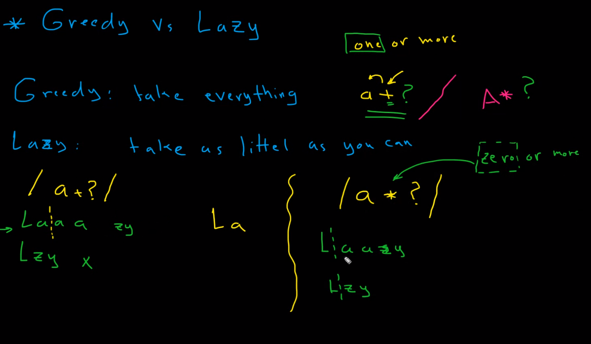
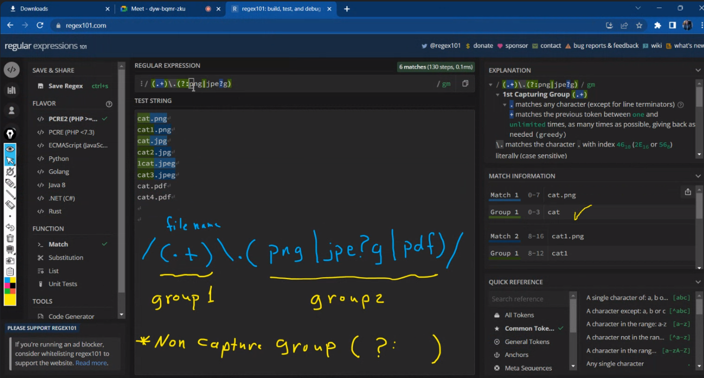
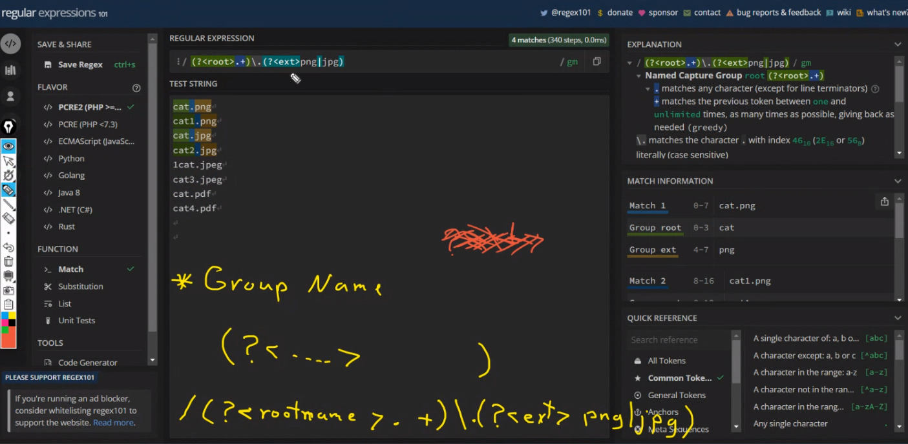
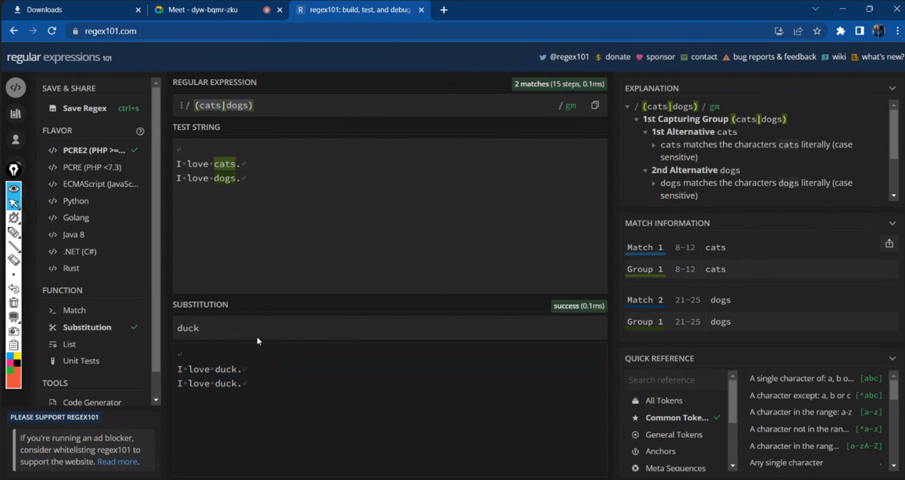

### - Greddy vs Lazy:
- ### Greedy: take everything it can.
- ### Lazy: take as little as possible. (?)

 

### Flags in regular expression:
- ### g: global: find all matches.
- ### i: ignore case.: case insensitive.
- ### m: multiline: match across multiple lines.
- ### s: single line.

### Special characters:
- ### $: end of a string.
- ### +: one or more.
- ### *: zero or more.
- ### ?: zero or one.
- ### ^: start of a string.
- ### .: any character except newline (\n).
- ### +?: one or more (lazy: taka as little as possible).
- ### \: literal character. for example: \.cats: find .cats. 

- ### Non capturing group: (?:...). for example: (?:cats): find cats, but don't capture it.

 

- ### Group name: (?<...>...). for example: (?<name>cats): find cats, and capture it in a group named name.
 

 

### - Multi-characters:
- ### |: either... or... .
- ### ():Grouping: is used to group sub-patterns.
- ### []: matches one of the set of characters within [].
- ### [^]: matches anything not in the set of characters within [].
- ### {}:  matches a specific number of occurrences of preceding expression.
- ###  [0-9]: matches a single character in the range 0 to 9.	

 

### - Examples:
1. /cats+/gm : find all cats, catss, catsss, catssss, ... .
2. /(cats)+/gm: find all cats, catscats, catscatscats, ... . 
3. /[cats]+/gm: find all c, a, t, s, cats, catss, catsss, catssss, ... .
4. /(W[0o]w)+/gm: find all W0w, Wow, W0wow, Wowow, ... .

### - Subtitution:
- ### to replace a string with another string.

> in python: re.replace(pattern, repl, string, count=0, flags=0)